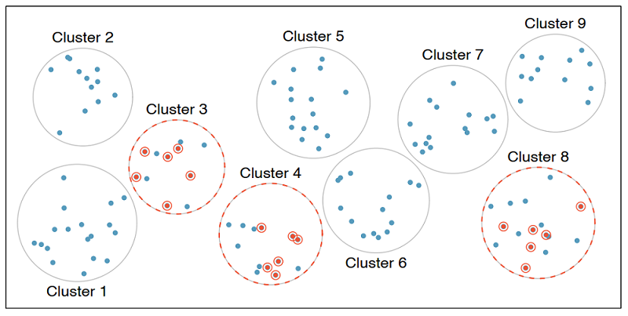

<!doctype html>
<html lang="en" class="no-js">
  <head>
    

<meta charset="utf-8">


<!-- begin SEO -->


<title>Tutorial 1: An Introduction to Data and Sampling   MATH 224 - Intro to Stat</title>


<meta property="og:locale" content="en-US">
<meta property="og:site_name" content="MATH 224 - Intro to Stat">
<meta property="og:title" content="Tutorial 1: An Introduction to Data and Sampling">


  <link rel="canonical" href="http://localhost:4000/files/Shiny%20Tutorials/1_IntroToData/1_IntroToData.Rmd">
  <meta property="og:url" content="http://localhost:4000/files/Shiny%20Tutorials/1_IntroToData/1_IntroToData.Rmd">


  

  


  <script type="application/ld+json">
    {
      "@context" : "http://schema.org",
      "@type" : "Person",
      "name" : "Intro To Stat NCAT",
      "url" : "http://localhost:4000",
      "sameAs" : null
    }
  </script>


<!-- end SEO -->


<link href="http://localhost:4000/feed.xml" type="application/atom+xml" rel="alternate" title="MATH 224 - Intro to Stat Feed">

<!-- http://t.co/dKP3o1e -->
<meta name="HandheldFriendly" content="True">
<meta name="MobileOptimized" content="320">
<meta name="viewport" content="width=device-width, initial-scale=1.0">

<script>
  document.documentElement.className = document.documentElement.className.replace(/\bno-js\b/g, '') + ' js ';
</script>

<!-- For all browsers -->
<link rel="stylesheet" href="http://localhost:4000/assets/css/main.css">

<meta http-equiv="cleartype" content="on">
    

<!-- start custom head snippets -->

<link rel="apple-touch-icon" sizes="57x57" href="http://localhost:4000/images/apple-touch-icon-57x57.png?v=M44lzPylqQ">
<link rel="apple-touch-icon" sizes="60x60" href="http://localhost:4000/images/apple-touch-icon-60x60.png?v=M44lzPylqQ">
<link rel="apple-touch-icon" sizes="72x72" href="http://localhost:4000/images/apple-touch-icon-72x72.png?v=M44lzPylqQ">
<link rel="apple-touch-icon" sizes="76x76" href="http://localhost:4000/images/apple-touch-icon-76x76.png?v=M44lzPylqQ">
<link rel="apple-touch-icon" sizes="114x114" href="http://localhost:4000/images/apple-touch-icon-114x114.png?v=M44lzPylqQ">
<link rel="apple-touch-icon" sizes="120x120" href="http://localhost:4000/images/apple-touch-icon-120x120.png?v=M44lzPylqQ">
<link rel="apple-touch-icon" sizes="144x144" href="http://localhost:4000/images/apple-touch-icon-144x144.png?v=M44lzPylqQ">
<link rel="apple-touch-icon" sizes="152x152" href="http://localhost:4000/images/apple-touch-icon-152x152.png?v=M44lzPylqQ">
<link rel="apple-touch-icon" sizes="180x180" href="http://localhost:4000/images/apple-touch-icon-180x180.png?v=M44lzPylqQ">
<link rel="icon" type="image/png" href="http://localhost:4000/images/favicon-32x32.png?v=M44lzPylqQ" sizes="32x32">
<link rel="icon" type="image/png" href="http://localhost:4000/images/android-chrome-192x192.png?v=M44lzPylqQ" sizes="192x192">
<link rel="icon" type="image/png" href="http://localhost:4000/images/favicon-96x96.png?v=M44lzPylqQ" sizes="96x96">
<link rel="icon" type="image/png" href="http://localhost:4000/images/favicon-16x16.png?v=M44lzPylqQ" sizes="16x16">
<link rel="manifest" href="http://localhost:4000/images/manifest.json?v=M44lzPylqQ">
<link rel="mask-icon" href="http://localhost:4000/images/safari-pinned-tab.svg?v=M44lzPylqQ" color="#000000">
<link rel="shortcut icon" href="/images/favicon.ico?v=M44lzPylqQ">
<meta name="msapplication-TileColor" content="#000000">
<meta name="msapplication-TileImage" content="http://localhost:4000/images/mstile-144x144.png?v=M44lzPylqQ">
<meta name="msapplication-config" content="http://localhost:4000/images/browserconfig.xml?v=M44lzPylqQ">
<meta name="theme-color" content="#ffffff">
<link rel="stylesheet" href="http://localhost:4000/assets/css/academicons.css"/>

<script type="text/x-mathjax-config"> MathJax.Hub.Config({ TeX: { equationNumbers: { autoNumber: "all" } } }); </script>
<script type="text/x-mathjax-config">
  MathJax.Hub.Config({
    tex2jax: {
      inlineMath: [ ['$','$'], ["\\(","\\)"] ],
      processEscapes: true
    }
  });
</script>
<script src='https://cdnjs.cloudflare.com/ajax/libs/mathjax/2.7.4/latest.js?config=TeX-MML-AM_CHTML' async></script>

<!-- end custom head snippets -->

  </head>

  <body>

    <!--[if lt IE 9]>
<div class="notice--danger align-center" style="margin: 0;">You are using an <strong>outdated</strong> browser. Please <a href="http://browsehappy.com/">upgrade your browser</a> to improve your experience.</div>
<![endif]-->
    

<div class="masthead">
  <div class="masthead__inner-wrap">
    <div class="masthead__menu">
      <nav id="site-nav" class="greedy-nav">
        <button><div class="navicon"></div></button>
        <ul class="visible-links">
          <li class="masthead__menu-item masthead__menu-item--lg"><a href="http://localhost:4000/">MATH 224 - Intro to Stat</a></li>
          
            
            <li class="masthead__menu-item"><a href="http://localhost:4000/syllabus/">Syllabus</a></li>
          
            
            <li class="masthead__menu-item"><a href="http://localhost:4000/slides/">Slides</a></li>
          
            
            <li class="masthead__menu-item"><a href="http://localhost:4000/labs/">Computing Labs</a></li>
          
            
            <li class="masthead__menu-item"><a href="http://localhost:4000/tutorials/">R Tutorials</a></li>
          
            
            <li class="masthead__menu-item"><a href="http://localhost:4000/dap/">Data Analysis Project</a></li>
          
            
            <li class="masthead__menu-item"><a href="http://localhost:4000/assessments/">Assessments</a></li>
          
            
            <li class="masthead__menu-item"><a href="http://localhost:4000/research/">Research/Publication</a></li>
          
            
            <li class="masthead__menu-item"><a href="http://localhost:4000/manual/">Implementation Manual</a></li>
          
            
            <li class="masthead__menu-item"><a href="http://localhost:4000/workshop/">Faculty Workshops</a></li>
          
        </ul>
        <ul class="hidden-links hidden"></ul>
      </nav>
    </div>
  </div>
</div>

    


<div id="main" role="main">
  


  <div class="sidebar sticky">
  


<div itemscope itemtype="http://schema.org/Person">

  <div class="author__avatar">
    
    	
    
  </div>

  <div class="author__content">
    <h3 class="author__name">Introduction to Probability & Statistics</h3>
    
  </div>

  <div class="author__urls-wrapper">
    <button class="btn btn--inverse">Follow</button>
    <ul class="author__urls social-icons">
      
        <li><i class="fa fa-fw fa-map-marker" aria-hidden="true"></i> NC A&T State University</li>
      
      
      
      
      
       
      
      
      
      
      
      
      
      
      
        <li><a href="https://github.com/IntroToStatNCAT/IntroToStatNCAT.github.io"><i class="fab fa-fw fa-github" aria-hidden="true"></i> Github</a></li>
      
      
      
      
      
      
      
      
      
      
      
      
      
      
      
      
      
      
    </ul>
  </div>
</div>

  
  </div>


  <article class="page" itemscope itemtype="http://schema.org/CreativeWork">
    <meta itemprop="headline" content="Tutorial 1: An Introduction to Data and Sampling">
    
    
    

    <div class="page__inner-wrap">
      
        <header>
          <h1 class="page__title" itemprop="headline">Tutorial 1: An Introduction to Data and Sampling
</h1>
          
        
        
        
        
             
        
    
        </header>
      

      <section class="page__content" itemprop="text">
        ```{r global-options, include=FALSE}
#knitr::opts_chunk$set(eval = FALSE)
library(dplyr)
library(ggplot2)
library(learnr)
library(gradethis)
library(gradethis) #remotes::install_github("rstudio/gradethis")
library(learnrhash) #devtools::install_github("rundel/learnrhash")
library(openintro)
library(gapminder)
library(emo) #devtools::install_github("hadley/emo")

set.seed(42)
#https://raw.githubusercontent.com/NikhilKumarMutyala/Linear-Regression-from-scartch-on-KC-House-Dataset/master/kc_house_data.csv

houses <- read.csv("https://raw.githubusercontent.com/IntroToStatNCAT/RA_IntroToData/main/houses.csv")
houses$exterior <- sample(c("brick", "vinyl siding", "shingles", "NA"), size = nrow(houses), prob = c(0.15, 0.7, 0.12, 0.03), replace = TRUE)
houses$month <- sample(1:12, size = nrow(houses), replace = TRUE)
housesSubset <- houses[ , c(1, 23, 3, 6, 7, 9, 22)]

#knitr::opts_chunk$set(exercise.checker = gradethis::grade_learnr)
```


## Data and Sampling

If you've never coded before (or even if you have), type `"Your Name"` in the interactive R chunk below and run it by hitting `crtl+Enter` or `cmd+Enter` for MAC users.

```{r Student-Name, exercise = TRUE}

```

This is the first of a series of interactive tutorials you'll use to engage content from introductory statistics. This tutorial covers an introduction to data, including some background on experimental design and data collection.

###

### An Introduction to Data


In this tutorial you'll encounter two datasets -- one concerning real estate from King County, WA (`houses`) and another containing prices and attributes of almost 54,000 diamonds (`diamonds`). A few rows of the `houses` data is shown below in a convenient form where the rows of data represent *records* (sometimes called **observations**), and the columns represent **variables** (sometimes called **features**). We'll see later in our course that such data is called *tidy*.

###

```{r showData, exercise = FALSE, echo = FALSE}
head(housesSubset[sample(1:nrow(housesSubset), size = nrow(housesSubset), replace = FALSE), ])
```

You can see the first six rows of the dataset above. A simplified *data dictionary* (a map of column names and explanations) appears below.

###

+ `id` provides the property identification number.
+ `month` gives the month that the property was listed for sale.
+ `price` is the listing price of the property in US dollars (\$).
+ `sqft_living` gives the finished square footage of the home.
+ `sqft_lot` gives the square footage of the property (land).
+ `waterfront` indicates whether the property is waterfront.
+ `exterior` provides a description of the exterior covering of the home.


## Variable Types


In this section, we will delve deeper into the categorization of variables as **numerical and categorical**. This is an important step, as the type of variable helps us determine what summary statistics to calculate, what type of visualizations to make, and what statistical method will be appropriate to answer the research questions we're exploring.

There are two types of variables: numerical and categorical.

- **Numerical**, in other words, quantitative, variables take on numerical values. It is sensible to add, subtract, take averages, and so on, with these values.

- **Categorical**, or qualitative, variables, take on a limited number of distinct categories. These categories can be identified with numbers, for example, it is customary to see likert variables (strongly agree to strongly disagree) coded as 1 through 5, but it wouldn't be sensible to do arithmetic operations with these values. They are merely placeholders for the levels of the categorical variable.

###

### Numerical data

Numerical variables can be further categorized as **continuous or discrete**.

- **Continuous numerical** variables are usually measured, such as height. These variables can take on an infinite number of values within a given range.

- **Discrete numerical** variables are those that take on one of a specific set of numeric values where we are able to count or enumerate all of the possibilities. One example of a discrete variable is number of pets in a household. In general, count data are an example of discrete variables.

When determining whether a numerical variable is continuous or discrete, it is important to think about the nature of the variable and not just the observed value, as rounding of continuous variables can make them appear to be discrete. For example, height is a continuous variable, however we tend to report our height rounded to the nearest unit of measure, like inches or centimeters.


### Categorical data

Categorical variables that have ordered levels are called **ordinal**.

Think about a survey question where you're asked how satisfied you are with the customer service you received and the options are very unsatisfied, unsatisfied, neutral, satisfied, and very satisfied. These levels have an inherent ordering, hence the variable would be called ordinal.

If the levels of a categorical variable do not have an inherent ordering to them, then the variable is simply called categorical. For example, do you consume caffeine or not?

###

Answer the following using your knowledge of the dataset and variable types.

```{r id-vars-numerical, echo = FALSE}
quiz(
question_checkbox(
"Check off each of the variables from the `houses` dataset which are numerical",
answer("id", message = "are we able to take a meaningful average of these values?"),
answer("month", message = "is an average meaningful here?"),
answer("price", correct = TRUE),
answer("sqft_living", correct = TRUE),
answer("sqft_lot", correct = TRUE),
answer("waterfront"),
answer("exterior"),
allow_retry = TRUE,
try_again = "Be sure to select all of them! There are three."
),

question_checkbox(
"Check off each of the variables from the `houses` dataset which are categorical",
answer("id", message = "are we able to take a meaningful average of these values?"),
answer("month", correct = TRUE),
answer("price"),
answer("sqft_living"),
answer("sqft_lot"),
answer("waterfront", correct = TRUE),
answer("exterior", correct = TRUE),
allow_retry = TRUE,
try_again = "Be sure to select all of them!"
),

question_checkbox(
"Check off each of the variables from the `houses` dataset which are unique identifiers.",
answer("id", correct = TRUE),
answer("month"),
answer("price"),
answer("sqft_living"),
answer("sqft_lot"),
answer("waterfront"),
answer("exterior"),
allow_retry = TRUE,
try_again = "There's just one here!"
)

)
```

###

The **levels** of a variable are the different (unique) values that the variable takes on. For example, a dataset on students might include a variable called `ClassYear` with the levels *Freshman*, *Sophomore*, *Junior*, *Senior*. Numerical variables also have levels -- usually there are lots of levels corresponding to a numerical variable, but if there are too few, we may be better off considering the corresponding variable to be categorical. For example, if we had a dataset that included a `Year` variable, but the only observed levels in the dataset are 2008 and 2017, we may be better off thinking about `Year` as a categorical variable than as a numerical one.


## Relationships between variables


**Association, Independence, Correlation:** Two variables are *associated* with one another if a change in levels of one is generally accompanied by change in the other. That is, larger values of one variable are accompanied by larger (or smaller) values in the other. Think – does knowing something about one of the variables give me any information about the other? If two variables are not associated, then we might say that they are *independent* of one another. Lastly, *correlation* is a way to formally measure the strength of a <u>LINEAR</u> association between two variables. Look at the plots considering characteristics of various diamonds below.

###

```{r plots-associations-num1, echo = FALSE, eval = TRUE, message = FALSE, warning = FALSE, results = FALSE}
ggplot(data=diamonds) + geom_point(mapping = aes(x = carat, y = price, col = clarity), alpha = .5, show.legend = F) + labs(title = "Price by Carat", x = "Carat", y = "Price")
```


```{r plots-associations-num2, echo = FALSE, eval = TRUE, message = FALSE, warning = FALSE, results = FALSE}
ggplot(data=diamonds) + geom_point(mapping = aes(x = carat, y = depth, col = clarity), alpha = .5, show.legend = F) + labs(title = "Carat by Depth", x = "Depth", y = "Carat")
```

```{r plots-associations-num3, echo = FALSE, eval = TRUE, message = FALSE, warning = FALSE, results = FALSE}
ggplot(data=diamonds) + geom_point(mapping = aes(x = x, y = y, col = clarity), alpha = .5, show.legend = F) + labs(title = "Length by Width", x = "Length (mm)", y = "Width (mm)")
```


```{r plots-associations-num4, echo = FALSE, eval = TRUE, message = FALSE, warning = FALSE, results = FALSE}
ggplot(data=diamonds) + geom_point(mapping = aes(x = log(x), y = log(y), col = clarity), alpha = .5, show.legend = F) + labs(title = "Length by Width - Log transformed", x = "Length (mm)", y = "Width (mm)")
```

###

Use the plots above to answer the following questions.

```{r plots-associations-questions-num, echo = FALSE}
quiz(
question_checkbox(
"Which of the plots above highlight an association between the corresponding variables?",
answer("Carat versus Price", correct = TRUE),
answer("Depth versus Carat"),
answer("Length by Width", correct = TRUE),
allow_retry = TRUE
),

question(
"Which pair of variables from the above plots is independent?",
answer("price and carat"),
answer("carat and depth", correct = TRUE),
answer("length and width"),
allow_retry = TRUE
),

question(
"Which of the plots shows the strongest correlation between the corresponding variables?",
answer("Carat versus Price"),
answer("Depth versus Carat"),
answer("Length by Width", correct = TRUE),
allow_retry = TRUE
)

)
```

###

Since both of the variables in each of the plots above are numerical, we can describe the direction of the association. Notice that there is a *positive* association in both of the plots you identified above, since an increase in one of the variables is generally accompanied by an increase in the other. If two numerical variables are associated but an increase in one is generally accompanied by a decrease in the other, we say that the association is *negative*. For those familiar with lines and slopes, the direction of the association corresponds to the sign on the slope of a line of "best fit" (which we will discuss at the end of our course).

###

We can also identify whether an association exists between variables when one or more are categorical. Consider the plots below which refer back to our `houses` dataset from earlier.

```{r plots-association-cat, echo = FALSE, eval = TRUE, message = FALSE, warning = FALSE, results = FALSE, fig.width = 4, fig.height = 4}
housesSubset$waterfront <- ifelse(housesSubset$waterfront == 1, "yes", "no")
housesSubset$waterfront <- as.factor(housesSubset$waterfront)
ggplot(data=housesSubset) + geom_boxplot(mapping = aes(x = waterfront, y = price)) + labs(title = "Price by Waterfront", x = "Waterfront", y = "Price", group = "Waterfront") + scale_y_log10()
ggplot(data=housesSubset) + geom_bar(mapping = aes(x = waterfront, fill = exterior), position = "fill") + labs(title = "Exterior Covering and Waterfront", x = "Waterfront") + theme(legend.position = "below")
```

###

```{r plots-associations-questions-cat, echo = FALSE}
question_checkbox(
"One of the plots above shows an association between the corresponding variables. Which one is it?",
answer("Price by Waterfront", correct = TRUE),
answer("Exterior Covering and Waterfront"),
allow_retry = TRUE
)
```

###

Did you get the previous question right on the first try? Think about why the answer is as this tutorial indicates and ask a question if you need more clarification.

###

**Major Questions In Statistics**: Given groups with different characteristics (differing levels) regarding variable *X*, do they differ with respect to variable *Y*?

###

We'll find that we can't just answer these questions by looking at plots involving some sample data. Why not?


## Data collection principles


**Population versus Sample**: In statistics, we almost always want to apply generalizations from a small sample to a large population -- you might think of this as a sort of *stereotyping*. The trick here is that for our assertions (generalizations) to be valid, our sample must be *representative of* our population.

###

<center> **The following takeaway is critical:** *Results based off of a sample may only be generalized to a population for which that sample is representative.* </center>
<br/>


### Why not take a census?

First, taking a census requires a lot more resources than collecting data from a sample of the population.

Second, certain individuals in your population might be hard to locate or collect data from. If these individuals that are missed in the census are different from those in the rest of the population, the census data will be biased. For example, in the US census, undocumented immigrants are often not recorded properly since they tend to be reluctant to fill out census forms with the concern that this information could be shared with immigration. However, these individuals might have characteristics different than the rest of the population and hence, not getting information from them might result in unreliable data from geographical regions with high concentrations of undocumented immigrants.

Lastly, populations are constantly changing. Even if you do have the required resources and manage to collect data from everyone in the population, tomorrow your population will be different and so the hard work required to collect such data may not pay off.

If you think about it, sampling is actually quite natural.


### Sampling is natural

Think about something you are cooking we taste or in other words examine a small part of what we're cooking to get an idea about the dish as a whole. After all, we would never eat a whole pot of soup just to check its taste.

When you taste a spoonful of soup and decide the spoonful you tasted isn't salty enough, what you're doing is simply exploratory analysis for the sample at hand.

If you then generalize and conclude that your entire soup needs salt, that's making an inference.

For your inference to be valid, the spoonful you tasted, your sample, needs to be representative of the entire pot, your population.

If your spoonful comes only from the surface and the salt is collected at the bottom of the pot, what you tasted is probably not going to be representative of the whole pot.

On the other hand, if you first stir the soup thoroughly before you taste, your spoonful will more likely be representative of the whole pot.

Sampling data is a bit different than sampling soup though. So next, we'll introduce a few commonly used sampling methods: simple random sampling, stratified sampling, cluster sampling, and multistage sampling.


### Sampling strategies

Here we discuss some of the different ways to draw a sample from a population.


### Simple random sample

In *simple random* sampling, we randomly select cases from the population, such that each case is equally likely to be selected. This is similar to randomly drawing names from a hat.
<center>  </center>


### Stratified sample

In *stratified sampling*, we first divide the population into homogeneous groups, called strata, and then we randomly sample from within each stratum. For example, if we wanted to make sure that people from low, medium, and high socioeconomic status are equally represented in a study, we would first divide our population into three groups as such and then sample from within each group.
<center>  </center>


### Cluster sample

In cluster sampling, we divide the population into clusters, randomly sample a few clusters, and then sample all observations within these clusters. The clusters, unlike strata in stratified sampling, are heterogeneous within themselves and each cluster is similar to the others, such that we can get away with sampling from just a few of the clusters.
<center>  </center>


### Multistage sample

Multistage sampling adds another step to cluster sampling. Just like in cluster sampling, we divide the population into clusters, randomly sample a few clusters, and then we randomly sample observations from within those clusters.
<center>  </center>

###

Note: Cluster and multistage sampling are often used for economical reasons. For example, one might divide a city into geographic regions that are on average similar to each other and then sample randomly from a few randomly picked regions in order to avoid traveling to all regions.


### Convenience sample

The *convenience sample* is the most commonly used sampling method. Unfortunately, it is also the worst. When researchers sample from individuals they have "easy access" to, they are conducting a convenience sample. There are always hidden biases in these samples. Do a quick Google search for "FDR versus Alf Landon Sampling Error" to see a very famous example here. In addition, much of the error in predicting the results of the 2016 presidential election may be attributable to convenience sampling.


### Sampling strategies, determine which

A consulting company is planning a pilot study on marketing in Boston. They identify the zip codes that make up the greater Boston area, then sample 50 randomly selected addresses from each zip code and mail a coupon to these addresses. They then track whether the coupon was used in the following month.

```{r quiz-sampling-strategies-determine-which, echo = FALSE}
quiz(
  question("What sampling strategy has this company used?", correct = "Nice! Let's continue to the next exercise.", allow_retry = TRUE,
    answer("Simple random sample", message = "Try again. The company is dividing the Boston area by zip code."),
    answer("Stratified sample", correct = TRUE),
    answer("Cluster sample", message = "Hmm, not quite. The company isn't sampling all the houses in each zip code."), 
    answer("Multistage sample", message = "Not quite! The company is sampling 50 addresses from each zip code.") ), 
  caption = "")
```

### Sampling strategies, choose worst

A school district has requested a survey be conducted on the socioeconomic status of their students. Their budget only allows them to conduct the survey in some of the schools, hence they need to first sample a few schools. 

Students living in this district generally attend a school in their neighborhood. The district is broken into many distinct and unique neighborhoods, some including large single-family homes and others with only low-income housing. 

```{r quiz-sampling-strategies-choose-worst, echo = FALSE}
quiz(
  question("Which approach would likely be the **least effective** for selecting the schools where the survey will be conducted?", correct = "Nice job! This sampling strategy would be a bad idea because each neighborhood has a unique socioeconomic status. A good study would collect information about every neighborhood.", allow_retry = TRUE,
    answer("Simple random sample", message = "Incorrect!"),
    answer("Stratified sampling, where each stratum is a neighborhood", message = "Try again. Remember, the socioeconomic status of each neighborhood is unique."), 
    answer("Cluster sampling, where each cluster is a neighborhood", correct = TRUE) ), 
  caption = "")
```

## Experimental Design


**Experiment versus Observational Study**: Beyond just sampling, there are multiple methods for collecting data. We can just *observe* what happens naturally (without manipulating any conditions) or we can run an *experiment*. In experiments we manipulate one or more conditions, utilizing a control and treatment group(s). The advantage to an experiment is that we can infer cause and effect relationships (this is extremely important in medical studies), but in observational studies we can only discuss an association between variables.


There's lots more to learn about experimental design, but it is beyond the scope of our course. You should read pages 32 through 35 of [OpenIntro Statistics, 4Ed](https://www.openintro.org/book/os/) as a starting point.


## Explanatory and response variables

Often when one mentions "a relationship between variables" we think of a relationship between just two variables, say a so called explanatory variable, x, and response variable, y. However, truly understanding the relationship between two variables might require considering other potentially related variables as well. If we don't, we might find ourselves in a *Simpson's paradox*. So, what is Simpson's paradox?

First, let's clarify what we mean when we say explanatory and response variables. Labeling variables as explanatory and response does not guarantee the relationship between the two is actually causal, even if there is an association identified. We use these labels only to keep track of which variable we suspect affects the other.

### Explanatory and response

{width="30%"}

And these definitions can be expanded to more than just two variables. For example, we could study the relationship between three explanatory variables and a single response variable.

### Multivariate relationships

{width="50%"}

This is often a more realistic scenario since most real world relationships are multivariable. For example, if we're interested in the relationship between calories consumed daily and heart health, we would probably also want to consider information on variables like age and fitness level of the person as well.

{width="50%"}

Not considering an important variable when studying a relationship can result in what we call a **Simpson's paradox**. This paradox illustrates the effect the omission of an explanatory variable can have on the measure of association between another explanatory variable and the response variable. In other words, the inclusion of a third variable in the analysis can change the apparent relationship between the other two variables. 

Consider the eight dots in the scatter plot below (the points happen to fall on the orange and blue lines). The trend describing the points when only considering `x1` and `y`, illustrated by the black dashed line, is reversed when `x2`, the grouping variable, is also considered. If we don't consider `x2`, the relationship between `x1` and `y` is positive. If we do consider `x2`, we see that within each group the relationship between `x1` and `y` is actually negative.

{width="50%"}

We'll explore Simpson's paradox further with another dataset, which comes from a study carried out by the graduate Division of the University of California, Berkeley in the early 70’s to evaluate whether there was a sex bias in graduate admissions. The data come from six departments. For confidentiality we'll call them A through F. The dataset contains information on whether the applicant identified as male or female, recorded as `Gender`, and whether they were admitted or rejected, recorded as `Admit`. 

### Berkeley admission data

   .   | Admitted | Rejected  
-------| ---------|---------
Male   | 1198     | 1493
Female | 557      | 1278

> Note: At the time of this study, gender and sexual identities were not given distinct names. Instead, it
> was common for a survey to ask for your "gender" and then provide you with the options of "male" and 
> "female." Today, we better understand how an individual's gender and sexual identities are different 
> pieces of who they are. To learn more about inclusive language surrounding gender and sexual identities 
> see the [gender unicorn](https://transstudent.org/gender/). 

First, we will evaluate whether the percentage of males admitted is indeed higher than females, overall.

```{r gender-male-admission, echo=FALSE}
load("data/ucb_admit.RData")
ucb_admit %>% 
  group_by(Gender) %>% 
  count(Admit)%>%
  ungroup()%>%
  # Group by gender
  group_by(Gender) %>%
  # Create new variable
  mutate(prop = n / sum(n)) %>%
  # Filter for admitted
  filter(Admit == "Admitted")
```

Next, we will calculate the same percentage for each individual department.

### Admission rates for males across departments

```{r prepare-gender3, echo=FALSE}

ucb_admit %>%
  # Group by department, then gender
  group_by(Dept, Gender) %>%
  # Table of counts of admission status and gender and department
  count(Admit) %>%
  # Create new variable
  mutate(prop = n / sum(n)) %>%
  # Filter for male and admitted
  filter(Gender == "Male", Admit == "Admitted")
```

```{r quiz-gender, echo=FALSE}
quiz(
  question("Which of the following best describes the relationship between admission status and gender?", correct = "Correct! Let's recap what we've learned in the next section.", allow_retry = TRUE,
    answer("Within most departments, female applicants are more likely to be admitted.", correct = TRUE),
    answer("Within most departments, male applicants are more likely to be admitted.", message = "That doesn't seem right."),
    answer("Within most departments, male and female applicants are equally likely to be admitted.", message = "Try again!")
), caption = "")
```


## Recap: Simpson's paradox


We'll wrap up the lesson with a recap of our findings.

Overall: males were more likely to be admitted

* Within most departments: females were more likely
* When controlling for department, relationship between gender and admission status was reversed
* Potential reason:
  + Women tended to apply to competitive departments with lower admission rates
  + Men tended to apply to less competitive departments with higher admission rates

We saw that overall males were more likely to be admitted.

But when we consider the department information, within most departments actually females are more likely to be admitted.

So when we control for department, the relationship between gender and admission status was reversed, which is what we call Simpson's paradox.

One potential reason for this paradox is that women tended to apply to competitive departments with lower rates of admission even among qualified applicants, such as in the English Department. Whereas, men tended to apply to less competitive departments with higher rates of admission among the qualified applicants, such as in engineering and chemistry.

Note that we were only able to discover the contradictory finding once we incorporated information about the department of the application. Examples like this highlight the importance of a good study design that considers and collects information on extraneous, but potentially confounding variables in a study.


## Submit

```{r context="server"}
learnrhash::encoder_logic(strip_output = TRUE)
```

```{r encode, echo=FALSE}
learnrhash::encoder_ui(
  ui_before = shiny::div(
    "If you have completed this tutorial and are happy with all of your",
    "solutions, please click the button below to generate your hash and",
    "submit it using the corresponding tutorial assignment tab on Blackboard",
    shiny::tags$br()
  ), 
  ui_after = shiny::tags$a(href = "https://blackboard.ncat.edu/", "NCAT Blackboard")
)
```

## Summary

**Summary**: Here's a quick summary of the most important ideas from this first notebook.

  * Data is stored in a table called a data frame. The rows of the data frame are observations and the columns are collected variables.
  * Data is either numerical or categorical -- to determine type, ask "is the average of these observations meaningful?"
  * Two variables are associated if a change in one has predictive value about a change in the other.
  * There are many ways data can be collected, but in order to produce meaningful results we must use random sampling.
  * Results from a sample can be generalized only to a population for which that sample is representative.

        
      </section>

      <footer class="page__meta">
        
        


      </footer>

      

      


    </div>

    
  </article>

  
  
</div>


    <div class="page__footer">
      <footer>
        <!-- start custom footer snippets -->
<a href="/sitemap/">Sitemap</a>
<!-- end custom footer snippets -->

        

<div class="page__footer-follow">
  <ul class="social-icons">
    
      <li><strong>Follow:</strong></li>
    
    
    
    
      <li><a href="http://github.com/IntroToStatNCAT/IntroToStatNCAT.github.io"><i class="fab fa-github" aria-hidden="true"></i> GitHub</a></li>
    
    
    <li><a href="http://localhost:4000/feed.xml"><i class="fa fa-fw fa-rss-square" aria-hidden="true"></i> Feed</a></li>
  </ul>
</div>

<div class="page__footer-copyright">&copy; 2022 Intro To Stat NCAT. Powered by <a href="http://jekyllrb.com" rel="nofollow">Jekyll</a> &amp; <a href="https://github.com/academicpages/academicpages.github.io">AcademicPages</a>, a fork of <a href="https://mademistakes.com/work/minimal-mistakes-jekyll-theme/" rel="nofollow">Minimal Mistakes</a>.</div>

      </footer>
    </div>

    <script src="http://localhost:4000/assets/js/main.min.js"></script>


  <script>
  (function(i,s,o,g,r,a,m){i['GoogleAnalyticsObject']=r;i[r]=i[r]||function(){
  (i[r].q=i[r].q||[]).push(arguments)},i[r].l=1*new Date();a=s.createElement(o),
  m=s.getElementsByTagName(o)[0];a.async=1;a.src=g;m.parentNode.insertBefore(a,m)
  })(window,document,'script','//www.google-analytics.com/analytics.js','ga');

  ga('create', '', 'auto');
  ga('send', 'pageview');
</script>


  </body>
</html>

