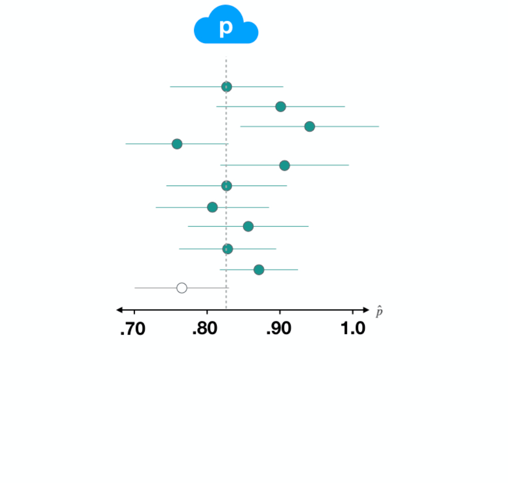

<!doctype html>
<html lang="en" class="no-js">
  <head>
    

<meta charset="utf-8">


<!-- begin SEO -->


<title>Tutorial 7: Foundations For Inference   MATH 224 - Intro to Stat</title>


<meta property="og:locale" content="en-US">
<meta property="og:site_name" content="MATH 224 - Intro to Stat">
<meta property="og:title" content="Tutorial 7: Foundations For Inference">


  <link rel="canonical" href="http://localhost:4000/files/Shiny%20Tutorials/8_FoundationsForInference/9_FoundationsForInference.Rmd">
  <meta property="og:url" content="http://localhost:4000/files/Shiny%20Tutorials/8_FoundationsForInference/9_FoundationsForInference.Rmd">


  

  


  <script type="application/ld+json">
    {
      "@context" : "http://schema.org",
      "@type" : "Person",
      "name" : "Intro To Stat NCAT",
      "url" : "http://localhost:4000",
      "sameAs" : null
    }
  </script>


<!-- end SEO -->


<link href="http://localhost:4000/feed.xml" type="application/atom+xml" rel="alternate" title="MATH 224 - Intro to Stat Feed">

<!-- http://t.co/dKP3o1e -->
<meta name="HandheldFriendly" content="True">
<meta name="MobileOptimized" content="320">
<meta name="viewport" content="width=device-width, initial-scale=1.0">

<script>
  document.documentElement.className = document.documentElement.className.replace(/\bno-js\b/g, '') + ' js ';
</script>

<!-- For all browsers -->
<link rel="stylesheet" href="http://localhost:4000/assets/css/main.css">

<meta http-equiv="cleartype" content="on">
    

<!-- start custom head snippets -->

<link rel="apple-touch-icon" sizes="57x57" href="http://localhost:4000/images/apple-touch-icon-57x57.png?v=M44lzPylqQ">
<link rel="apple-touch-icon" sizes="60x60" href="http://localhost:4000/images/apple-touch-icon-60x60.png?v=M44lzPylqQ">
<link rel="apple-touch-icon" sizes="72x72" href="http://localhost:4000/images/apple-touch-icon-72x72.png?v=M44lzPylqQ">
<link rel="apple-touch-icon" sizes="76x76" href="http://localhost:4000/images/apple-touch-icon-76x76.png?v=M44lzPylqQ">
<link rel="apple-touch-icon" sizes="114x114" href="http://localhost:4000/images/apple-touch-icon-114x114.png?v=M44lzPylqQ">
<link rel="apple-touch-icon" sizes="120x120" href="http://localhost:4000/images/apple-touch-icon-120x120.png?v=M44lzPylqQ">
<link rel="apple-touch-icon" sizes="144x144" href="http://localhost:4000/images/apple-touch-icon-144x144.png?v=M44lzPylqQ">
<link rel="apple-touch-icon" sizes="152x152" href="http://localhost:4000/images/apple-touch-icon-152x152.png?v=M44lzPylqQ">
<link rel="apple-touch-icon" sizes="180x180" href="http://localhost:4000/images/apple-touch-icon-180x180.png?v=M44lzPylqQ">
<link rel="icon" type="image/png" href="http://localhost:4000/images/favicon-32x32.png?v=M44lzPylqQ" sizes="32x32">
<link rel="icon" type="image/png" href="http://localhost:4000/images/android-chrome-192x192.png?v=M44lzPylqQ" sizes="192x192">
<link rel="icon" type="image/png" href="http://localhost:4000/images/favicon-96x96.png?v=M44lzPylqQ" sizes="96x96">
<link rel="icon" type="image/png" href="http://localhost:4000/images/favicon-16x16.png?v=M44lzPylqQ" sizes="16x16">
<link rel="manifest" href="http://localhost:4000/images/manifest.json?v=M44lzPylqQ">
<link rel="mask-icon" href="http://localhost:4000/images/safari-pinned-tab.svg?v=M44lzPylqQ" color="#000000">
<link rel="shortcut icon" href="/images/favicon.ico?v=M44lzPylqQ">
<meta name="msapplication-TileColor" content="#000000">
<meta name="msapplication-TileImage" content="http://localhost:4000/images/mstile-144x144.png?v=M44lzPylqQ">
<meta name="msapplication-config" content="http://localhost:4000/images/browserconfig.xml?v=M44lzPylqQ">
<meta name="theme-color" content="#ffffff">
<link rel="stylesheet" href="http://localhost:4000/assets/css/academicons.css"/>

<script type="text/x-mathjax-config"> MathJax.Hub.Config({ TeX: { equationNumbers: { autoNumber: "all" } } }); </script>
<script type="text/x-mathjax-config">
  MathJax.Hub.Config({
    tex2jax: {
      inlineMath: [ ['$','$'], ["\\(","\\)"] ],
      processEscapes: true
    }
  });
</script>
<script src='https://cdnjs.cloudflare.com/ajax/libs/mathjax/2.7.4/latest.js?config=TeX-MML-AM_CHTML' async></script>

<!-- end custom head snippets -->

  </head>

  <body>

    <!--[if lt IE 9]>
<div class="notice--danger align-center" style="margin: 0;">You are using an <strong>outdated</strong> browser. Please <a href="http://browsehappy.com/">upgrade your browser</a> to improve your experience.</div>
<![endif]-->
    

<div class="masthead">
  <div class="masthead__inner-wrap">
    <div class="masthead__menu">
      <nav id="site-nav" class="greedy-nav">
        <button><div class="navicon"></div></button>
        <ul class="visible-links">
          <li class="masthead__menu-item masthead__menu-item--lg"><a href="http://localhost:4000/">MATH 224 - Intro to Stat</a></li>
          
            
            <li class="masthead__menu-item"><a href="http://localhost:4000/home/">Home</a></li>
          
            
            <li class="masthead__menu-item"><a href="http://localhost:4000/syllabus/">Syllabus</a></li>
          
            
            <li class="masthead__menu-item"><a href="http://localhost:4000/slides/">Slides</a></li>
          
            
            <li class="masthead__menu-item"><a href="http://localhost:4000/assignments/">Assignments</a></li>
          
            
            <li class="masthead__menu-item"><a href="http://localhost:4000/labs/">Computing Labs</a></li>
          
            
            <li class="masthead__menu-item"><a href="http://localhost:4000/tutorials/">R Tutorials</a></li>
          
            
            <li class="masthead__menu-item"><a href="http://localhost:4000/dap/">Data Analysis Project</a></li>
          
            
            <li class="masthead__menu-item"><a href="http://localhost:4000/assessments/">Assessments</a></li>
          
            
            <li class="masthead__menu-item"><a href="http://localhost:4000/research/">Research/Publication</a></li>
          
            
            <li class="masthead__menu-item"><a href="http://localhost:4000/manual/">Implementation Manual</a></li>
          
            
            <li class="masthead__menu-item"><a href="http://localhost:4000/workshop/">Faculty Workshops</a></li>
          
        </ul>
        <ul class="hidden-links hidden"></ul>
      </nav>
    </div>
  </div>
</div>

    


<div id="main" role="main">
  


  <div class="sidebar sticky">
  


<div itemscope itemtype="http://schema.org/Person">

  <div class="author__avatar">
    
    	
    
  </div>

  <div class="author__content">
    <h3 class="author__name">Introduction to Probability & Statistics</h3>
    
  </div>

  <div class="author__urls-wrapper">
    <button class="btn btn--inverse">Follow</button>
    <ul class="author__urls social-icons">
      
        <li><i class="fa fa-fw fa-map-marker" aria-hidden="true"></i> NC A&T State University</li>
      
      
      
      
      
       
      
      
      
      
      
      
      
      
      
        <li><a href="https://github.com/IntroToStatNCAT/IntroToStatNCAT.github.io"><i class="fab fa-fw fa-github" aria-hidden="true"></i> Github</a></li>
      
      
      
      
      
      
      
      
      
      
      
      
      
      
      
      
      
      
    </ul>
  </div>
</div>

  
  </div>


  <article class="page" itemscope itemtype="http://schema.org/CreativeWork">
    <meta itemprop="headline" content="Tutorial 7: Foundations For Inference">
    
    
    

    <div class="page__inner-wrap">
      
        <header>
          <h1 class="page__title" itemprop="headline">Tutorial 7: Foundations For Inference
</h1>
          
        
        
        
        
             
        
    
        </header>
      

      <section class="page__content" itemprop="text">
        ```{r setup, include=FALSE}
#knitr::opts_chunk$set(eval = FALSE)
library(dplyr)
library(tidyverse)
library(ggplot2)
library(learnr)
library(broom)
library(knitr)
library(infer)
library(emo)
library(openintro)
library(gradethis) #remotes::install_github("rstudio/gradethis")
library(learnrhash) #devtools::install_github("rundel/learnrhash")

# data prep --------------------------------------------------------------------

# load data

gss <- read.csv(url("https://raw.githubusercontent.com/IntroToStatNCAT/RA_FoundationsForInference/main/gss-sampled.csv"))
gss2016 <- read.csv(url("https://raw.githubusercontent.com/IntroToStatNCAT/RA_FoundationsForInference/main/gss-sampled-2016.csv"))
gss2016_small <- read.csv(url("https://raw.githubusercontent.com/IntroToStatNCAT/RA_FoundationsForInference/main/gss2016-n50.csv"))
gss2016_smaller <- read.csv(url("https://raw.githubusercontent.com/IntroToStatNCAT/RA_FoundationsForInference/main/gss2016-n10.csv"))

# recode

gss2016 <- gss2016 %>%
  mutate(consci = if_else(consci == 1, "Low", "High"))

# objects to be used later

p_hat_happy <- gss2016 %>%
  summarize(prop_happy = mean(happy == "HAPPY")) %>%
  pull()
  
p_hat_consci <- gss2016 %>%
  summarize(prop_high = mean(consci == "High")) %>%
  pull()

# happy
set.seed(47)
boot_dist_happy <- gss2016 %>%
  specify(response = happy, success = "HAPPY") %>%
  generate(reps = 500, type = "bootstrap") %>%
  calculate(stat = "prop")

 SE_happy <- boot_dist_happy %>%
  summarize(se = sd(stat)) %>%
  pull()

# consci, just one
set.seed(47)
boot_1_consci <- gss2016 %>%
  specify(response = consci, success = "High") %>%
  generate(reps = 1, type = "bootstrap")

# consci
set.seed(47)
boot_dist_consci <- gss2016 %>%
  specify(response = consci, success = "High") %>%
  generate(reps = 500, type = "bootstrap") %>%
  calculate(stat = "prop")

SE_consci <- boot_dist_consci %>%
  summarize(se = sd(stat)) %>%
  pull()

#knitr::opts_chunk$set(eval = FALSE)
```


## Intro to Statistical Inference

If you've never coded before (or even if you have), type `"Your Name"` in the interactive R chunk below and run it by hitting `crtl+Enter` or `cmd+Enter` for MAC users.

```{r Student-Name, exercise = TRUE}

```

###

### What is statistical inference?

Statistical inference is _the process of making claims about a population based on information from a sample_ of data. 

Typically, the data represent only a small portion of the larger group which you'd like to summarize. For example, you might be interested in how a drug treats diabetes. Your interest is in how the drug treats all people with diabetes, not just the few dozen people in your study.

At first glance, the logic of statistical inference seems to be backwards, but as you become more familiar with the steps in the process, the logic will make much more sense.

{ width=80% }

###

In this tutorial we'll begin investigating the true power of statistics -- using sample data to make accurate claims about a population (even when we don't have access to the entire population). We start by exploring the connection between a *Population Distribution* and the distribution of sample means, often called the *Sampling Distribution*. We'll do this through a series of simple, interactive code blocks which you will run and use to answer questions.


### Exploring the connection between population and sampling distributions

Start by viewing the following following video from the New York Times.

###

<center><iframe width="560" height="315" src="https://www.youtube.com/embed/jvoxEYmQHNM" frameborder="0" allow="accelerometer; autoplay; encrypted-media; gyroscope; picture-in-picture" allowfullscreen></iframe></center>

###

So the video claimed that the sampling distribution can help us answer questions about the population. This is really important because, as we mentioned in our first tutorial, Census is almost always impossible. Use the code blocks below to explore the connection between the population and the sampling distribution for various different populations. Note that you do not need to understand all of the code contained in the code blocks -- you should focus, instead, on the pictures resulting each time you run the code. In general, you are invited to change the first few lines of code in each block, and you are not expected to look at the remaining code.

## Sampling Distribution

### Point Estimate error

Suppose a poll suggested the US President’s approval rating is 45%. We would consider 45% to be a **point estimate** of the approval rating we might see if we collected responses from the entire population. This entire-population response proportion is generally referred to as the **parameter** of interest. When the parameter is a proportion, it is often denoted by p, and we often refer to the sample proportion as $\hat{p}$ (pronounced p - hat). Unless we collect responses from every individual in the population, p remains unknown, and we use $\hat{p}$ as our estimate of p. The difference we observe from the poll versus the parameter is called the **error** in the estimate. Generally, the error consists of two aspects: sampling error and bias.

###

- **Sampling error**, sometimes called sampling uncertainty, describes how much an estimate will tend to vary from one sample to the next. For instance, the estimate from one sample might be 1% too low while in another it may be 3% too high. Much of statistics, including much of this book, is focused on understanding and quantifying sampling error, and we will find it useful to consider a sample’s size to help us quantify this error; the **sample size** is often represented by the letter n. 

###

- **Bias** describes a systematic tendency to over- or under-estimate the true population value. For example, if we were taking a student poll asking about support for a new college stadium, we’d probably get a biased estimate of the stadium’s level of student support by wording the question as, *Do you support your school by supporting funding for the new stadium?* We try to minimize bias through thoughtful data collection procedures, which were discussed in Chapter 1 and are the topic of many other books.

###

Question:

Suppose the proportion of American adults who support the expansion of solar energy is p = 0.88, which is our parameter of interest. Is a randomly selected American adult more or less likely to support the expansion of solar energy?

###

Answer: More likely.


### Let's see an example of sampling

Suppose that you don't have access to the population of all American adults, which is a quite likely scenario. In order to estimate the proportion of American adults who support solar power expansion, you might sample from the population and use your sample proportion as the best guess for the unknown population proportion.

We will simulate a data to play the role of the population. As discusses above, we will assume that 88% of the population support the expansion and the remaining 12% don't.

```{r pop-simulated-data}
pop_size <- 250000000
possible_entries_solar <- c(rep("support", 0.88 * pop_size),
                      rep("not", 0.12 * pop_size))
```

First we will sample, without replacement, 1000 American adults from the population, and record whether they support or not solar power expansion.

```{r sampling-1000-no-replacement}
sampled_entries <- sample(possible_entries_solar,
                          size = 1000, replace = F)
```


Second we will find the sample proportion.

```{r sample-prop}
sum(sampled_entries == "support")/1000
```

Interesting thing about sampling from a population is that its always random. So the first sample might give a completely different sample proportion compared to the second sample, third sample and so on.

For example, we will perform the same sampling using the same code and we will obtain a different sample proportion.

```{r sample-two, exercise = TRUE}
sampled_entries <- sample(possible_entries_solar,
                          size = 1000, replace = F)
sum(sampled_entries == "support")/1000
```

```{r sample-three, exercise = TRUE}
sampled_entries <- sample(possible_entries_solar,
                          size = 1000, replace = F)
sum(sampled_entries == "support")/1000
```

> Run the code to see that you obtain a different result everytime you perform sampling.

Third we will use the fact that the sample proportion changes with every sample and collect multiple samples and find the sample proportion for all of those samples. This will help us to create a distribution for the sample proportion to understand the spread, center and shape of the sample proportions.

```{r sample-proportion-hist, exercise = TRUE}
set.seed(123)
# Creating 10000 different sample proportions
phat <- rep(NA, 10000)
for(i in 1:10000){
  sampled_entries <- sample(possible_entries_solar, size = 1000, replace = F)
  phat[i] <- sum(sampled_entries == "support") / 1000
}

sampling <- tibble(phat = phat)

# Plot

ggplot(sampling, aes(x = phat)) +
  geom_histogram(aes(y=..density..),bins = 40,col = "black", fill = "lightblue") +
  geom_vline(xintercept = 0.88, col = "red")+
  theme_minimal(base_size = 14) +
  labs(x = "Sample proportions", y = "Frequency")+
  stat_function(fun = dnorm, args = list(mean = mean(phat), sd = sd(phat)), size = 1.2)
```

###

This distribution of sample proportions is called a sampling distribution. We can characterize this sampling distribution as follows:

**Center.** The center of the distribution is $\bar{x_{\hat{p}}}$ = 0.880, which is the same as the parameter. Notice that the simulation mimicked a simple random sample of the population, which is a straightforward sampling strategy that helps avoid sampling bias.

**Spread.** The standard deviation of the distribution is $s_{\hat{p}}$ = 0.010. When we’re talking about a sampling distribution or the variability of a point estimate, we typically use the term **standard error** rather than *standard deviation*, and the notation $SE_{\hat{p}}$ is used for the standard error associated with the sample proportion.

**Shape.** The distribution is symmetric and bell-shaped, and it resembles a normal distribution.

These findings are encouraging! When the population proportion is p = 0.88 and the sample size is n = 1000, the sample proportion ˆp tends to give a pretty good estimate of the population proportion. We also have the interesting observation that the histogram resembles a normal distribution.


### Central Limit Theorem

The distribution in the histogram plot above looks an awful lot like a normal distribution. That is no anomaly; it is the result of a general principle called the **Central Limit Theorem**.

### 

**Central Limit Theorem and the Success-Failure Condition**

When observations are independent and the sample size is sufficiently large, the sample proportion $\hat{p}$ will tend to follow a normal distribution with the following mean and standard error:

\[ \mu_{\hat p} = p ~~~~~~ SE_{\hat p} = \sqrt{\frac{p(1-p)}{n}} \]

In order for the Central Limit Theorem to hold, the sample size is typically considered sufficiently large when $np \ge 10$ and $n(1-p) \ge 10$, which is called the **success-failure condition**.

> The Central Limit Theorem is incredibly important, and it provides a foundation for much of statistics. As we begin applying the Central Limit Theorem, be mindful of the two technical conditions: 1) the observations must be independent, and 2) the sample size must be sufficiently large such that $np \ge 10$ and $n(1-p) \ge 10$.

###

```{r success-failure, echo=FALSE}
quiz(
  question_radio(
    "Earlier we estimated the mean and stadard error of $\\hat p$ using simulated data when $p = 0.88$ and $n = 1000$. Using this select the right answer.",
    answer("$np < 10$ but $n(1-p) \\ge 10$"),
    answer("$np \\ge 10$ but $n(1-p) < 10$"),
    answer("$np < 10$ but $n(1-p) < 10$"),
    answer("$np \\ge 10$ but $n(1-p) \\ge 10$", correct = TRUE),
    allow_retry = TRUE,
    random_answer_order = TRUE
  )
)
```

```{r muphat, echo=FALSE}
quiz(
  question_radio(
    "What is the mean of $\\hat p$ when $p = 0.88$ and $n = 1000$.",
    answer("$\\mu_{\\hat{p}} = 0.12$"),
    answer("$\\mu_{\\hat{p}} = 1000$"),
    answer("Impossible to know"),
    answer("$\\mu_{\\hat{p}} = 0.88$", correct = TRUE),
    allow_retry = TRUE,
    random_answer_order = TRUE
  )
)
```

Use the code block below to compute the standard error of $\hat p$ when $p = 0.88$ and $n = 1000$ 

```{r sephat, exercise = TRUE}

```

```{r sephat-check}
grade_result(
  pass_if(~ (abs(.result - sqrt((0.88*0.12)/1000)) < 0.001))
)
```

###

Let's estimate how frequently the sample proportion $\hat p$ should be withing 0.02 (2%) of the population value, $p = 0.88$. Based on the questions above, we know that the distribution is approximately $N(\mu_{\hat p} = 0.88, SE_{\hat p} = 0.010)$

After so much practice in Section 4.1, this normal distribution example will hopefully feel familiar! We would like to understand the fraction of $\hat p$'s between 0.86 and 0.90:

```{r, echo=F, message=F, warning=F}
par(mar=c(2.1,0,0,0))
normTail(m = 0.88, s = 0.01, M = c(0.86, 0.90), axes = FALSE, col = COL[1])
axis(1, at=c(0.86, 0.88, 0.90), label=expression("0.86", "0.88", "0.90"))
```

With $\mu_{\hat p} = 0.88$ and $SE_{\hat p} = 0.010$, we can compute the Z-score for both the left and right cutoffs:

\[ Z_{0.86} = \frac{0.86-0.88}{0.010}=-2 ~~~~~~~~~~~  Z_{0.90} = \frac{0.90-0.88}{0.010}=2\]

We can use either R, a graphing calculator, or a table to find the areas to the tails. So now we will see how to use R to find the area under the curve.

```{r zscore2_1, exercise = TRUE}
pnorm(-2)
```

This gives us the area under the curve to the left of -2. We know that the normal distribution is symmetric so this area is the same to the right of 2

```{r zscore_2, exercise = TRUE}
1 - pnorm(2)
```


So now to find the shaded area. We will do the following:

```{r zscore_3, exercise = TRUE}
1 - 2*pnorm(-2)
```


This is about 95.44% of the sampling distribution in the histogram plot from the sampling proportion example is within $\pm 0.02$ of the population proportion, $p = 0.88$

###

An interesting question to answer is, <i>what happens when $np < 10~ or~ n(1-p)<10?$</i>. As we did before, we can simulate drawing samples of different sizes where, say, the true proportion is $p = 0.25$. Here's a sample of size 10:

\[no,~ no,~ yes,~ yes,~ no,~ no,~ no,~ no,~ no,~ no\]

```{r 10-sample, exercise = TRUE}
set.seed(123)
possible_entries = c("no","no","yes","yes","no","no","no","no","no","no")
# Creating 10000 different sample proportions
phat <- rep(NA, 10000)
for(i in 1:10000){
  sampled_entries <- sample(possible_entries, size = 10, replace = T)
  phat[i] <- sum(sampled_entries == "yes") / 10
}

sampling <- tibble(phat = phat)

# Plot

ggplot(sampling, aes(x = phat)) +
  geom_histogram(aes(y=..density..),bins = 40,col = "black", fill = "lightblue") +
  geom_vline(xintercept = 0.25, col = "red")+
  theme_minimal(base_size = 14) +
  labs(x = "Sample proportions", y = "Frequency")
```

Things to notice about the plot above:

- It's unimodal.
- It's **not** smooth.
- It's **not** symmetric.

Notice that the success-failure condition was not satisfied when $n = 10$ and $p = 0.25$:

\[n= 10 \times 0.25 = 2.5 < 10 ~~~ n(1-p) = 10 \times 0.75 = 7.5 < 10 \]


### Sampling distributions for several scenarios of p and n values

### **p = 0.1**

```{r sample-p1, echo=F}
set.seed(123)
possible_entries = c("no","no","no","yes","no","no","no","no","no","no")

phat10 <- rep(NA, 10000)
phat25 <- rep(NA, 10000)
phat50 <- rep(NA, 10000)
phat100 <- rep(NA, 10000)
phat250 <- rep(NA, 10000)

# Creating 10000 different sample proportions
for(i in 1:10000){
  sampled_entries <- sample(possible_entries, size = 10, replace = T)
  phat10[i] <- sum(sampled_entries == "yes") / 10
}

# Creating 10000 different sample proportions
for(i in 1:10000){
  sampled_entries <- sample(possible_entries, size = 25, replace = T)
  phat25[i] <- sum(sampled_entries == "yes") / 25
}

# Creating 10000 different sample proportions
for(i in 1:10000){
  sampled_entries <- sample(possible_entries, size = 50, replace = T)
  phat50[i] <- sum(sampled_entries == "yes") / 50
}

# Creating 10000 different sample proportions
for(i in 1:10000){
  sampled_entries <- sample(possible_entries, size = 100, replace = T)
  phat100[i] <- sum(sampled_entries == "yes") / 100
}

# Creating 10000 different sample proportions
for(i in 1:10000){
  sampled_entries <- sample(possible_entries, size = 250, replace = T)
  phat250[i] <- sum(sampled_entries == "yes") / 250
}

# Plot
par(mfrow = c(1,3))
hist(phat10, main = "n = 10", xlim = c(0,1), xlab = "", ylab = "", col = 'skyblue3')
hist(phat25, main = "n = 25", xlim = c(0,1), xlab = "", ylab = "", col = 'skyblue3')
hist(phat50, main = "n = 50", xlim = c(0,1), xlab = "", ylab = "", col = 'skyblue3')
par(mfrow = c(1,2))
hist(phat100, main = "n = 100", xlim = c(0,1), xlab = "", ylab = "", col = 'skyblue3')
hist(phat250, main = "n = 250", xlim = c(0,1), xlab = "", ylab = "", col = 'skyblue3')
```


### **p = 0.2**

```{r sample-p2, echo=F}
set.seed(123)
possible_entries = c("no","no","yes","yes","no","no","no","no","no","no")

phat10 <- rep(NA, 10000)
phat25 <- rep(NA, 10000)
phat50 <- rep(NA, 10000)
phat100 <- rep(NA, 10000)
phat250 <- rep(NA, 10000)

# Creating 10000 different sample proportions
for(i in 1:10000){
  sampled_entries <- sample(possible_entries, size = 10, replace = T)
  phat10[i] <- sum(sampled_entries == "yes") / 10
}


# Creating 10000 different sample proportions
for(i in 1:10000){
  sampled_entries <- sample(possible_entries, size = 25, replace = T)
  phat25[i] <- sum(sampled_entries == "yes") / 25
}

# Creating 10000 different sample proportions
for(i in 1:10000){
  sampled_entries <- sample(possible_entries, size = 50, replace = T)
  phat50[i] <- sum(sampled_entries == "yes") / 50
}

# Creating 10000 different sample proportions
for(i in 1:10000){
  sampled_entries <- sample(possible_entries, size = 100, replace = T)
  phat100[i] <- sum(sampled_entries == "yes") / 100
}

# Creating 10000 different sample proportions
for(i in 1:10000){
  sampled_entries <- sample(possible_entries, size = 250, replace = T)
  phat250[i] <- sum(sampled_entries == "yes") / 250
}

# Plot
par(mfrow = c(1,3))
hist(phat10, main = "n = 10", xlim = c(0,1), xlab = "", ylab = "", col = 'skyblue3')
hist(phat25, main = "n = 25", xlim = c(0,1), xlab = "", ylab = "", col = 'skyblue3')
hist(phat50, main = "n = 50", xlim = c(0,1), xlab = "", ylab = "", col = 'skyblue3')
par(mfrow = c(1,2))
hist(phat100, main = "n = 100", xlim = c(0,1), xlab = "", ylab = "", col = 'skyblue3')
hist(phat250, main = "n = 250", xlim = c(0,1), xlab = "", ylab = "", col = 'skyblue3')
```


### **p = 0.5**

```{r sample-p5, echo=F}
set.seed(139)
possible_entries = c("no","no","yes","yes","yes","no","no","yes","no","yes")

phat10 <- rep(NA, 10000)
phat25 <- rep(NA, 10000)
phat50 <- rep(NA, 10000)
phat100 <- rep(NA, 10000)
phat250 <- rep(NA, 10000)

# Creating 10000 different sample proportions
for(i in 1:10000){
  sampled_entries <- sample(possible_entries, size = 10, replace = T)
  phat10[i] <- sum(sampled_entries == "yes") / 10
}

# Creating 10000 different sample proportions
for(i in 1:10000){
  sampled_entries <- sample(possible_entries, size = 25, replace = T)
  phat25[i] <- sum(sampled_entries == "yes") / 25
}

# Creating 10000 different sample proportions
for(i in 1:10000){
  sampled_entries <- sample(possible_entries, size = 50, replace = T)
  phat50[i] <- sum(sampled_entries == "yes") / 50
}

# Creating 10000 different sample proportions
for(i in 1:10000){
  sampled_entries <- sample(possible_entries, size = 100, replace = T)
  phat100[i] <- sum(sampled_entries == "yes") / 100
}

# Creating 10000 different sample proportions
for(i in 1:10000){
  sampled_entries <- sample(possible_entries, size = 250, replace = T)
  phat250[i] <- sum(sampled_entries == "yes") / 250
}

# Plot
par(mfrow = c(1,3))
hist(phat10, main = "n = 10", xlim = c(0,1), xlab = "", ylab = "", col = 'skyblue3')
hist(phat25, main = "n = 25", xlim = c(0,1), xlab = "", ylab = "", col = 'skyblue3')
hist(phat50, main = "n = 50", xlim = c(0,1), xlab = "", ylab = "", col = 'skyblue3')
par(mfrow = c(1,2))
hist(phat100, main = "n = 100", xlim = c(0,1), xlab = "", ylab = "", col = 'skyblue3')
hist(phat250, main = "n = 250", xlim = c(0,1), xlab = "", ylab = "", col = 'skyblue3')
```


### **p = 0.8**

```{r sample-p8, echo=F}
set.seed(123)
possible_entries = c("yes","no","yes","yes","yes","yes","yes","yes","no","yes")

phat10 <- rep(NA, 10000)
phat25 <- rep(NA, 10000)
phat50 <- rep(NA, 10000)
phat100 <- rep(NA, 10000)
phat250 <- rep(NA, 10000)

# Creating 10000 different sample proportions
for(i in 1:10000){
  sampled_entries <- sample(possible_entries, size = 10, replace = T)
  phat10[i] <- sum(sampled_entries == "yes") / 10
}

# Creating 10000 different sample proportions
for(i in 1:10000){
  sampled_entries <- sample(possible_entries, size = 25, replace = T)
  phat25[i] <- sum(sampled_entries == "yes") / 25
}

# Creating 10000 different sample proportions
for(i in 1:10000){
  sampled_entries <- sample(possible_entries, size = 50, replace = T)
  phat50[i] <- sum(sampled_entries == "yes") / 50
}

# Creating 10000 different sample proportions
for(i in 1:10000){
  sampled_entries <- sample(possible_entries, size = 100, replace = T)
  phat100[i] <- sum(sampled_entries == "yes") / 100
}

# Creating 10000 different sample proportions
for(i in 1:10000){
  sampled_entries <- sample(possible_entries, size = 250, replace = T)
  phat250[i] <- sum(sampled_entries == "yes") / 250
}

# Plot
par(mfrow = c(1,3))
hist(phat10, main = "n = 10", xlim = c(0,1), xlab = "", ylab = "", col = 'skyblue3')
hist(phat25, main = "n = 25", xlim = c(0,1), xlab = "", ylab = "", col = 'skyblue3')
hist(phat50, main = "n = 50", xlim = c(0,1), xlab = "", ylab = "", col = 'skyblue3')
par(mfrow = c(1,2))
hist(phat100, main = "n = 100", xlim = c(0,1), xlab = "", ylab = "", col = 'skyblue3')
hist(phat250, main = "n = 250", xlim = c(0,1), xlab = "", ylab = "", col = 'skyblue3')
```


### **p = 0.9**

```{r sample-p9, echo=F}
set.seed(123)
possible_entries = c("yes","yes","yes","yes","yes","yes","yes","yes","no","yes")

phat10 <- rep(NA, 10000)
phat25 <- rep(NA, 10000)
phat50 <- rep(NA, 10000)
phat100 <- rep(NA, 10000)
phat250 <- rep(NA, 10000)

# Creating 10000 different sample proportions
for(i in 1:10000){
  sampled_entries <- sample(possible_entries, size = 10, replace = T)
  phat10[i] <- sum(sampled_entries == "yes") / 10
}

# Creating 10000 different sample proportions
for(i in 1:10000){
  sampled_entries <- sample(possible_entries, size = 25, replace = T)
  phat25[i] <- sum(sampled_entries == "yes") / 25
}

# Creating 10000 different sample proportions
for(i in 1:10000){
  sampled_entries <- sample(possible_entries, size = 50, replace = T)
  phat50[i] <- sum(sampled_entries == "yes") / 50
}

# Creating 10000 different sample proportions
for(i in 1:10000){
  sampled_entries <- sample(possible_entries, size = 100, replace = T)
  phat100[i] <- sum(sampled_entries == "yes") / 100
}

# Creating 10000 different sample proportions
for(i in 1:10000){
  sampled_entries <- sample(possible_entries, size = 250, replace = T)
  phat250[i] <- sum(sampled_entries == "yes") / 250
}

# Plot
par(mfrow = c(1,3))
hist(phat10, main = "n = 10", xlim = c(0,1), xlab = "", ylab = "", col = 'skyblue3')
hist(phat25, main = "n = 25", xlim = c(0,1), xlab = "", ylab = "", col = 'skyblue3')
hist(phat50, main = "n = 50", xlim = c(0,1), xlab = "", ylab = "", col = 'skyblue3')
par(mfrow = c(1,2))
hist(phat100, main = "n = 100", xlim = c(0,1), xlab = "", ylab = "", col = 'skyblue3')
hist(phat250, main = "n = 250", xlim = c(0,1), xlab = "", ylab = "", col = 'skyblue3')
```


###

This single sampling distribution does not show that the success-failure conditions is the perfect guideline, but we have found that the guideline did correctly identify that a normal distribution might not be appropriate.

We can complete several additional simulations and we can see some trends:

- When either $np~ or~ n(1-p)$ is small, the distribution is more **discrete**, i.e. *not continuous*.

- When $np~or~n(1-p)$ is smaller than 10, the skew in the distribution is more noteworthy.

- The larger both $np~or~n(1-p)$, the more normal the distribution. This maybe a little harder to see for the larger sample size in these plots as the variability also becomes much smaller to see for the larger sample size in these plots as the variability also becomes much smaller.

- When $np~or~n(1-p)$ are both very large, the distribution's discreteness is hardly evident, and the distribution looks much more like a normal distribution.

###

Use the code block below to answer the questions that follow.
```{r clt-prop-sandbox, exercise = TRUE}

```

```{r clt-prop, echo = FALSE}
quiz(
  question_checkbox(
    "The sample size is sufficiently large if the *success-failure* condition is satisfied. What is the success-failure condition?",
    answer("There should be at least an expected 10 observations in each group (here: in favor/not in favor).", correct = TRUE),
    answer("If the population proportion is $p$ and the sample size is $n$, then $n\\cdot p\\geq 10$ and $n\\cdot\\left(1 - p\\right)\\geq 10$.", correct = TRUE),
    answer("There should be a possibility that we succeed but also that we fail."),
    answer("There must be at least one success and one failure."),
    answer("Failure is an option."),
    allow_retry = TRUE,
    random_answer_order = TRUE,
    incorrect = "There are two again."
  ),
  question_radio(
    "What will be the shape of the sampling distribution for samples of size 9,654?",
    answer("Approximately normal", correct = TRUE),
    answer("Skewed left"),
    answer("Skewed right"),
    allow_retry = TRUE,
    random_answer_order = TRUE
  ),
  question_radio(
    "Which of the following is expected to be the spread of the sampling distribution? Recall that the spread of the sampling distribution is measured by the standard error.",
    answer("Approximately 0.0045", correct = TRUE),
    answer("Approximately 0.00002"),
    answer("Approximately 0.74"),
    answer("Approximately 0.26"),
    answer("Approximately 0.1924"),
    allow_retry = TRUE,
    random_answer_order = TRUE
  )
)
```

###

Good work -- notice that the standard error is about half of a percentage point (close to $0.005$). Doubling this estimate closely matches what we observed about the sampling error using our simulations. This brings us to our next topic -- *confidence intervals*.

## Intro to Confidence Intervals

You'll start again with a video from Dr. Diez. Once you've watched it, we'll continue with our example about the 2020 Pew Research study on the proportion of American adults who are in favor of a citizenship option for the DREAMers.

<center><iframe width="560" height="315" src="https://www.youtube.com/embed/A6_W8qY8zJo" frameborder="0" allow="accelerometer; autoplay; encrypted-media; gyroscope; picture-in-picture" allowfullscreen></iframe></center>

###

###

As Dr. Diez mentions, a confidence interval can be used to capture a population parameter with some degree of certaintly. In general, we construct a confidence interval using the following formula:
$$\displaystyle{\left(\tt{point~estimate}\right)\pm \left(\tt{critical~value}\right)\cdot S_E}$$
where the

+ $\tt{point~estimate}$ comes from the sample data
+ $\tt{critical~value}$ is related to the level of confidence
+ $S_E$ is the standard error, which measures the spread of the sampling distribution

###

### What is a critical value?

The critical value is also known as the Z-score. The Z-score of an observation is the number of standard deviations it falls above or below the mean. We compute the Z-score for an observation $p~(point~estimate)$ that follows a distribution with mean $\mu_{\hat p}$ and standard deviation $\sigma_{\hat p}$ using

\[ Z = \frac{p-\mu_{\hat p}}{\sigma_{\hat p}}\]

###

Recall that we've been working with a 2020 Pew Research study which included 9,654 participants. The study resulted in 74% of participants being in favor of a path to citizenship for the DREAMers, and we computed the standard error to be approximately $0.0045$.

###

If we are sure that a sampling distribution is well-modeled by a normal distribution, we have the following critical values associated with several common levels of confidence.

+ The critical value for a 90% confidence interval is approximately 1.65
+ The critical value for a 95% confidence interval is approximately 1.96
+ The critical value for a 98% confidence interval is approximately 2.33
+ The critical value for a 99% confidence interval is approximately 2.58

###

Use what you learned in the video and your knowledge of the Pew Research study to answer the following questions. You can use the code block to make any necessary computations.

```{r build-ci-code-block, exercise = TRUE}

```

```{r build-ci-questions, echo = FALSE}
quiz(
  question_radio(
    "The *point estimate* for our confidence interval is",
    answer("0.74", correct = TRUE),
    answer("74"),
    answer("7,144"),
    answer("9,654"),
    allow_retry = TRUE,
    random_answer_order = TRUE
  ),
  question_radio(
    "The standard error ($S_E$) is",
    answer("0.0045", correct = TRUE),
    answer("0.5"),
    answer("0.74"),
    answer("9,653"),
    allow_retry = TRUE,
    random_answer_order = TRUE
  ),
  question_radio(
    "The appropriate critical value to use for a 98% confidence interval is",
    answer("0.74"),
    answer("1.65"),
    answer("1.96"),
    answer("2.33", correct = TRUE),
    answer("2.58"),
    allow_retry = TRUE
  ),
  question_radio(
    "Without computing the bounds, a 90% confidence interval would be",
    answer("Wider than the 98% confidence interval."),
    answer("More narrow than the 98% confidence interval.", correct = TRUE),
    answer("Exactly the same as the 98% confidence interval"),
    answer("It is impossible to tell without computing the bounds."),
    allow_retry = TRUE,
    random_answer_order = TRUE
  )
)
```

### 

So far, so good! There's one more topic to go. Sometimes we'll want to test a claim about a population parameter rather than build a confidence interval for it. Inferential statistics provides a formal framework called the *hypothesis test* for evaluating statistical claims such as

+ Is a population mean or proportion larger/smaller/different than some proposed value?
+ Do the population means or proportions different across multiple groups?

## Interpreting a Confidence Interval

### Confidence intervals

**Conclusion:** The true proportion of Americans that are happy is between 0.71 and 0.84.

What do we mean by *confident*? 

Let's look deeper into this by starting with the confidence interval that we've already formed.

### Happiness in 2016

The data from which this interval was constructed is from 2016, and we can plot both p-hat and the resulting interval on a number line here. To understand what is meant by confident, we need to consider how this interval fits into the big picture.

```{r echo=FALSE, out.width = "60%"}
knitr::include_graphics("images/confidence-interval.png")
```

### The unknown proportion: p

In classical statistical inference, there is thought to be a fixed but unknown parameter of interest, in this case the population proportion of Americans that are happy.

```{r echo=FALSE, out.width = "60%"}
knitr::include_graphics("images/p-01.png")
```

### 

The 2016, the survey drew a small sample of this population...

```{r echo=FALSE, out.width = "60%"}

```

### 

calculated $\hat{p}$ to estimate the parameter, $p$,

```{r echo=FALSE, out.width = "60%"}

```

### 

and quantified the uncertainty in that estimate with a confidence interval.

```{r echo=FALSE, out.width = "60%"}

```

### 

Now imagine what would happen if we were to draw a new sample...

```{r echo=FALSE, out.width = "60%"}
knitr::include_graphics("images/p-05.png")
```

### 

of the same size from that population and come up with a new p-hat and a new interval. It wouldn't be the same as our first, but it'd likely be similar.

```{r echo=FALSE, out.width = "60%"}

```

### 

We can imagine doing this a third time: a new data sample,

```{r echo=FALSE, out.width = "60%"}

```

### 

a new p-hat and a new interval.

```{r echo=FALSE, out.width = "60%"}
knitr::include_graphics("images/p-08.png")
```

### 

We can keep this thought experiment going

```{r echo=FALSE, out.width = "60%"}

```

### 

but what we want to focus on is the properties of this collection of confidence intervals that are accumulating.

```{r echo=FALSE, out.width = "60%"}
knitr::include_graphics("images/p-10.png")
```

### Happiness in 2014

Now let's do the same for another year from the GSS: 2014.

While we can't go out right now and knock on doors to collect a new sample of data, we do have data from previous years that we can treat as separate samples. Let's look at the data from 2014. In that sample, the proportion that are happy is about 0.89.

When we compute a 95% confidence interval, we see it stretches from about 0.83 to 0.94.

```{r include=FALSE}
set.seed(1234)
```

```{r echo=TRUE}
gss2014 <- gss %>%
  filter(year == 2014)

p_hat_happy <- gss2014 %>%
  summarize(prop_happy = mean(happy == "HAPPY")) %>%
  pull()

SE_happy <- gss2014 %>%
  specify(response = happy, success = "HAPPY") %>%
  generate(reps = 500, type = "bootstrap") %>%
  calculate(stat = "prop") %>%
  summarize(se = sd(stat)) %>%
  pull()

c(p_hat_happy - 2 * SE_happy, p_hat_happy + 2 * SE_happy)
```

```{r echo=FALSE, out.width = "60%"}
knitr::include_graphics("images/gss2014-happy.png")
```

### Happiness in 2012 

Now let's do the same for another year from the GSS: 2012.

When we compute a 95% confidence interval, we see it stretches from about 0.76 to 0.89.

```{r include=FALSE}
set.seed(1234)
```

```{r echo=TRUE}
gss2012 <- gss %>%
  filter(year == 2012)

p_hat_happy <- gss2012 %>%
  summarize(prop_happy = mean(happy == "HAPPY")) %>%
  pull()

SE_happy <- gss2012 %>%
  specify(response = happy, success = "HAPPY") %>%
  generate(reps = 500, type = "bootstrap") %>%
  calculate(stat = "prop") %>%
  summarize(se = sd(stat)) %>%
  pull()

c(p_hat_happy - 2 * SE_happy, p_hat_happy + 2 * SE_happy)
```

```{r echo=FALSE, out.width = "60%"}
knitr::include_graphics("images/gss2012-happy.png")
```

### 

If we were to continue this process many times, we'd get many different $\hat{p}$s and many different intervals. These intervals aren't arbitrary: they're designed to capture that unknown population parameter $p$.

```{r echo=FALSE, out.width = "60%"}

```

### 

You can see in this plot that almost all of our intervals succeeded in capturing p, but not all of them. 

This interval missed the mark. If these are 95% confident intervals, they will have the property that if we form a very large collection of intervals, we'd expect that 95% of them would capture the parameter and 5% of them would not.

```{r echo=FALSE, out.width = "60%"}
knitr::include_graphics("images/gssMany-happy-nocapture.png")
```

### Confidence Intervals

**Interpretation:** "We’re 95% confident that the true proportion of Americans that are happy is between 0.71 and 0.84."

Width of the interval affected by

- `n` 
- confidence level 
- `p` 

This is what is meant by 95% confident. It's a statement about the way that these intervals behave across many samples of data. Another property of intervals that is important to consider is their width, which is effected by three factors: the sample size, n, the confidence level, and the value of the parameter, p.

In the following exercises you'll get the chance to explore these factors and how they effect confidence intervals.

### CIs and confidence level

We learned that for a 95% confidence interval (a confidence level of .95), if we were to take many samples of the same size and compute many intervals, we would expect 95% of the resulting intervals to contain the parameter. Based on the set of confidence intervals plotted here, what is your best guess at the confidence level used in these intervals?

The population proportion is represented by the p in the cloud and the dotted line and each confidence interval is represented by a segment that extends out from it's p-hat. Intervals that capture the true value are in green; those that miss it are in red.

```{r echo=FALSE, out.width = "60%"}
knitr::include_graphics("images/gssMany-happy-nocapture.png")
```

You can guess the confidence level using the proportion of intervals that contain the true parameter value.

```{r mc2, echo=FALSE}
question("What is your best guess at the confidence level used in these intervals?",
  answer("0.05", message = "Nope, too low. If the confidence level were this low, nearly all of the intervals would be missing the parameter and be colored red."),
  answer("0.35", message = "Nope, that's a bit off. If the confidence level were 0.35, we'd expect around 0.35 of the intervals to capture the parameter, that is they would be colored green."),
  answer("0.65", correct = TRUE, message = "Great job! About 65% of the intervals plotted contain the true parameter."),
  answer("0.95", message = "Nope, too high. If the confidence level were this high, nearly all of the intervals would be hitting the parameter and be colored green."),
  allow_retry = TRUE
)
```


## Submit

```{r context="server"}
learnrhash::encoder_logic(strip_output = TRUE)
```

```{r encode, echo=FALSE}
learnrhash::encoder_ui(
  ui_before = shiny::div(
    "If you have completed this tutorial and are happy with all of your",
    "solutions, please click the button below to generate your hash and",
    "submit it using the corresponding tutorial assignment tab on Blackboard",
    shiny::tags$br()
  ), 
  ui_after = shiny::tags$a(href = "https://blackboard.ncat.edu/", "NCAT Blackboard")
)
```

## Summary

Wow -- good work through all of that! I hope you found the application to sentence lengths in the SDNY to be interesting and eye-opening. The approaches to these problems were really drawn out, step-by-step, to help you identify the necessary steps for computing a confidence interval or conducting a hypothesis test with numerical data. Think about each individual step you were asked to complete and how that step relates to the larger process of completing the inference task. Doing this will help you become a better independent problem solver. Your next tutorial will provide you an opportunity to practice with a mixture of inference tasks dealing with both numerical and categorical data. You'll become more comfortable with the content and applying our statistical techniques as you work through more and more problems.
        
      </section>

      <footer class="page__meta">
        
        


      </footer>

      

      


    </div>

    
  </article>

  
  
</div>


    <div class="page__footer">
      <footer>
        <!-- start custom footer snippets -->
<a href="/sitemap/">Sitemap</a>
<!-- end custom footer snippets -->

        

<div class="page__footer-follow">
  <ul class="social-icons">
    
      <li><strong>Follow:</strong></li>
    
    
    
    
      <li><a href="http://github.com/IntroToStatNCAT/IntroToStatNCAT.github.io"><i class="fab fa-github" aria-hidden="true"></i> GitHub</a></li>
    
    
    <li><a href="http://localhost:4000/feed.xml"><i class="fa fa-fw fa-rss-square" aria-hidden="true"></i> Feed</a></li>
  </ul>
</div>

<div class="page__footer-copyright">&copy; 2022 Intro To Stat NCAT. Powered by <a href="http://jekyllrb.com" rel="nofollow">Jekyll</a> &amp; <a href="https://github.com/academicpages/academicpages.github.io">AcademicPages</a>, a fork of <a href="https://mademistakes.com/work/minimal-mistakes-jekyll-theme/" rel="nofollow">Minimal Mistakes</a>.</div>

      </footer>
    </div>

    <script src="http://localhost:4000/assets/js/main.min.js"></script>


  <script>
  (function(i,s,o,g,r,a,m){i['GoogleAnalyticsObject']=r;i[r]=i[r]||function(){
  (i[r].q=i[r].q||[]).push(arguments)},i[r].l=1*new Date();a=s.createElement(o),
  m=s.getElementsByTagName(o)[0];a.async=1;a.src=g;m.parentNode.insertBefore(a,m)
  })(window,document,'script','//www.google-analytics.com/analytics.js','ga');

  ga('create', '', 'auto');
  ga('send', 'pageview');
</script>


  </body>
</html>

