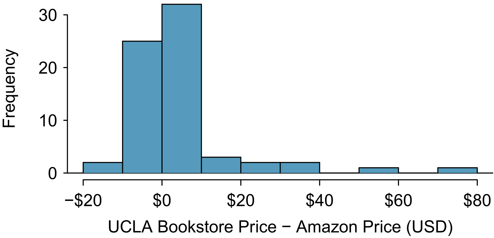
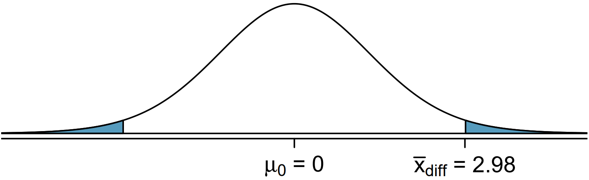

<!doctype html>
<html lang="en" class="no-js">
  <head>
    

<meta charset="utf-8">


<!-- begin SEO -->


<title>Tutorial 10: Inference for Numerical Data   MATH 224 - Intro to Stat</title>


<meta property="og:locale" content="en-US">
<meta property="og:site_name" content="MATH 224 - Intro to Stat">
<meta property="og:title" content="Tutorial 10: Inference for Numerical Data">


  <link rel="canonical" href="http://localhost:4000/files/Shiny%20Tutorials/9_HTandCInum/ToBeUsed%20-%20Inference%20for%20numerical%20data.Rmd">
  <meta property="og:url" content="http://localhost:4000/files/Shiny%20Tutorials/9_HTandCInum/ToBeUsed%20-%20Inference%20for%20numerical%20data.Rmd">


  

  


  <script type="application/ld+json">
    {
      "@context" : "http://schema.org",
      "@type" : "Person",
      "name" : "Intro To Stat NCAT",
      "url" : "http://localhost:4000",
      "sameAs" : null
    }
  </script>


<!-- end SEO -->


<link href="http://localhost:4000/feed.xml" type="application/atom+xml" rel="alternate" title="MATH 224 - Intro to Stat Feed">

<!-- http://t.co/dKP3o1e -->
<meta name="HandheldFriendly" content="True">
<meta name="MobileOptimized" content="320">
<meta name="viewport" content="width=device-width, initial-scale=1.0">

<script>
  document.documentElement.className = document.documentElement.className.replace(/\bno-js\b/g, '') + ' js ';
</script>

<!-- For all browsers -->
<link rel="stylesheet" href="http://localhost:4000/assets/css/main.css">

<meta http-equiv="cleartype" content="on">
    

<!-- start custom head snippets -->

<link rel="apple-touch-icon" sizes="57x57" href="http://localhost:4000/images/apple-touch-icon-57x57.png?v=M44lzPylqQ">
<link rel="apple-touch-icon" sizes="60x60" href="http://localhost:4000/images/apple-touch-icon-60x60.png?v=M44lzPylqQ">
<link rel="apple-touch-icon" sizes="72x72" href="http://localhost:4000/images/apple-touch-icon-72x72.png?v=M44lzPylqQ">
<link rel="apple-touch-icon" sizes="76x76" href="http://localhost:4000/images/apple-touch-icon-76x76.png?v=M44lzPylqQ">
<link rel="apple-touch-icon" sizes="114x114" href="http://localhost:4000/images/apple-touch-icon-114x114.png?v=M44lzPylqQ">
<link rel="apple-touch-icon" sizes="120x120" href="http://localhost:4000/images/apple-touch-icon-120x120.png?v=M44lzPylqQ">
<link rel="apple-touch-icon" sizes="144x144" href="http://localhost:4000/images/apple-touch-icon-144x144.png?v=M44lzPylqQ">
<link rel="apple-touch-icon" sizes="152x152" href="http://localhost:4000/images/apple-touch-icon-152x152.png?v=M44lzPylqQ">
<link rel="apple-touch-icon" sizes="180x180" href="http://localhost:4000/images/apple-touch-icon-180x180.png?v=M44lzPylqQ">
<link rel="icon" type="image/png" href="http://localhost:4000/images/favicon-32x32.png?v=M44lzPylqQ" sizes="32x32">
<link rel="icon" type="image/png" href="http://localhost:4000/images/android-chrome-192x192.png?v=M44lzPylqQ" sizes="192x192">
<link rel="icon" type="image/png" href="http://localhost:4000/images/favicon-96x96.png?v=M44lzPylqQ" sizes="96x96">
<link rel="icon" type="image/png" href="http://localhost:4000/images/favicon-16x16.png?v=M44lzPylqQ" sizes="16x16">
<link rel="manifest" href="http://localhost:4000/images/manifest.json?v=M44lzPylqQ">
<link rel="mask-icon" href="http://localhost:4000/images/safari-pinned-tab.svg?v=M44lzPylqQ" color="#000000">
<link rel="shortcut icon" href="/images/favicon.ico?v=M44lzPylqQ">
<meta name="msapplication-TileColor" content="#000000">
<meta name="msapplication-TileImage" content="http://localhost:4000/images/mstile-144x144.png?v=M44lzPylqQ">
<meta name="msapplication-config" content="http://localhost:4000/images/browserconfig.xml?v=M44lzPylqQ">
<meta name="theme-color" content="#ffffff">
<link rel="stylesheet" href="http://localhost:4000/assets/css/academicons.css"/>

<script type="text/x-mathjax-config"> MathJax.Hub.Config({ TeX: { equationNumbers: { autoNumber: "all" } } }); </script>
<script type="text/x-mathjax-config">
  MathJax.Hub.Config({
    tex2jax: {
      inlineMath: [ ['$','$'], ["\\(","\\)"] ],
      processEscapes: true
    }
  });
</script>
<script src='https://cdnjs.cloudflare.com/ajax/libs/mathjax/2.7.4/latest.js?config=TeX-MML-AM_CHTML' async></script>

<!-- end custom head snippets -->

  </head>

  <body>

    <!--[if lt IE 9]>
<div class="notice--danger align-center" style="margin: 0;">You are using an <strong>outdated</strong> browser. Please <a href="http://browsehappy.com/">upgrade your browser</a> to improve your experience.</div>
<![endif]-->
    

<div class="masthead">
  <div class="masthead__inner-wrap">
    <div class="masthead__menu">
      <nav id="site-nav" class="greedy-nav">
        <button><div class="navicon"></div></button>
        <ul class="visible-links">
          <li class="masthead__menu-item masthead__menu-item--lg"><a href="http://localhost:4000/">MATH 224 - Intro to Stat</a></li>
          
            
            <li class="masthead__menu-item"><a href="http://localhost:4000/home/">Home</a></li>
          
            
            <li class="masthead__menu-item"><a href="http://localhost:4000/syllabus/">Syllabus</a></li>
          
            
            <li class="masthead__menu-item"><a href="http://localhost:4000/slides/">Slides</a></li>
          
            
            <li class="masthead__menu-item"><a href="http://localhost:4000/labs/">Computing Labs</a></li>
          
            
            <li class="masthead__menu-item"><a href="http://localhost:4000/tutorials/">R Tutorials</a></li>
          
            
            <li class="masthead__menu-item"><a href="http://localhost:4000/dap/">Data Analysis Project</a></li>
          
            
            <li class="masthead__menu-item"><a href="http://localhost:4000/assessments/">Assessments</a></li>
          
            
            <li class="masthead__menu-item"><a href="http://localhost:4000/research/">Research/Publication</a></li>
          
            
            <li class="masthead__menu-item"><a href="http://localhost:4000/manual/">Implementation Manual</a></li>
          
            
            <li class="masthead__menu-item"><a href="http://localhost:4000/workshop/">Faculty Workshops</a></li>
          
        </ul>
        <ul class="hidden-links hidden"></ul>
      </nav>
    </div>
  </div>
</div>

    


<div id="main" role="main">
  


  <div class="sidebar sticky">
  


<div itemscope itemtype="http://schema.org/Person">

  <div class="author__avatar">
    
    	
    
  </div>

  <div class="author__content">
    <h3 class="author__name">Introduction to Probability & Statistics</h3>
    
  </div>

  <div class="author__urls-wrapper">
    <button class="btn btn--inverse">Follow</button>
    <ul class="author__urls social-icons">
      
        <li><i class="fa fa-fw fa-map-marker" aria-hidden="true"></i> NC A&T State University</li>
      
      
      
      
      
       
      
      
      
      
      
      
      
      
      
        <li><a href="https://github.com/IntroToStatNCAT/IntroToStatNCAT.github.io"><i class="fab fa-fw fa-github" aria-hidden="true"></i> Github</a></li>
      
      
      
      
      
      
      
      
      
      
      
      
      
      
      
      
      
      
    </ul>
  </div>
</div>

  
  </div>


  <article class="page" itemscope itemtype="http://schema.org/CreativeWork">
    <meta itemprop="headline" content="Tutorial 10: Inference for Numerical Data">
    
    
    

    <div class="page__inner-wrap">
      
        <header>
          <h1 class="page__title" itemprop="headline">Tutorial 10: Inference for Numerical Data
</h1>
          
        
        
        
        
             
        
    
        </header>
      

      <section class="page__content" itemprop="text">
        ```{r setup, include=FALSE}
#knitr::opts_chunk$set(eval = FALSE)
library(dplyr)
library(ggplot2)
library(learnr)
library(gradethis) #remotes::install_github("rstudio/gradethis")
library(learnrhash) #devtools::install_github("rundel/learnrhash")


tutorial_options(exercise.timelimit = 60, exercise.checker = gradethis::grade_learnr)
```

## One-sample means with the t-distribution

If you've never coded before (or even if you have), type `"Your Name"` in the interactive R chunk below and run it by hitting `crtl+Enter` or `cmd+Enter` for MAC users.

```{r Student-Name, exercise = TRUE}

```

Similar to how we can model the behavior of the sample proportion $\hat p$ using a normal distribution, the sample mean $\bar x$ can also be modeled using a normal distribution when certain conditions are met. However, we will soon learn that a new distribution, called the $t$-distribution, then we will use it to construct confidence intervals and conduct hypothesis tests for the mean.

### 

### The sampling distribution of $\bar x$

The sample mean tends to follow a normal distribution centered at the population mean, $\mu$, when certain conditions are met. Additionally, we can compute a standard error for the sample mean using the population standard deviation $\sigma$ and the sample size $n$.

### 

***Central limit theorem for the sample mean***

When we collect a sufficiently large sample of $n$ independent observations from a population with mean $\mu$ and standard deviation $\sigma$, the sampling distribution of $\bar x$ will be nearly normal with

$$\text{Mean} = \mu ~~~~~~~~~~~~~~~~~~~~~ \text{Standard Error}(SE) = \frac{\sigma}{\sqrt{n}} $$

### 

Before diving into confidence intervals and hypothesis tests using $\bar x$, we first need to conver two topics:

-   When we modeled $\hat p$ using the normal distribution, certain conditions had to be satisfied. The conditions for working with $\bar x$ are a little more complex, and we will spend the next section discussing how to check conditions for inference.

-   The standard error is dependent on the population standard deviation, $\sigma$. However, we rarely know $\sigma$, and instead we must estimate it. Because this estimation is itself imperfect, we use a new distribution called the $t$-distribution to fix this problem.

### Evaluating the two conditions required for modeling $\bar x$

Two conditions are required to apply the Central limit theorem for a sample mean $\bar x$:

**Independence.** The sample observations must be independent. The most common way to satisfy this condition is when the sample is a simple random sample from the population. If the data comes from a random process, analogus to rolling a die, this would also satisfy the independence condition.

**Normality.** When a sample is small, we also require that the sample observations come from a normally distributed population. We can relax this condition more and more for larger and larger sample sizes. This condition is obviously vague, making it difficult to evaluate, so next we introduce a couple rules of thumb to make checking this condition easier.

### Rules of thumb: How to perform the normality check

There is no perfect way to check the normality condition, so instead we use two rules of thumb:

-   **n \< 30 :** If the sample size $n$ is less than 30 and there are no clear outliers in the data, then we typically assume the data come from a nearly normal distribution to satisfy the condition.

-   $\mathbf{n \ge 30:}$ If the sample size $n$ is at least 30 and there are no *particularly extreme* outliers, then we typically assume the sampling distribution of $\bar x$ is nearly normal, even if the underlying distribution of individual observations is not.

### 

In this course, you aren't expected to develop perfect judgement on the normality condition. However, you are expected to be able to handle clear cut cases based on the rules of thumb.

In practice, it's typical to also do a mental check to evaluate whether we have reason to believe the underlying population would have moderate skew (if $n < 30$) or have aprticularly extreme outliers ($n \ge 30$) beyond what we observe in the data. For example, consider the number of followers for each individual account on Twitter, and then imagine the distribution. The large majority of accounts have built up a couple thousand followers or fewer, while relatively tiny fraction have amassed tens of millions of followers, meaning the distribution is extremely skewed. When we know the data come from such an extremely skewed distribution, it takes some effor to understand what sample size is large enough for the normality condition to be satisfied.

### Introducing the $t$-distribution

In practice, we cannot directly calculate the standard error for $\bar x$ since we do not know the population standard deviation, $\sigma$. We encountered a similar issue when computing the standard error for a sample proportion, which relied on the population proportion, $p$. Our solution in the proportion context was to use sample value in place of the population value when computing the standard error. We will employ a similar strategy for computing the standard error of $\bar x$, using the sample standard deviation $s$ in place of $\sigma$:

$$ SE = \frac{\sigma}{\sqrt{n}} \approx \frac{s}{\sqrt{n}} $$

This strategy tends to work well when we have a lot of data and can estimate $\sigma$ using $s$ accurately. However, the estimate is less precise with smaller samples, and this leads to problems when using the normal distribution to model $\bar x$.

### 

We will find it useful to use a new distribution for inference called the $\mathbf{t}$**-distribution**. A $t$- distribution, shown as a solid line in the figure below, has a bell shape. However, its tails are thicker than the normal distribution's, meaning observations are more likely to fall beyond two standard deviations from the mean than under the normal distribution. The extra thick tails of the $t$-distribution are exactly the correction needed to resolve the problem of using $s$ in place of $\sigma$ in the $SE$ calculation.

{width="80%"}

### 

The $t$-distribution is always centered at zero and has a single parameter: degrees of freedom. The **degrees of freedom** $\mathbf{(df)}$ describes the precise form of the bell-shaped $t$-distribution. Several $t$-distributions are shown in the figure below in comparison to the normal distribution.

In general, we will use a $t$-distribution with $df = n-1$ to model the sample mean when the sample size is $n$. That is, when we have more observations, the degrees of freedom will be larger and the $t$-distribution will look more like the standard normal distribution: when the degrees of freedom is about 30 or more, the $t$-distribution is nearly indistinguishable from the normal distribution.

{width="80%"}

### 

**Degrees of Freedom** $\mathbf(df)$

The degrees of freedom describes the shape of the $t$-distribution. The larger the degrees of freedom, the more closely the distribution approximates the normal model.

When modeling $\bar x$ using the $t$-distribution, use $df = n - 1$.

### 

The $t$-distribution allows us greater flexibility than the normal distribution when analyzing numerical data. In practice, its common to use a statistical software, such as R, Python or SAS for these analyses. Alternatively, a graphing calculator or a **t-table** may be used; the $t$-table is similar to the normal distribution table.

{width="80%"}

{width="80%"}

### 

Just like the normal distribution, we can use R to find the area to the below a certain standard deviation.

We can find the area to the left of 1.75 standard deviations with 12 degrees of freedom by using the following:

```{r pt1_example}
pt(1.75, df = 12)
```

### 

What proportion of the $t$-distribution with 18 degrees of freedom falls below -2.10?

```{r exercise_pt_1, exercise = TRUE, exercise.eval = TRUE}

```

```{r exercise_pt_1-check}
grade_result(
  pass_if(~ (abs(.result-0.0250452) < 0.01))
)
```

### 

What proportion of the $t$-distribution with 20 degrees of freedom falls above 1.65?

```{r exercise_pt_2, exercise = TRUE, exercise.eval = TRUE}

```

```{r exercise_pt_2-check}
grade_result(
  pass_if(~ (abs(.result-0.05728041) < 0.01))
)
```

### 

To find the two tailed proportion with 2 degrees of freedom more than 3 units from the mean, we will do the following

```{r pt2_1_example}
2*pt(-3, df = 2, lower.tail = TRUE)
```

OR

```{r pt2_2_example}
pt(-3, df = 2, lower.tail = TRUE) + pt(3, df = 2, lower.tail = FALSE)
```

OR

```{r pt2_3_example}
pt(-3, df = 2, lower.tail = TRUE) + 1 -  pt(3, df = 2, lower.tail = TRUE)
```

We can see that there are multiple ways to acquire the same results by modifying the arguments with the use of the complement rule.

### One sample $t$-confidence intervals

Let's get our first taste of applying the $t$-distribution in the context of an example about the mercury content of dolphin muscle. Elevated mercury concentration are an omportant problem for both dolphins and other animals, like humans, who occasionally eat them.

We will identify a confidence interval for the average mercury content in dolphin muscle using a sample of 19 Risso's dolphins from the Taiji area in Japan. The data are summarized in the table below. The minimum and maximum observed values can be used to evaluate whether or not there are clear outliers.

| Metric   | Value |
|----------|-------|
| n        | 19    |
| $\bar x$ | 4.4   |
| s        | 2.3   |
| minimum  | 1.7   |
| maximum  | 9.2   |

You can use the code block below for any calculations you need to make.

```{r example_7_6_sandbox, exercise = TRUE}

```

```{r example_7_6, echo=FALSE}
question("Are the independence and normality conditions satisfied for this data set?",
  answer("Yes", correct = TRUE, message = "The observations are a simple random sample, therefore independence is reasonable. The summary statistics don't suggest any clear outliers, since all observations are within 2.5 standard deviations of the mean. Based on this evidence, the normality condition seems reasonable."),
  answer("No"),
  allow_retry = TRUE
)
```

### 

In the normal model, we used $z^*$ and the standard error to determine the width of a confidence interval. We revise the confidence interval formula slightly when using the $t$-distribution:

$$ point~estimate \pm t^*_{df} \times SE ~~~~~\rightarrow~~~~~ \bar x \pm t^*_{df} \times \frac{s}{\sqrt{n}} $$

Using the summary statistics, compute the standard error for the average mercury content in the $n = 19$ dolphins.

```{r example_7_7, exercise = TRUE, exercise.eval = TRUE}

```

```{r example_7_7-check}
grade_result(
  pass_if(~ (abs(.result-0.5276562) < 0.01))
)
```

### 

The values $t^*_{df}$ is a cutoff we obtain based on the confidence level and the $t$-distribution with $df$ degrees of freedom. That cutoff is found in the same way as with a normal distribution: we find $t^*_{df}$ such that the fraction of the $t$-distribution with $df$ degrees of freedom within a distance $t^*_{df}$ of 0 matches the confidence level of interest.

When n = 19, what is the appropriate degrees of freedom?

```{r example_7_8, echo=FALSE}
question("Choose the right answer.",
  answer("$n = 20$"),
  answer("$n = 19$"),
  answer("$n = 18$", correct = TRUE, message = "$df = n -1 = 19 - 1 = 18$"),
  answer("$n = 17$"),
  allow_retry = TRUE
)
```

### 

For a 95% confidence level, $t^*_{df}$ for the calculated $df$ from above is 2.10.

We can find this by doing the following:

```{r find_t}
qt(1.95/2, df = 18)
```

**Reminder:**

| Metric   | Value |
|----------|-------|
| n        | 19    |
| $\bar x$ | 4.4   |
| s        | 2.3   |
| minimum  | 1.7   |
| maximum  | 9.2   |

$$ point~estimate \pm t^*_{df} \times SE ~~~~~\rightarrow~~~~~ \bar x \pm t^*_{df} \times \frac{s}{\sqrt{n}} $$

Use the code chunk below to compute the 95% confidence interval for the average mercury content in Risso's dolphins

```{r example_7_9_sandbox, exercise = TRUE}

```

```{r example_7_9, echo=FALSE}
question("Choose the right confidence interval.",
  answer("$(5.51, 3.29)$"),
  answer("$(3.29, 5.51)$", correct = TRUE, message = "$4.4 \\pm 2.10 \\times 0.528 \\rightarrow (3.29, 5.51)$"),
  answer("$(-1.89, 5.23)$"),
  answer("$(-10, 10)$"),
  allow_retry = TRUE
)
```

### Confidence interval for a single mean

Once you've determined a one-mean confidence interval would be helpful for an application, there are four steps to constructing the interval:

**Prepare.** Identify $\bar x, s, n,$ and determine what confidence level you wish to use.

**Check.** Verify the conditions to ensure $\bar x$ is nearly normal.

**Calculate.** If the conditions hold, compute, $SE$, find $t^*_{df}$ and construct the interval.

**Conclude.** Interpret the confidence interval in the context of the problem.

### One sample $t$-tests

Is the typical US runner getting faster or slower over time? We consider this question in the context of the Cherry Blossom Race, which is a 10-mile race in Washington, DC each spring.

The average time for all runner who finished the Cherry Blossom Race in 2006 was 93.29 minutes (93 minutes and about 17 seconds). We want to determine using data from 100 participants in the 2017 Cherry Blossom Race whether runners in this race are getting faster or slower, versus the other possibility that there has been no change.

### 

When completing a hypothesis test, for the one-sample mean, the process is nearly identical to completing a hypothesis test for a single proportion. First, we find the Z-score using the observed value, null value, and standard error; however, we call it a **T-score** since we use a $t$-distribution for calculating the tail area. Then we find the p-value using the same ideas we used previously: find the one-tail area under the sampling distribution, and double it.

{width="80%"}

With both the independence and normality conditions satisfied, we can proceed with a hypothesis test using the $t$-distribution. The sample mean and sample standard deviation of the sample of 100 runner from the 2017 Cherry Blossom Race are 97.32 and 16.98 minutes, respectively. Recall that the sample size is 100 and the average run time in 2006 was 93.29 minutes.

Lets find the test statistics and p-value.

### 

To find the test statistic (T-score), we first must determine the standard error:

$$  SE = \frac{16.98}{\sqrt{100}} = 1.70 $$

Now we can compute the T-score using the sample mean (97.32), null value (93.29), and $SE$ (1.70):

$$  T = \frac{97.32 - 93.29}{1.70} = 2.37 $$

For $df = 100 - 1 = 99$, we can determine using R that the one tail area is 0.01. which we double to get the p-value of 0.02.

```{r example7_16}
2*pt(-2.37, df = 99, lower.tail = TRUE)
```

### 

Because the p-value is smaller than 0.05, we reject the null hypothesis. That is, the data provide strong evidence that the average run time for the Cherry Blossom Run in 2017 is different than the 2006 average. Since the observed value is above the null value and we have rejected the null hypothesis, we would conclude that runners in the race were slower on average in 2017 than in 2006.

### Hypothesis testing for a single mean

Once you have determined a one-mean hypothesis test is the correct procedure, there are four steps to completing the test:

**Prepare.** Identify the parameter of interest, list out hypotheses, identify the significance level, and identify $\bar x,s$ and $n$.

**Check.** Verify conditions to ensure $\bar x$ is nearly normal.

**Calculate.** If the conditions hold, compute $SE$, compute the T-score, and identify the p-value.

**Conclude.** Evaluate the hypothesis test by comparing the p-value to $\alpha$, and provide a conclusion in the context of the problem/.

## Paired Data

In an earlier edition of this text book, we found that Amazon prices were, on average, lower than those of the UCLA Bookstore for UCLA courses in 2010. It's been several years, and many stores have adapted to the online market, so we wondered, how is the UCLA Bookstore doing today?

We sampled 201 UCLA courses. Of those, 68 required books could be found on Amazon. A portion of the data set from these courses is shown in the table below, where the prices are in US dollars.

|          | subject                 | course_number | bookstore | amazon   | price_difference |
|----------|-------------------------|---------------|-----------|----------|------------------|
| 1        | American Indian Studies | M10           | 47.97     | 47.45    | 0.52             |
| 2        | Anthropology            | 2             | 14.26     | 13.55    | 0.71             |
| 3        | Arts and Architecture   | 10            | 13.50     | 12.53    | 0.97             |
| $\vdots$ | $\vdots$                | $\vdots$      | $\vdots$  | $\vdots$ | $\vdots$         |
| 68       | Jewish studies          | M10           | 35.96     | 32.40    | 3.56             |

### 

### Paired observations

Each textbook has two corresponding prices in the data set: one for the UCLA Bookstore and one for Amazon. When two sets of observations have this special correspondence, they are said to be **paired**.

### 

**Paired data**

Two sets of observations are *paired* if each observation in one set has a special correspondence or connection with exactly one observation in the other data set.

### 

To analyze paired data, it is often useful to look at the difference in outcomes of each pair of observations. In the textbook data, we look at the differences in prices, which is represented as the `price_difference` variable in the data set. Here the differences are taken as

$$  \text{UCLA Bookstore price} - \text{Amazon price} $$

It is important that we always subtract using a consistent order; here Amazon prices are always subtracted from UCLA prices. The first difference shown in the table above is computed as $47.97 - 47.45 = 0.52$. Similarly, the second difference is computed as $14.26 - 13.55 = 0.71$, and the third is $13.50 - 12.53 = 0.97$. A histogram of the differences is shown in the figure below. Using differences between paired observations is a common and useful way to analyze paired data.

{width="80%"}

### Inference for paired data

To analyze a paired data set, we simply analyze the differences.

$$n_{diff} = 68~~~~~\bar{x}_{diff} = 3.58~~~~~s_{diff} = 13.42 $$

Lets set up a hypothesis test to determine whether, on average, there is a difference between Amazon's price for a book and the UCLA bookstore's price. Also, check the conditions for whether we can move forward with the test using the $t$-distribution.

We are considering two scenarios: there is no difference or there is some difference in average prices.

$$H_0: \mu_{diff} = 0. \text{ There is no difference in the average textbook price.}$$

$$H_A: \mu_{diff} \ne 0. \text{ There is a difference in average prices.}$$

### 

Next, we will check the independence and normality conditions.

The observations are based on a simple random sample, so independence is reasonable. While there are some outliers, $n = 68$ and none of the outliers are particularly extreme, so the normality of $\bar x$ is satisfied. With these conditions satisfied, we can move forward with the $t$-distribution.

### 

Let's complete the hypothesis test.

To compute the test, we need to compute the standard error associated with $\bar{x}_{diff}$ using the standard deviation of the differences ($s_{diff} = 13.42$) and the number of differences ($n_{diff} = 68$):

$$SE_{\bar{x}_{diff}} = \frac{s_{diff}}{\sqrt{n_{diff}}} = \frac{13.42}{\sqrt{68}} = 1.63$$

The test statistics is the T-score of $\bar{x}_{diff}$ under the null condition that the actual mean difference is 0:

$$T = \frac{\bar{x}_{diff} - 0}{SE_{\bar{x}_{diff}}} = \frac{3.58 - 0}{1.63} = 2.20$$

To visualize the p-value, the sampling distribution of $\bar{x}_{diff}$ is drawn as though $H_0$ is true, and the p-value is represented by the two shaded tails:

{width="80%"}

The degrees of freedom is $df = 68 -1 = 67$. Using R, we find the one-tail area of 0.0156. Doubling this area gives the p-value: 0.0312.

```{r t_example7_18}
2*pt(-2.20, df = 67, lower.tail = TRUE)
```

Because the p-value is less than 0.05, we reject the null hypothesis. Amazon prices are, on average, lower than the UCLA Bookstore prices for UCLA courses.

## Submit

```{r context="server"}
learnrhash::encoder_logic(strip_output = TRUE)
```

```{r encode, echo=FALSE}
learnrhash::encoder_ui(
  ui_before = shiny::div(
    "If you have completed this tutorial and are happy with all of your",
    "solutions, please click the button below to generate your hash and",
    "submit it using the corresponding tutorial assignment tab on Blackboard",
    shiny::tags$br()
  ), 
  ui_after = shiny::tags$a(href = "https://blackboard.ncat.edu/", "NCAT Blackboard")
)
```

## Summary

Wow -- good work through all of that! I hope you found the application to sentence lengths in the SDNY to be interesting and eye-opening. The approaches to these problems were really drawn out, step-by-step, to help you identify the necessary steps for computing a confidence interval or conducting a hypothesis test with numerical data. Think about each individual step you were asked to complete and how that step relates to the larger process of completing the inference task. Doing this will help you become a better independent problem solver. Your next workbook will provide you an opportunity to practice with a mixture of inference tasks dealing with both numerical and categorical data. You'll become more comfortable with the content and applying our statistical techniques as you work through more and more problems.

        
      </section>

      <footer class="page__meta">
        
        


      </footer>

      

      


    </div>

    
  </article>

  
  
</div>


    <div class="page__footer">
      <footer>
        <!-- start custom footer snippets -->
<a href="/sitemap/">Sitemap</a>
<!-- end custom footer snippets -->

        

<div class="page__footer-follow">
  <ul class="social-icons">
    
      <li><strong>Follow:</strong></li>
    
    
    
    
      <li><a href="http://github.com/IntroToStatNCAT/IntroToStatNCAT.github.io"><i class="fab fa-github" aria-hidden="true"></i> GitHub</a></li>
    
    
    <li><a href="http://localhost:4000/feed.xml"><i class="fa fa-fw fa-rss-square" aria-hidden="true"></i> Feed</a></li>
  </ul>
</div>

<div class="page__footer-copyright">&copy; 2022 Intro To Stat NCAT. Powered by <a href="http://jekyllrb.com" rel="nofollow">Jekyll</a> &amp; <a href="https://github.com/academicpages/academicpages.github.io">AcademicPages</a>, a fork of <a href="https://mademistakes.com/work/minimal-mistakes-jekyll-theme/" rel="nofollow">Minimal Mistakes</a>.</div>

      </footer>
    </div>

    <script src="http://localhost:4000/assets/js/main.min.js"></script>


  <script>
  (function(i,s,o,g,r,a,m){i['GoogleAnalyticsObject']=r;i[r]=i[r]||function(){
  (i[r].q=i[r].q||[]).push(arguments)},i[r].l=1*new Date();a=s.createElement(o),
  m=s.getElementsByTagName(o)[0];a.async=1;a.src=g;m.parentNode.insertBefore(a,m)
  })(window,document,'script','//www.google-analytics.com/analytics.js','ga');

  ga('create', '', 'auto');
  ga('send', 'pageview');
</script>


  </body>
</html>

