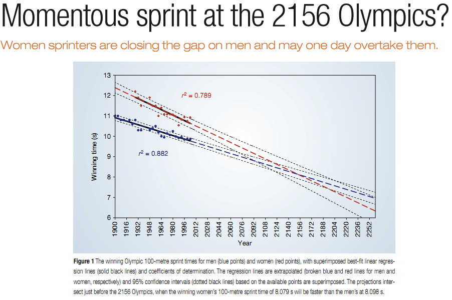

<!doctype html>
<html lang="en" class="no-js">
  <head>
    

<meta charset="utf-8">


<!-- begin SEO -->


<title>Chapter 8   MATH 224 - Intro to Stat</title>


<meta property="og:locale" content="en-US">
<meta property="og:site_name" content="MATH 224 - Intro to Stat">
<meta property="og:title" content="Chapter 8">


  <link rel="canonical" href="http://localhost:4000/files/Slides/Chapter%208/Section%208.2%20Fitting%20a%20Line%20by%20Least%20Squares%20Regression/Section8.2-FittingALineByLeastSquaresRegression.rmd">
  <meta property="og:url" content="http://localhost:4000/files/Slides/Chapter%208/Section%208.2%20Fitting%20a%20Line%20by%20Least%20Squares%20Regression/Section8.2-FittingALineByLeastSquaresRegression.rmd">


  

  


  <script type="application/ld+json">
    {
      "@context" : "http://schema.org",
      "@type" : "Person",
      "name" : "Intro To Stat NCAT",
      "url" : "http://localhost:4000",
      "sameAs" : null
    }
  </script>


<!-- end SEO -->


<link href="http://localhost:4000/feed.xml" type="application/atom+xml" rel="alternate" title="MATH 224 - Intro to Stat Feed">

<!-- http://t.co/dKP3o1e -->
<meta name="HandheldFriendly" content="True">
<meta name="MobileOptimized" content="320">
<meta name="viewport" content="width=device-width, initial-scale=1.0">

<script>
  document.documentElement.className = document.documentElement.className.replace(/\bno-js\b/g, '') + ' js ';
</script>

<!-- For all browsers -->
<link rel="stylesheet" href="http://localhost:4000/assets/css/main.css">

<meta http-equiv="cleartype" content="on">
    

<!-- start custom head snippets -->

<link rel="apple-touch-icon" sizes="57x57" href="http://localhost:4000/images/apple-touch-icon-57x57.png?v=M44lzPylqQ">
<link rel="apple-touch-icon" sizes="60x60" href="http://localhost:4000/images/apple-touch-icon-60x60.png?v=M44lzPylqQ">
<link rel="apple-touch-icon" sizes="72x72" href="http://localhost:4000/images/apple-touch-icon-72x72.png?v=M44lzPylqQ">
<link rel="apple-touch-icon" sizes="76x76" href="http://localhost:4000/images/apple-touch-icon-76x76.png?v=M44lzPylqQ">
<link rel="apple-touch-icon" sizes="114x114" href="http://localhost:4000/images/apple-touch-icon-114x114.png?v=M44lzPylqQ">
<link rel="apple-touch-icon" sizes="120x120" href="http://localhost:4000/images/apple-touch-icon-120x120.png?v=M44lzPylqQ">
<link rel="apple-touch-icon" sizes="144x144" href="http://localhost:4000/images/apple-touch-icon-144x144.png?v=M44lzPylqQ">
<link rel="apple-touch-icon" sizes="152x152" href="http://localhost:4000/images/apple-touch-icon-152x152.png?v=M44lzPylqQ">
<link rel="apple-touch-icon" sizes="180x180" href="http://localhost:4000/images/apple-touch-icon-180x180.png?v=M44lzPylqQ">
<link rel="icon" type="image/png" href="http://localhost:4000/images/favicon-32x32.png?v=M44lzPylqQ" sizes="32x32">
<link rel="icon" type="image/png" href="http://localhost:4000/images/android-chrome-192x192.png?v=M44lzPylqQ" sizes="192x192">
<link rel="icon" type="image/png" href="http://localhost:4000/images/favicon-96x96.png?v=M44lzPylqQ" sizes="96x96">
<link rel="icon" type="image/png" href="http://localhost:4000/images/favicon-16x16.png?v=M44lzPylqQ" sizes="16x16">
<link rel="manifest" href="http://localhost:4000/images/manifest.json?v=M44lzPylqQ">
<link rel="mask-icon" href="http://localhost:4000/images/safari-pinned-tab.svg?v=M44lzPylqQ" color="#000000">
<link rel="shortcut icon" href="/images/favicon.ico?v=M44lzPylqQ">
<meta name="msapplication-TileColor" content="#000000">
<meta name="msapplication-TileImage" content="http://localhost:4000/images/mstile-144x144.png?v=M44lzPylqQ">
<meta name="msapplication-config" content="http://localhost:4000/images/browserconfig.xml?v=M44lzPylqQ">
<meta name="theme-color" content="#ffffff">
<link rel="stylesheet" href="http://localhost:4000/assets/css/academicons.css"/>

<script type="text/x-mathjax-config"> MathJax.Hub.Config({ TeX: { equationNumbers: { autoNumber: "all" } } }); </script>
<script type="text/x-mathjax-config">
  MathJax.Hub.Config({
    tex2jax: {
      inlineMath: [ ['$','$'], ["\\(","\\)"] ],
      processEscapes: true
    }
  });
</script>
<script src='https://cdnjs.cloudflare.com/ajax/libs/mathjax/2.7.4/latest.js?config=TeX-MML-AM_CHTML' async></script>

<!-- end custom head snippets -->

  </head>

  <body>

    <!--[if lt IE 9]>
<div class="notice--danger align-center" style="margin: 0;">You are using an <strong>outdated</strong> browser. Please <a href="http://browsehappy.com/">upgrade your browser</a> to improve your experience.</div>
<![endif]-->
    

<div class="masthead">
  <div class="masthead__inner-wrap">
    <div class="masthead__menu">
      <nav id="site-nav" class="greedy-nav">
        <button><div class="navicon"></div></button>
        <ul class="visible-links">
          <li class="masthead__menu-item masthead__menu-item--lg"><a href="http://localhost:4000/">MATH 224 - Intro to Stat</a></li>
          
            
            <li class="masthead__menu-item"><a href="http://localhost:4000/syllabus/">Syllabus</a></li>
          
            
            <li class="masthead__menu-item"><a href="http://localhost:4000/slides/">Slides</a></li>
          
            
            <li class="masthead__menu-item"><a href="http://localhost:4000/labs/">Statistical Computing Labs</a></li>
          
            
            <li class="masthead__menu-item"><a href="http://localhost:4000/tutorials/">R Tutorials</a></li>
          
            
            <li class="masthead__menu-item"><a href="http://localhost:4000/dap/">Data Analysis Project</a></li>
          
            
            <li class="masthead__menu-item"><a href="http://localhost:4000/workshop/">Faculty Workshop</a></li>
          
            
            <li class="masthead__menu-item"><a href="http://localhost:4000/manual/">Implementation Manual</a></li>
          
            
            <li class="masthead__menu-item"><a href="http://localhost:4000/research/">Research/Publication</a></li>
          
        </ul>
        <ul class="hidden-links hidden"></ul>
      </nav>
    </div>
  </div>
</div>

    


<div id="main" role="main">
  


  <div class="sidebar sticky">
  


<div itemscope itemtype="http://schema.org/Person">

  <div class="author__avatar">
    
    	
    
  </div>

  <div class="author__content">
    <h3 class="author__name">Intro to Statistics</h3>
    
  </div>

  <div class="author__urls-wrapper">
    <button class="btn btn--inverse">Follow</button>
    <ul class="author__urls social-icons">
      
        <li><i class="fa fa-fw fa-map-marker" aria-hidden="true"></i> Mateena Hall</li>
      
      
      
      
      
       
      
      
      
      
      
      
      
      
      
        <li><a href="https://github.com/IntroToStatNCAT/IntroToStatNCAT.github.io"><i class="fab fa-fw fa-github" aria-hidden="true"></i> Github</a></li>
      
      
      
      
      
      
      
      
      
      
      
      
      
      
      
      
      
      
    </ul>
  </div>
</div>

  
  </div>


  <article class="page" itemscope itemtype="http://schema.org/CreativeWork">
    <meta itemprop="headline" content="Chapter 8">
    
    
    

    <div class="page__inner-wrap">
      
        <header>
          <h1 class="page__title" itemprop="headline">Chapter 8
</h1>
          
        
        
        
        
             
        
    
        </header>
      

      <section class="page__content" itemprop="text">
        ```{r setup, include=FALSE}
knitr::opts_chunk$set(echo = FALSE)
```

```{r, echo=F, message=F, warning=F}
library(readr)
library(openintro)
library(here)
library(tidyverse)
library(xtable)
library(broom)
library(faraway)
data(COL)
```


# Fitting a line by least squares regression

## An objective measure for finding the best line

\begin{itemize}

\item We want a line that has small residuals:
\pause
\begin{enumerate}
\item Option 1: Minimize the sum of magnitudes (absolute values) of residuals
\[ |e_1| + |e_2| + \cdots + |e_n| \]
\pause
\item Option 2: Minimize the sum of squared residuals -- \textbf{least squares}
\[ e_1^2 + e_2^2 + \cdots + e_n^2 \]
\end{enumerate}

\pause

\item Why least squares?
\pause
\begin{enumerate}
\item Most commonly used
\pause
\item Easier to compute by hand and using software
\pause
\item In many applications, a residual twice as large as another is usually more than twice as bad
\end{enumerate}

\end{itemize}

## The least squares line

\centering{\alert{$\hat{y} = \beta_0 + \beta_1 x$}}

- $\hat{y}:$ Predicted value of the response variable, $y$.

- $\beta_0:$ Intercept, parameter.

  - $b_0:$ Intercept, point estimate.
  
- $\beta_1:$ Slope, parameter

  - $b_1:$ Slope, point estimate
  
- $x:$ Explanatory variable


## Conditions for the least squares line

\begin{enumerate}

\item Linearity.

\pause

\item Nearly normal residuals.

\pause

\item Constant variability.

\end{enumerate}

## Conditions: Linearity

\begin{itemize}

\item The relationship between the explanatory and the response variable should be linear. 

\pause

\item Methods for fitting a model to non-linear relationships exist, but are beyond the scope of this class. If this topic is of interest, an \href{http://www.openintro.org/download.php?file=os2_extra_nonlinear_relationships&referrer=/stat/textbook.php}{Online Extra is available on openintro.org} covering new techniques.

\pause

\item Check using a scatterplot of the data, or a \textbf{residuals plot}.

\end{itemize}

```{r, echo=F, message=F, warning=F, fig.width=4, fig.height=1.5,fig.align='center'}
COL <- c('#22558899', '#000000CC')
set.seed(1)

par(mfrow=2:3, mar=rep(0.5, 4))

MyLayOut <- matrix(1:6, 2)
nf <- layout(mat=MyLayOut, widths=c(2,2,2), heights=c(2,1), respect=TRUE)

n <- c(25)
x <- runif(n[1])
y <- -8*x + rnorm(n[1])
plot(x,y, axes=FALSE, pch=20, col=COL[1], cex=1.202, xlim=c(-0.03, 1.03), ylim=c(-10, 1))
box()
g <- lm(y~x)
abline(g, col=COL[2])
plot(x, summary(g)$residuals, pch=20, col=COL[1], cex=1.202, xlim=c(-0.03, 1.03), axes=FALSE, ylim=2.5*c(-1,1)*max(abs(summary(g)$residuals)))
box()
abline(h=0, col=COL[2], lty=2)

n <- 30
x <- c(runif(n[1]-2, 0, 4), 2, 2.1)
y <- -2*x^2 + rnorm(n[1])
plot(x,y, axes=FALSE, pch=20, col=COL[1], cex=1.202, xlim=c(-0.2, 4.2), ylim=c(-35, 2))
box()
g <- lm(y~x)
abline(g, col=COL[2])
plot(x, summary(g)$residuals, pch=20, col=COL[1], cex=1.202, xlim=c(-0.2, 4.2), axes=FALSE, ylim=1.8*c(-1,1)*max(abs(summary(g)$residuals)))
box()
abline(h=0, col=COL[2], lty=2)

n <- 40
x <- runif(n[1])
y <- 0.2*x + rnorm(n[1])
y[y < -2] <- -1.5
plot(x,y, axes=FALSE, pch=20, col=COL[1], cex=1.202, xlim=c(-0.03, 1.03), ylim=c(-2, 2))
box()
g <- lm(y~x)
abline(g, col=COL[2])
plot(x, summary(g)$residuals, pch=20, col=COL[1], cex=1.202, xlim=c(-0.03, 1.03), axes=FALSE, ylim=1.2*c(-1,1)*max(abs(summary(g)$residuals)))
box()
abline(h=0, col=COL[2], lty=2)
```

## Anatomy of a residuals plot

\begin{columns}

\begin{column}{0.5\textwidth}

```{r, echo=F, message=F, warning=F, out.width="100%",fig.align='center'}
data(COL)
poverty = read.table("dataset/poverty.txt", header = T, sep = "\t")

par(mar=c(4,4,1,1), las=1, mgp=c(2.5,0.5,0), cex.lab = 2, cex.axis = 2, mfrow = c(2,1))

lmPlot(x = poverty$Graduates, y = poverty$Poverty, highlight = c(9,40), hlCol = c(COL[4],COL[2]), hlPch = c(15,17), col = COL[1,2], ylab = "% in poverty", xlab = "% HS grad", lCol = COL[4], cex = 2,lwd = 3, xAxis = 4)
```

\end{column}

\begin{column}{0.5\textwidth}

\small

\raisebox{0.5pt}{\tikz{\node[draw,scale=0.3,regular polygon, regular polygon sides=3,fill=green!10!green,rotate=0](){};}} \textbf{RI:}

\begin{align*}
\%~HS~grad &= 81 \hspace{1cm} \%~in~poverty = 10.3 \\
\widehat{\%~in~poverty} &= 64.68 - 0.62 * 81 = 14.46 \\
e &= \%~in~poverty - \widehat{\%~in~poverty} \\
&= 10.3 - 14.46 = \textcolor{green}{-4.16}
\end{align*}

\pause

{\textcolor{red}{\Large $\blacksquare$}} \textbf{DC:}

\begin{align*}
\%~HS~grad &= 86 \hspace{1cm} \%~in~poverty = 16.8 \\
\widehat{\%~in~poverty} &= 64.68 - 0.62 * 86 = 11.36 \\
e &= \%~in~poverty - \widehat{\%~in~poverty} \\
&= 16.8 - 11.36 = \textcolor{red}{5.44}
\end{align*}

\end{column}

\end{columns}

## Conditions: Nearly normal residuals

- The residuals should be nearly normal.

\pause

- This condition may not be satisfied when there are unusual observations that don't follow the trend of the rest of the data.

\pause

- Check using a histogram.

```{r, echo=F, message=F, warning=F, out.width="75%",fig.align='center'}
lm_pov_grad = lm(poverty$Poverty ~ poverty$Graduates)
histPlot(lm_pov_grad$residuals, col = COL[1], xlab = "residuals", cex.lab = 1.5)
```

## Conditions: Constant variability

\begin{columns}

\begin{column}{0.5\textwidth}

```{r, echo=F, message=F, warning=F, out.width="100%",fig.align='center'}
layout(matrix(1:2, 2), c(1,1), c(2,1))
par(mar=c(4,4,1,1))

plot(x = poverty$Graduates, y = poverty$Poverty, ylab = "% in poverty", xlab = "% HS grad", pch=19, col=COL[1,2], cex.lab = 1.3)
makeTube(x = poverty$Graduates, y = poverty$Poverty)

plot(x = poverty$Graduates, y = lm_pov_grad$residuals, pch=19, col=COL[1,2], ylab = "", xlab = "", axes = FALSE, ylim = c(-5.5,5.5))
makeTube(x = poverty$Graduates, y = lm_pov_grad$residuals, addLine = FALSE)
axis(1, at = c(80,90,95))
axis(2, at = c(-4, 0, 4))
box()
abline(h = 0, lty = 2)
```

\end{column}

\begin{column}{0.45\textwidth}

\begin{itemize}

\item The variability of points around the least squares line should be roughly constant.

\pause

\item This implies that the variability of residuals around the 0 line should be roughly constant as well.

\pause

\item Also called \textbf{homoscedasticity}.

\pause

\item Check using a residuals plot.

\end{itemize}

\end{column}

\end{columns}


## Checking conditions

\begin{columns}

\begin{column}{0.45\textwidth}

\alert{What condition is this linear model obviously violating?}

A) Constant variability

B) Linear relationship

C) Normal residuals

D) No extreme outliers

\end{column}

\begin{column}{0.5\textwidth}

\includegraphics[width=1\columnwidth]{nonlinear.pdf}

\end{column}

\end{columns}

## Checking conditions

\begin{columns}

\begin{column}{0.45\textwidth}

\alert{What condition is this linear model obviously violating?}

A) Constant variability

B) \alert{Linear relationship}

C) Normal residuals

D) No extreme outliers

\end{column}

\begin{column}{0.5\textwidth}

\includegraphics[width=1\columnwidth]{nonlinear.pdf}

\end{column}

\end{columns}

## Checking conditions

\begin{columns}

\begin{column}{0.45\textwidth}

\alert{What condition is this linear model obviously violating?}

A) Constant variability

B) Linear relationship

C) Normal residuals

D) No extreme outliers

\end{column}

\begin{column}{0.5\textwidth}

\includegraphics[width=1\columnwidth]{heteroscedastic.pdf}

\end{column}

\end{columns}

## Checking conditions

\begin{columns}

\begin{column}{0.45\textwidth}

\alert{What condition is this linear model obviously violating?}

A) \alert{Constant variability}

B) Linear relationship

C) Normal residuals

D) No extreme outliers

\end{column}

\begin{column}{0.5\textwidth}

\includegraphics[width=1\columnwidth]{heteroscedastic.pdf}

\end{column}

\end{columns}

## Given...

\begin{columns}

\begin{column}{0.5\textwidth}

```{r, echo=F, message=F, warning=F, out.width="100%",fig.align='center'}
par(mar=c(4,4,1,1), las=1, mgp=c(2.5,0.7,0), cex.lab = 2, cex.axis = 2)
plot(poverty$Poverty ~ poverty$Graduates, ylab = "% in poverty", xlab = "% HS grad", pch=19, col=COL[1,2], cex =2)
```

\end{column}

\begin{column}{0.5\textwidth}

\begin{tabular}{l r r}
\hline
		& \% HS grad		& \% in poverty \\
		& $(x)$			& $(y)$ \\
\hline
mean	& $\bar{x} = 86.01$	& $\bar{y} = 11.35$  \\
sd		& $s_x = 3.73$		& $s_y = 3.1$ \\
\hline
		& correlation		& $R = -0.75$ \\
\hline
\end{tabular}

\end{column}

\end{columns}

## Slope

The slope of the regression can be calculated as

\centering{$b_1 = \frac{s_y}{s_x}R$}

\pause

\raggedright \textbf{In context...}

\centering{$b_1 = \frac{3.1}{3.73} \times -0.75 = -0.62$}

\pause

\raggedright \textbf{Interpretation}

For each additional % point in HS graduate rate, we would expect the % living in poverty to be lower on average by 0.62% points.

## Intercept

The intercept is where the regression line intersects the $y$-axis. The calculation of the intercept uses the fact the a regression line always passes through ($\bar{x}, \bar{y}$).

\centering{$b_0 = \bar{y}-b_1 \bar{x}$}

\pause

\begin{columns}

\begin{column}{0.7\textwidth}

```{r, echo=F, message=F, warning=F, out.width="100%",fig.align='center'}
par(mar=c(4,4,1,1), las=1, mgp=c(2.5,0.7,0), cex.lab = 1.5, cex.axis = 1.5)

plot(poverty$Poverty ~ poverty$Graduates, ylab = "% in poverty", xlab = "% HS grad", pch=19, col=COL[1,2], xlim = c(0,100), ylim = c(0,70), cex.lab = 2)
lm_pov_grad = lm(poverty$Poverty ~ poverty$Graduates)
abline(lm_pov_grad, col = COL[4], lwd = 3)
abline(v = 0)
text(y = lm_pov_grad$coefficient[1]+3, x = 7, "intercept", cex = 2, col = COL[1])
```

\end{column}

\begin{column}{0.28\textwidth}

\pause

\begin{align*}
b_0 &= 11.35 - (-0.62) \times 86.01 \\
&= 64.68
\end{align*}

\end{column}

\end{columns}


## Practice

\alert{Which of the following is the correct interpretation of the intercept?}

A) For each % point increase in HS graduate rate, % living in poverty is expected to increase on average by 64.68%.

B) For each % point decrease in HS graduate rate, % living in poverty is expected to increase on average by 64.68%.

C) Having no HS graduates leads to 64.68% of residents living below the poverty line.

D) States with no HS graduates are expected on average to have 64.68% of residents living below the poverty line.

E) In states with no HS graduates % living in poverty is expected to increase on average by 64.68%.

## Practice

\alert{Which of the following is the correct interpretation of the intercept?}

A) For each % point increase in HS graduate rate, % living in poverty is expected to increase on average by 64.68%.

B) For each % point decrease in HS graduate rate, % living in poverty is expected to increase on average by 64.68%.

C) Having no HS graduates leads to 64.68% of residents living below the poverty line.

D) \alert{States with no HS graduates are expected on average to have 64.68\% of residents living below the poverty line.}

E) In states with no HS graduates % living in poverty is expected to increase on average by 64.68%.

## More on the intercept

Since there are no states in the dataset with no HS graduates, the intercept is of no interest, not very useful, and also not reliable since the predicted value of the intercept is so far from the bulk of the data.

```{r, echo=F, message=F, warning=F, out.width="80%",fig.align='center'}
par(mar=c(4,4,1,1), las=1, mgp=c(2.5,0.7,0), cex.lab = 1.5, cex.axis = 1.5)

plot(poverty$Poverty ~ poverty$Graduates, ylab = "% in poverty", xlab = "% HS grad", pch=19, col=COL[1,2], xlim = c(0,100), ylim = c(0,70), cex.lab = 2)
lm_pov_grad = lm(poverty$Poverty ~ poverty$Graduates)
abline(lm_pov_grad, col = COL[4], lwd = 3)
abline(v = 0)
text(y = lm_pov_grad$coefficient[1]+3, x = 7, "intercept", cex = 2, col = COL[1])
```

## Regression line

\centering{$\widehat{\%~in~poverty} = 64.68 - 0.62 \%~HS~grad$}

```{r, echo=F, message=F, warning=F, out.width="100%",fig.align='center'}
par(mar=c(4,4,1,1), las=1, mgp=c(2.5,0.7,0), cex.lab = 1.5, cex.axis = 1.5)
plot(poverty$Poverty ~ poverty$Graduates, ylab = "% in poverty", xlab = "% HS grad", pch=19, col=COL[1,2], cex.lab = 2)
lm_pov_grad = lm(poverty$Poverty ~ poverty$Graduates)
abline(lm_pov_grad, col = COL[4], lwd = 3)
```


## Interpretation of slope and intercept

\begin{columns}

\begin{column}{0.5\textwidth}

\begin{itemize}

\item \textbf{Intercept:} When {$x = 0$}, {$y$} is expected to equal {the intercept}. \\

\item[]

\item \textbf{Slope:} For each {unit} in {$x$}, {$y$} is expected to {increase / decrease} on average by {the slope}.

\end{itemize}

\end{column}

\begin{column}{0.5\textwidth}

\includegraphics[width=1\columnwidth]{diagram.png}

\end{column}

\end{columns}

\noindent\rule{4cm}{0.4pt}

\alert{Note:} These statements are not casual, unless the study is a randomized controlled experiment.

## Prediction

- Using the linear model to predict the value of the response variable for a given value of the explanatory variable is called **prediction**, simply by plugging in the value of $x$ in the linear model equation.

- There will be some uncertainty associated with the predicted value.

```{r, echo=F, message=F, warning=F, out.height="50%",fig.align='center'}
par(mar=c(4,4,1,1), las=1, mgp=c(2.5,0.7,0), cex.lab = 1.5, cex.axis = 1.5)

plot(poverty$Poverty ~ poverty$Graduates, ylab = "% in poverty", xlab = "% HS grad", pch=19, col=COL[1,2], cex.lab = 2, cex = 2)
lm_pov_grad = lm(poverty$Poverty ~ poverty$Graduates)
abline(lm_pov_grad, col = COL[4], lwd = 3)
lines(x = c(82,82), y = c(0,64.781-0.6212*82), lty = 3)
lines(x = c(0,82), y = c(64.781-0.6212*82,64.781-0.6212*82), lty = 3)
```


## Extrapolation

- Applying a model estimate to values outside of the realm of the original data is called **extrapolation**.

- Sometimes the intercept might be an extrapolation.

```{r, echo=F, message=F, warning=F, out.height="55%",fig.align='center'}
par(mar=c(4,4,1,1), las=1, mgp=c(2.5,0.7,0), cex.lab = 2, cex.axis = 2)

plot(poverty$Poverty ~ poverty$Graduates, ylab = "% in poverty", xlab = "% HS grad", pch=19, col=COL[1,2], xlim = c(0,100), ylim = c(0,70))
lm_pov_grad = lm(poverty$Poverty ~ poverty$Graduates)
abline(lm_pov_grad, col = COL[4], lwd = 3)
abline(v = 0)
text(y = lm_pov_grad$coefficient[1]+3, x = 7, "intercept", cex = 2, col = COL[1])
```

## Examples of extrapolation


## Example of extrapolation

{width="90%"}

## Example of extrapolation



## $R^2$

- The strength of the fit of a linear model is most commonly evaluated using $\mathbf{R^2}$.

\pause

- $R^2$ is calculated as the square of the correlation coefficient.

\pause

- It tells us what percent of variability in the response variable is explained by the model.

\pause

- The remainder of the variability is explained by variables not included in the model or by inherent randomness in the data.

\pause

- For the model we've been working with, $R^2 = (-0.75)^2 = 0.56$.

## Interpretation of $R^2$

\alert{Which of the below is the correct interpretation of $R = -0.75, R^2 = 0.56?$}

\begin{columns}

\begin{column}{0.65\textwidth}

A) 56\% of the variability in the \% of HG graduates among the 51 states is explained by the model.

B) 56\% of the variability in the \% of residents living in poverty among the 51 states is explained by the model.\

C) 56\% of the time \% HS graduates predict \% living in poverty correctly.

D) 75\% of the variability in the \% of residents living in poverty among the 51 states is explained by the model.

\end{column}

\begin{column}{0.35\textwidth}

```{r, echo=F, message=F, warning=F, out.height="100%",fig.align='center'}
par(mar=c(4,4,1,1), las=1, mgp=c(2.5,0.7,0), cex.lab = 2, cex.axis = 2)
plot(poverty$Poverty ~ poverty$Graduates, ylab = "% in poverty", xlab = "% HS grad", pch=19, col=COL[1,2], cex = 2)

```

\end{column}

\end{columns}


## Interpretation of $R^2$

\alert{Which of the below is the correct interpretation of $R = -0.75, R^2 = 0.56?$}

\begin{columns}

\begin{column}{0.65\textwidth}

A) 56\% of the variability in the \% of HG graduates among the 51 states is explained by the model.

B) \alert{56\% of the variability in the \% of residents living in poverty among the 51 states is explained by the model.}\

C) 56\% of the time \% HS graduates predict \% living in poverty correctly.

D) 75\% of the variability in the \% of residents living in poverty among the 51 states is explained by the model.

\end{column}

\begin{column}{0.35\textwidth}

```{r, echo=F, message=F, warning=F, out.height="100%",fig.align='center'}
par(mar=c(4,4,1,1), las=1, mgp=c(2.5,0.7,0), cex.lab = 2, cex.axis = 2)
plot(poverty$Poverty ~ poverty$Graduates, ylab = "% in poverty", xlab = "% HS grad", pch=19, col=COL[1,2], cex = 2)

```

\end{column}

\end{columns}
        
      </section>

      <footer class="page__meta">
        
        


      </footer>

      

      


    </div>

    
  </article>

  
  
</div>


    <div class="page__footer">
      <footer>
        <!-- start custom footer snippets -->
<a href="/sitemap/">Sitemap</a>
<!-- end custom footer snippets -->

        

<div class="page__footer-follow">
  <ul class="social-icons">
    
      <li><strong>Follow:</strong></li>
    
    
    
    
      <li><a href="http://github.com/IntroToStatNCAT/IntroToStatNCAT.github.io"><i class="fab fa-github" aria-hidden="true"></i> GitHub</a></li>
    
    
    <li><a href="http://localhost:4000/feed.xml"><i class="fa fa-fw fa-rss-square" aria-hidden="true"></i> Feed</a></li>
  </ul>
</div>

<div class="page__footer-copyright">&copy; 2022 Intro To Stat NCAT. Powered by <a href="http://jekyllrb.com" rel="nofollow">Jekyll</a> &amp; <a href="https://github.com/academicpages/academicpages.github.io">AcademicPages</a>, a fork of <a href="https://mademistakes.com/work/minimal-mistakes-jekyll-theme/" rel="nofollow">Minimal Mistakes</a>.</div>

      </footer>
    </div>

    <script src="http://localhost:4000/assets/js/main.min.js"></script>


  <script>
  (function(i,s,o,g,r,a,m){i['GoogleAnalyticsObject']=r;i[r]=i[r]||function(){
  (i[r].q=i[r].q||[]).push(arguments)},i[r].l=1*new Date();a=s.createElement(o),
  m=s.getElementsByTagName(o)[0];a.async=1;a.src=g;m.parentNode.insertBefore(a,m)
  })(window,document,'script','//www.google-analytics.com/analytics.js','ga');

  ga('create', '', 'auto');
  ga('send', 'pageview');
</script>


  </body>
</html>

