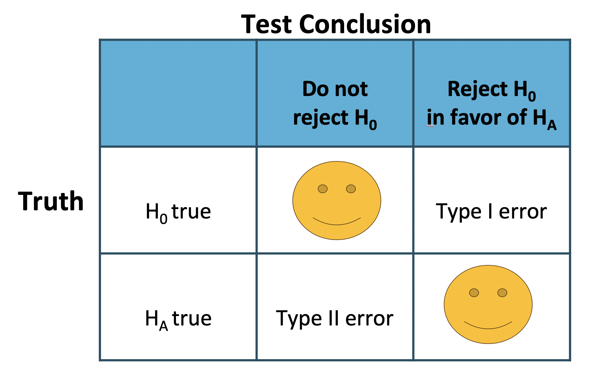

```{r setup, include=FALSE}
#knitr::opts_chunk$set(eval = FALSE)
library(dplyr)
library(ggplot2)
library(learnr)
library(gradethis) #remotes::install_github("rstudio/gradethis")
library(learnrhash) #devtools::install_github("rundel/learnrhash")


tutorial_options(exercise.timelimit = 60, exercise.checker = gradethis::grade_learnr)

#knitr::opts_chunk$set(eval = FALSE)
```

## Objective

If you've never coded before (or even if you have), type `"Your Name"` in the interactive R chunk below and run it by hitting `crtl+Enter` or `cmd+Enter` for MAC users.

```{r Student-Name, exercise = TRUE}

```

Before we start, the following question comes from a book written by Hans Rosling, Anna Rosling Ronnlund, and Ola Rosling called **Factfulness**:

*How many of the world's 1 year old children today have been vaccinated against some disease:*
  
  A) 20%
  B) 50%
  C) 80%


In this tutorial, we will be exploring how people with a 4-year college degree perform on this and other world health questions as we learn about hypothesis tests, which are a framework used to rigorously evaluate competing ideas and claims

## Hypothesis testing framework

We're interested in understanding how much people know about world health and development. If we take a multiple choice world health question, then we might like to understand if

$\mathbf{H_0:}$ People never learn these particular topics and their responses are simply equivalent to random guesses.

$\mathbf{H_A:}$ People have knowledge that helps them do better than random guessing, or perhaps, they have false knowledge that leads them to actually do worse than random guessing.

These competing ideas are called **hypotheses**. We call $H_0$ the null hupothesis and $H_A$ the alternative hypothesis. When there is a subscript 0 like in $H_0$, data scientists pronounce it as "nought" (e.g. $H_0$ is pronounced "H-nought").

### Null and Alternative Hypothesis

The **null hypothesis** ($H_0$) often represents a skeptical perspective or a claim to be tested.

The **alternative hypothesis** ($H_A$) represents an alternative claim under consideration and is often represented by a range of possible parameter values.

###

The null hypothesis often represents a skeptical position or a perspective of "no difference". In our first example, we'll consider whether the typical person does any different than random guessing on Rosling's question about infant vaccinations.

The alternative hypothesis generally represents a new or stronger perspective. In the case of the question about infant vaccinations, it would certainly be interesting to learn whether people do better than random guessing, since that would mean that the typical person knows something about world health statistics. It would also be very interesting if we learned that people do worse than random guessing, which would suggest people believe incorrect information about world health.

###

The hypothesis testing framework is a very general tool, and we often use it without a second thought. If a person makes a somewhat unbelievable claim, we are initially skeptical. However, if there is sufficient evidence that supports the claim, we set aside our skepticism and reject the null hypothesis in favor of the alternative. The hallmarks of hypothesis testing are also found in the US court system.

Jurors examine the evidence to see whether it convincingly shows a defendant is guilty. Even if the jurors leave unconvinced of guilt beyond a reasonable doubt, this does not mean they believe the defendant is innocent. This is also the case with hypothesis testing: *even if we fail to reject the null hypothesis, we typically do not accept the null hypothesis as true*. Failing to find strong evidence for the alternative hypothesis is not equivalent to accepting the null hypothesis.

When considering Roslings' question about infant vaccination, the null hypothesis represents the notion that the people we will be considering - college-educated adults - are as accurate as random guessing. That is, the proportion $p$ of respondent who pick the correct answer, that 80% of 1 year olds have been vaccinated against some disease, is about 33.3% (or 1-in-3 if wanting to be perfectly precise). The alternative hypothesis is that this proportion is something other than 33.3%.


###

While its helpful to write these hypotheses in words, it can be useful to wrtie them using mathematical notation:

$H_0: p = 0.333$

$H_A: p \ne 0.333$

In this hypothesis setup, we want to make a conclusion about the population parameter $p$. The value we are comparing the parameter to is called the **null value**, which in this case is 0.333. It's common to label the null value with the same symbol as the parameter but with a subscript "0". That is, in this case, the null value is $p_0 = 0.333$ (pronounces "p-nought equals 0.333")

###

```{r example_5_18, echo=FALSE}
question("It may seem impossible that the proportion of people who get the correct answer is exactly 33.3%. If we dont reject the null hypothesis, should we simply reject it?",
  answer("No", correct = TRUE, message = "While we may not buy into the notion that the proportion is exactly 33.3%, the hypothesis testing framework requires that there be strong evidence before we reject the null hypothesis and conclude something more interesting."),
  answer("Yes"),
  allow_retry = TRUE
)
```

###

After all, even if we don't believe the proportion is exactly 33.3%, that doesn't really tell us anything useful! We would still be stuck with the original question: do people do better or worse than random guessing on Roslings' question? Without data that strongly points in one direction or the other, it is both uninteresting and pointless to reject $H_0$.


## Testing hypotheses using confidence intervals

We will use the `rosling_responses` data set to evaluate the hypothesis test evaluating whether college-educated adults who get the question about infant vaccination correct is different from 33.3%. This data set summarizes the answers of 50 college-educated adults. Of these 50 adults, 24% of respondents got the question correct that 80% of 1 year olds have been vaccinated against some disease.

Up until now, our discussion has been philosophical. However, now that we have data, we might ask ourselves: does the data provide strong evidence that the proportion of all college-educated adults who would answer this question correctly is different than 33.3%?

###

We learned in Section 5.1 that there is fluctuation from one sample to another, and it is unlikely that our sample proportion, $\hat{p}$, will exactly equal $p$, but we want to make a conclusion about $p$. We have a nagging concern: is this deviation of 24% from 33.3% simply due to chance, or does the data provide strong evidence that the population proportion is different from 33.3%?

In section 5.2, we learned how to quantify the uncertainty in our estimate using confidence intervals. THe same method for measuring variability can be useful for the hypothesis test.

###

Things you would need to answer the question below:

$n = 50,~~ \hat{p} = 0.24,~~ z^* = 1.96,~~ SE_{\hat p} = \sqrt{\frac{\hat p(1- \hat p)}{n}} ~~CI: \hat{p} \pm z^* \times SE_{\hat p}$

You can use the code block below for any calculations you need to make.
```{r ht-questions-sandbox_5_20, exercise = TRUE}

```

```{r example_5_20_1, echo=FALSE}
question("Check whether it is reasonable to construct a confidence interval for $p$ using the sample data.",
  answer("The stability conditions are satisfied", correct = TRUE, message = "Right! We have that $n\\hat p = 12 >0$ and $n(1-\\hat p) = 38 > 10$"),
  answer("The stability conditions aren't satisfied"),
  allow_retry = TRUE
)
```

```{r example_5_20_2, echo=FALSE}
question("Now construct a 95% confidence interval.",
  answer("$(0.122, 0.358)$", correct = TRUE, message = "Right! We have that $SE_{\\hat p} = \\sqrt{\\frac{\\hat p(1- \\hat p)}{n}} = \\sqrt{\\frac{0.24(1- 0.24)}{50}} = 0.060$. Thus, we get $CI: 0.24 \\pm 1.96 \\times 0.060 \\rightarrow (0.122, 0.358)$"),
  answer("$(-0.122, 0.358)$"),
  answer("$(0, 10)$"),
  answer("Impossible to find the confidence interval"),
  allow_retry = TRUE
)
```

###

The above results would mean that we are 95% confident that the proportion of all college-educated adults to correctly answer this particular question about infant vaccination is between 12.2% and 35.8%.

Because the null value in the hypothesis test is $p_0 = 0.333$ which falls within the range of plausible values from the confidence interval, we cannot say the null value is implausible. That is, the data do not provide sufficient evidence to reject the notion that the performance of college-educated adults was different than random guessing, and we do not reject the null hypothesis, $H_0$

> While we failed to reject $H_0$, that does not necessarily mean the null hypothesis is true. Perhaps there was an actual difference, but we were not able to detect it with the relatively small sample of 50.

###

*What if we had used a 99% confidence level or even 99.9%?*

###

It is definitely possible to come to a different conclusion if using a difference confidence level. Therefore, when we make a conclusion based on confidence interval, we should also be sure it is clear what confidence level we used.

## Decision errors

Hypothesis tests are not flawless: we can make an incorrect decision in a statistical hypothesis test based on the data. For example, in the court system innocent people are sometimes wrongly convicted and the guilty sometimes walk free. One key distinction with statistical hypothesis tests is that we have the tools necessary to probabilistically quantify how often we make errors in our conclusions.

###

Recall that there are two competing hypotheses: the null and the alternative. In a hypothesis test, we make a statement about which one might be true, but we might choose incorrectly. There are four possible scenarios, which are summarized in the picture below.

{ width=80% }

- **Type 1 Error** is rejecting the null hypothesis when $H_0$ is actually true.

- **Type 2 Error** is failing to reject the null hypothesis when the alternative is actually true.


###

In a US court, the defendant is either innocent ($H_0$) or guilty ($H_A$). What does a Type 1 Error represent in this context? What does a Type 2 Error represent?

###

{ width=80% }

The logic of hypothesis testing shares many key elements with the US judicial system. The jury does not know whether the defendant committed the crime, but they must decide whether or not to convict the individual. The jury is presented with evidence, akin to data, and asked whether the evidence is consistent with innocence. If the evidence is outside of what would be expected, the defendant is charged with a crime.

###

Which of these statements is considered as Type 1 or Type 2 Error.

```{r type2error, echo=FALSE}
question("Declaring the defendant innocent when they are actually guilty",
  answer("Type 2 Error", correct = TRUE),
  answer("Type 1 Error"),
  allow_retry = TRUE
)
```

```{r type1error, echo=FALSE}
question("Declaring the defendant guilty when they are actually innocent",
  answer("Type 1 Error", correct = TRUE),
  answer("Type 2 Error"),
  allow_retry = TRUE
)
```

###

When it comes to the US judicial system, we should ask a very important question of "*How could we reduce the Type 1 Error rate in US courts? What influence would this have on the Type 2 Error rate?*"

> To lower the Type 1 Error rate, we might raise our standard for conviction from "beyond a reasonable doubt" to "beyond a conceivable doubt" so fewer people would be wrongly convicted. However, this would also make it more difficult to convict the people who are actually guilty, so we would make more Type 2 Errors.

###

How about the reverse of the question above? "*How could we reduce the Type 2 Error rate in US courts? What influence would this have on the Type 1 Error rate?*"

###

These questions provide an important lesson: if we reduce how often we make one type of error, we generally make more of the other type.

Hypothesis testing is built around rejecting or failing to reject the null hypothesis. That is, we do not reject $H_0$ unless we have strong evidence. But what precisely does *strong evidence* mean?

As a general rule of thumb, for those cases where the null hypothesis is actually true, we do not want to incorrectly reject $H_0$ more than 5% of the time. This corresponds to a **significance level** of 0.05. That is, if the null hypothesis is true, the significance level indicated how often the data lead us to incorrectly reject $H_0$. We often write the significance level using $\alpha$ (the Greek letter *alpha*): $\alpha = 0.05$.


###

If we use a 95% confidence interval to evaluate a hypothesis test and the null hypothesis happens to be true, we will make an error whenever the point estimate is at least 1.96 standard errors away from the population parameter. This happens about 5% of the time (2.5% in each tail). Similarly, using a 99% confidence interval to evaluate a hypothesis is equivalent to a significance level of $\alpha = 0.01$

A confidence interval is very helpful in determining whether or not to reject the null hypothesis. However. the confidence interval approach isn't always sustainable. In several sections, we will encounter situations where a confidence interval cannot be constructed. For example, if we wanted to evaluate the hypothesis that several proportions are equal, it isn't clear how to construct and compare many confidence intervals together.

To encounter this situation, with the introduction of a statistic called the *p-value* to help us expand our statistical toolkit, which will enable us to both better understand the strength of evidence and work in more complex data scenarios in later sections.

## Formal testing using p-values

The p-value is a way of quantifying the strength of the evidence against the null hypothesis and in favor of the alternative hypothesis. Statistical hypothesis testing typically uses the p-value method rather than making a decision based on confidence intervals.

###

The **p-value** is the probability of observing data at least as favorable to the alternative hypothesis as our current data set, if the null hypothesis were true. We typically use a summary statistic of the data, in this section the sample proportion, to help compute the p-value and evaluate the hypothesis.

###

```{r example_5_28, echo=FALSE}
question("Pew Research asked a random sample of 1000 American adults whether they support the increases usage of coal to produce energy. Set up a hypotheses to evaluate whether a mojority of American adults support or oppose the increases usage of coal",
  answer("$H_0: p = 0.5 ~and~ H_A: p \\ne 0.5$", correct = TRUE, message = "If p represents the proprotion supporting, then we can write the hypotheses as the chosen option"),
  answer("$H_0: p = 0.5 ~and~ H_A: p > 0.5$"),
  answer("$H_0: p = 0.5 ~and~ H_A: p < 0.5$"),
  answer("$H_0: p \\ne 0.5 ~and~ H_A: p = 0.5$"),
  answer("It isn't possible to set up a hypothesis test"),
  allow_retry = TRUE
)
```

###

The uninteresting result is that there is no majority either way: half of Americans support and the other half oppose expanding the use of coal to produce energy. The alternative hypothesis would be that there is a majority support or oppose (though we do not known which one!) expanding the use of coal.

In this case, the null value is $p_0 = 0.5$

###

When evaluating hypotheses for proportions using the p-value method, we will slightly modify how we check the success-failure condition and compute the standard error for the single proportion case. These changes aren't dramatic, but pay close attention to how we use the null value, $p_0$.

###

Pew Research's sample show that 37% of American adults support increased usage of coal. We now wonder, does 37% represent a real difference from the null hypothesis of 50%? What would the sampling distribution of $\hat p$ look like if the null hypothesis were true?

```{r example_5_20_null, echo=FALSE}
question("If the null hypothesis were true, the population proportion would be the null value. What is the null value?",
  answer("0.5", correct = TRUE,),
  answer("0.37"),
  answer("0.63"),
  answer("1"),
  allow_retry = TRUE
)
```

###

We previously learned that the sampling distribution of $\hat p$ will be normal when two conditions are met:

- **Independence:** The poll was based on a simple random sample, so independence is satisfied.

- **Success-failure.** Based on the poll's sample size of $n = 1000$, the success-failure condition is met, since

\[ np \stackrel{H_0}{=} 1000 \times 0.5 = 500~~~~~ n(1-p)\stackrel{H_0}{=} 1000 \times (1-0.5) = 500\]

are both at least 10. Note that the success-failure condition was checked using the null value, $p_0=0.5$; this is the first procedural difference from confidence intervals.

###

If the null hypothesis were true, the sampling distribution indicates that a sample proportion based on $n = 1000$ observations would be normally distributed. Next, we can compute the standard error $SE_{\hat p}$, where we will again use the null value $p_0 = 0.5$ in the calculation:

You can use the code block below for any calculations you need to make.

```{r example_5_29_SE, exercise = TRUE, exercise.eval = TRUE}

```

```{r example_5_29_SE-check}
grade_result(
  pass_if(~ (abs(.result-0.01581139) < 0.01))
)
```

###

\[SE_{\hat p} = \sqrt{\frac{p(1-p)}{n}} \stackrel{H_0}{=} \sqrt{\frac{0.5 \times (1-0.5)}{1000}} = 0.016\]

This marks the other procedural difference from confidence intervals: since the sampling distribution is determined under the null proportion, the null value $p_0$ was used for the proportion in the calculation rather than $\hat p$.

Ultimately, if the null hypothesis were true, then the sample proportion should follow a normal distribution with mean 0.5 and a standard error of 0.016. This distribution is shown in the figure below.

{ width=80% }

###

When we identify the sampling distribution under the null hypothesis, it has a special name: the **null distribution**. The p-value represents the probability of the observed $\hat p$, or a $\hat p$ that is more extreme, if the null hypothesis were true. To find the p-value, we generally find the null distribution, and then we find a tail area in that distribution corresponding to our point estimate.

If the null hypothesis were true, determine the chance of finding $\hat p$ at least as far into the tails as 0.37 under the null distribution, which is a normal distribution with mean $\mu = 0.5$ and $SE = 0.016$.

This is a normal probability problem where x = 0.37. First, we draw a simple graph to represent the situation, similar to what is shown in the figure above. Since $\hat p$ is so far out in the rail, we know the tail area is going to be very small. To find it, we start by computing the Z-score using the mean of 0.5 and the standard error of 0.016:

\[ Z = \frac{x-\mu}{SE} = \frac{0.37-0.5}{0.016} = -8.125\]

Using R we can find the tail area:

```{r, warning = FALSE, message = FALSE}
pnorm(-8.125, lower.tail = TRUE)
```

{ width=80% }

The potential $\hat p's$ in the upper tail beyond 0.63, which are shown in the figure above, also represent observations at least as extreme as the observed the observed value of 0.37. To account for these values that are also more extreme under the hypothesis setup, we double the lower tail to get an estimate of the p-value:

```{r, warning = FALSE, message = FALSE}
2*pnorm(-8.125, lower.tail = TRUE)
```

**OR**

```{r, warning = FALSE, message = FALSE}
pnorm(-8.125, lower.tail = TRUE) + pnorm(8.125, lower.tail = FALSE)
```

This p-value represents the probability of observing such an extreme sample proportion by chance if the null hypothesis were true.

###

How should we evaluate the hypothesis using the p-value of $4.4 \times 10^{-16}?$ Use the standard significance level of $\alpha = 0.05$.

If the null hypothesis were true, there's only an incredibly small chance of observing such an extreme deviation of $\hat p$ from 0.5. This means one of the following must be true:

- The null hypothesis is true and we just happened to observe something so extreme that only happens about once in every 23 quadrillion times.

- The alternative hypothesis is true, which would be consistent with observing a sample proportion far from 0.5.

The first scenario is laughably improbable, while the second scenario seems much more plausible.

Formally, when we evaluate a hypothesis test, we compare the p-value to the significance level, which in this case is $\alpha = 0.05.$ Since the p-value is **less than** $\alpha$, we reject the null hypothesis. That is, the data provide strong evidence against $H_0$. The data indicate the direction of the difference: a majority of Americans do not support expanding the use of coal-powered energy.

###

Now it's your turn to perform a hypothesis testing and decide if you should reject or not reject $H_0$.

Question: A simple random sample of 1028 US adults in March 2013 show that 56% support nuclear arms reduction. Does this provide convincing evidence that a majority of Americans supported nuclear arms reduction at the 5% significance level? Find the p-value.

You can use the code block below for any calculations you need to make.

```{r example_5_33_pvalue-sandbox, exercise = TRUE}

```

```{r example_5_33_pvalue, exercise = TRUE, exercise.eval = TRUE}

```

```{r example_5_33_pvalue-check}
grade_result(
  pass_if(~ (abs(.result-0.0001181178) < 0.01))
)
```

###

```{r example_5_33_decision, echo=FALSE}
question("Make a decision based on the p-value",
  answer("Reject $H_0$", correct = TRUE),
  answer("Failed to reject $H_0$"),
  allow_retry = TRUE
)
```

## Choosing a significance level

Choosing a significance level for a test is important in many contexts, and the traditional level is $\alpha = 0.05$. How ever it can be helpful to adjust the significance level based on the application. We may select a level that is smaller or larger than 0.05 depending on the consequences of any conclusions reached from the test

###

If making a Type 1 Error is dangerous or especially costly, we should choose a small significance level i.e. $\alpha = 0.01$. Under this scenario we want to be cautious about rejecting the null hypothesis, so we demand very strong evidence favoring $H_A$ before we would reject $H_0$.

###

If a Type 2 Error is relatively more dangerous or much more costly than a Type 1 Error, then we might choose a higher significance level i.e. $\alpha = 0.10$. Here we want to be cautious about failing to reject $H_0$ when the alternative hypothesis is actually true.

> If the cost of collecting data is small relative to the cost of a Type 2 Error, then it may also be a good strategy to collect more data. Under this strategy, the Type 2 Error can be reduced while not affecting the Type 1 Error rate. Of course, collecting extra data is often costly, so there is typically a cost-benefit analysis to be considered.

###

Let's consider a real life example

A car manufacturer is considering switching to a new, higher quality piece of equipment that constructs vehicle door hinges. They figure that they will save money in the long run if this new machine produces hinges that have flaws less than 0.2% of the time. However, if the hinges are flawed more than 0.2% of the time, they wouldn't get a good enough return-on-investment from the new piece of equipment, and they would lose money. Is there good reason to modify the significance level in such a hypothesis test?

###

Answer: The null hypothesis would be that the rate of flawed hinges is 0.2% while the alternative is that the rate is different than 0.2%. This decision is just one of many that have a marginal impact on the car and company. A significance level of 0.05 seems reasonable since neither a Type 1 or Type 2 Error should be dangerous or relatively much more expensive.

###

The same car manufacturer is considering a slightly more expensive supplier for parts related to safety, not door hinges. If the durability of these safety components is shown to be better than the current supplier, they will switch manufacturers. Is there good reason to modify the significance level in such an evaluation?

###

Answer: The null hypothesis would be that the suppliers' parts are equally reliable. Because safety is involved the car company should be eager to switch to the slightly more expensive manufacturer (reject $H_0$), even if the evidence of increased safety is only moderately strong. A slightly larger significance level, such as $\alpha = 0.10$ might be appropriate.

## Statistical significance versus practical significance

When the sample size becomes larger, point estimates become more precise and any real differences in the mean and null value become easier to detect and recognize. Even a very small difference would likely be detected if we took a large enough sample. Sometimes researchers will take such large samples that even the slightest difference is detected, even differences where there is no practical value.

In such cases, we will say the difference is **statistically significant**, but it is not **practically significant**. For example, an online experiment might identify that placing additional ads on a movie review website statistically significantly increases viewership of a TV show by 0.001% but this increase might not have any practical value.

###

One role of a data scientist in conducting a study often includes planning the size of the study. The data scientist might first consult experts or scientific literature to learn what would be the smallest meaningful difference from the null value. She also would obtain other information, such as very rough estimate of the true proportion $p$, so that she could roughly estimate the standard error. From here, she can suggest a sample size that is sufficiently large that, if there is a real difference that is meaningful, we could detect it. While larger sample sizes may still be used, these calculations are especially helpful when considering costs or potential risks, such as possible health impacts to volunteers in a medical study.


## One-sided hypothesis tests

So far we have only considered what are called **two-sided hypothesis tests**, where we care about detecting whether $p$ is either above or below some null value $p_0$ i.e. $H_A: p \ne p_0$. There is a second type of hypothesis test called a **one-sided hypothesis test**. For a one sided hypothesis test, the hypotheses take one of the following forms:

- There's only value in detecting if the population parameter is *less than* some value $p_0$. In this case, the alternative hypothesis is written as $p < p_0$ i.e. $H_A: p < p_0$ for some null value $p_0$.

- There's only value in detecting if the population parameter is *more than* some value $p_0$. In this case, the alternative hypothesis is written as $p > p_0$ i.e. $H_A: p > p_0$ for some null value $p_0$.

While we adjust the form of the alternative hypothesis, we continue to write the null hypothesis using an equals-sign i.e. $H_0: p = p_0$ in the one-sided hypothesis test case.

###

In the entire hypothesis testing procedure, there is only one difference in evaluating a one-sided hypothesis test vs a two-sided hypothesis test: how to compute the p-value. In a one-sided hypothesis test, we compute the p-value as the tail area in the *direction of the alternative hypothesis only*, meaning it is represented by a single tail area. 

Herein lies the reason why one-sided tests are sometimes interesting: if we don't have to double the tail area to get the p-value, then the p-value is smaller and the level of evidence required to identify an interesting finding in the direction of the alternative hypothesis goes down.

However, one-sided tests aren't all sunshine and rainbows: the heavy price paid is that any interesting findings in the opposite direction much be **disregarded**.

###

Why can't we simply run a one-sided test that goes in the direction of the data?

###

Answer:

We have been building a careful framework that controls for the Type 1 Error, which is the significance level $\alpha$ in a hypothesis test. We will use the $\alpha = 0.05$ below to keep things simple.

Imagine we could pick the one-sided test after we saw the data. **What will go wrong?**

- If $\hat p$ is *smaller* than the null value, then a one-sided test where $p < p_0$ would mean that any observation in the *lower* 5% tail of the null distribution would lead to us **rejecting** $H_0$.

- If $\hat p$ is *larger* than the null value, then a one-sided test where $p > p_0$ would mean that any observation in the *upper* 5% tail of the null distribution would lead to us **rejecting** $H_0$.

Now, if $H_0$ were **true**, there is a 10% chance of being in one of the two tails, so our testing error is actually $\alpha = 0.10$, not 0.05. That is, not being careful about when to use one-sided tests effectively undermines the methods we are working so hard to develop and utilize.

## Difference of two proportions

We would like to extend these methods to apply confidence intervals and hypothesis tests to differences in population proportions: $p_1 - p_2$. In our investigations, we will identify a reasonable point estimate of $p_1 - p_2$ based on the sample, and you may have already guessed its form: $\hat{p_1}-\hat{p_2}$. Next we will apply the same process we used in the single-hypothesis proportion context: we verify that the point estimate can be modeled using a normal distribution, we compute the estimate's standard error, and we apply our inferential framework.

###

### Sampling distribution of the difference of two proportions

Like with $\hat{p}$, the difference of two sample proportions $\hat{p_1}-\hat{p_2}$ can be modeled using a normal distribution when certain conditions are met. First, we require a broader independence condition, and secondly, the success-failure condition must be met by both groups.

- **Independence, extended.** The data are independent within and between the two groups. Generally this is satisfied if the data come from two independent random samples or if the data come from a randomized experiment.

- **Success-failure condition.** The success-failure condition holds for both groups, where we check successes and failures in each group separately.

When these conditions are satisfied, the standard error of $\hat{p_1}-\hat{p_2}$ is

\[SE = \sqrt{\frac{p_1(1-p_1)}{n_1}+\frac{p_2(1-p_2)}{n_2}} \]

where $p_1$ and $p_2$ represent the population proportions, and $n_1$ and $n_2$ represent the sample sizes.

### Confidence intervals for $p_1 - p_2$

We can apply the generic confidence interval formula for a difference of two proportions, where we use $\hat{p_1}-\hat{p_2}$ as the point estimate and substitute the SE formula:

\[ point~estimate \pm z^* \times SE~~~\rightarrow~~~\hat{p_1}-\hat{p_2} \pm z^* \times \sqrt{\frac{p_1(1-p_1)}{n_1}+\frac{p_2(1-p_2)}{n_2}} \]

###

We consider an experiment for patients who underwent CPR for a heart attack and were subsequently admitted to a hospital. These patients were randomly divided into a treatment group where they recieved a blood thinner or the control group where they did not receive a blood thinner. The out comes variable of interest was whether the patients survived for at least 24 hours. The results are shown in the table below. 

```{r, warning=FALSE, message=FALSE, echo=FALSE}
dat = as.data.frame(cbind("Survived" = c(11,14,25),"Died"=c(39,26,50),"Total"=c(50,40,90)))
rownames(dat) = c("Control","Treatment","Total")

dat
```

Let's do a example for calculating the two proportion 90% confidence interval of the difference for the survival rates in the CPR study.

We will use $p_t$ for the survival rate in the treatment group and $p_c$ for the control group:

\[\hat{p_t}-\hat{p_c} = \frac{14}{40}-\frac{11}{50} = 0.35-0.22 = 0.13 \]

We use the standard error formula provided earlier. As with the one sample proportion case, we use the sample estimates of each proportion in the formula in the confidence interval context.

\[SE = \sqrt{\frac{p_t(1-p_t)}{n_t}+\frac{p_c(1-p_c)}{n_c}} =  \sqrt{\frac{0.35(1-0.35)}{40}+\frac{0.22(1-0.22)}{50}} \approx 0.095\]

For a 90% confidence interval, we use $z^* = 1.65$:

\[ point~estimate \pm z^* \times SE~~~\rightarrow~~~0.13 \pm 1.65 \times 0.095~~~\rightarrow~~~ (-0.027, 0.287) \]

We will interpret this confidence interval as: We are 90% confident that blood thinners have a difference of -2.7% to +28.7% percentage point impact on survival rate for patients who are like those in the study, Because 0% is contained in the interval, we do not have enough information to say whether blood thinners help or harm heart attack patients who have been admitted after they have undergone CPR.


### Pooled estimate of a proportion

In the case of comparing two proportions where $H_0: p_1 = p_2,$ there isn't a given null value we can use to calculate the **expected** number of successes and failures in each sample. Therefore, we need to first find a common (**pooled**) proportion for the two groups, and use that in our analysis. We would do this by simply finding the proportion of total successes among the total number of observations.

\[ \hat p = \frac{\#~of~successes_1 + \#~of~successes_2}{n_1 + n_2}\]

###

Calculate the estimated **pooled proprotion** of Duke students and Americans who would be bothered a great deal by the melting of the northern ice cap.


```{r, warning=FALSE, message=FALSE, echo=FALSE}
dat = as.data.frame(cbind("Duke" = c(69,36,105), "US"=c(454, 226, 680)))
rownames(dat) = c("A great deal","Not a great deal","Total")

dat
```

```{r example_pooled, exercise = TRUE, exercise.eval = TRUE}

```

```{r example_pooled-check}
grade_result(
  pass_if(~ (abs(.result-0.666) < 0.01))
)
```

###

Do these data suggest that the proportion of all Duke students who would be bothered a great deal by the melting of the northern cap differs from the proportion of all Americans who do?

Based on the question above, we know that the hypotheses would be:

\[ H_0: p_{Duke} = p_{US}~~~~~~~H_A: p_{Duke} \ne p_{US}\]

Using this $\hat p$ we can calculate the Z-score.

\[\hat{p}_{Duke} = \frac{69}{105} = 0.657; ~~~  \hat{p}_{US} = \frac{454}{680} = 0.668\]

\[Z = \frac{\hat{p}_{Duke}- \hat{p}_{US}}{\sqrt{\frac{\hat p (1-\hat p)}{n_{Duke}}+\frac{\hat p (1- \hat p)}{n_{US}}}} \]

\[Z = \frac{0.657-0.668}{\sqrt{\frac{0.666 \times 0.334}{105}+\frac{0.666 \times 0.334}{680}}} \]

\[ Z = \frac{-0.011}{0.0495} = -0.22\]

Now we will find the p-value using this Z-score.

```{r example_pooled_z, exercise = TRUE, exercise.eval = TRUE}

```

```{r example_pooled_z-check}
grade_result(
  pass_if(~ (abs(.result-0.8258712) < 0.001))
)
```


```{r example_pooled_hypo, echo=FALSE}
question("Make a decision based on the p-value above.",
  answer("Fail to reject $H_0$", correct = TRUE, message = "Because p-value is well above 0.05, we fail to reject $H_0$ as there isn't a statistically significant evidence to reject $H_0$"),
  answer("Reject $H_0$"),
  allow_retry = TRUE
)
```

## Submit

```{r context="server"}
learnrhash::encoder_logic(strip_output = TRUE)
```

```{r encode, echo=FALSE}
learnrhash::encoder_ui(
  ui_before = shiny::div(
    "If you have completed this tutorial and are happy with all of your",
    "solutions, please click the button below to generate your hash and",
    "submit it using the corresponding tutorial assignment tab on Blackboard",
    shiny::tags$br()
  ), 
  ui_after = shiny::tags$a(href = "https://blackboard.ncat.edu/", "NCAT Blackboard")
)
```

## Summary

As a recap, this workbook covered the following main points and ideas:

+ *Sample statistics* provide a *point estimate* for their corresponding *population parameters*.
  + A sample mean provides an estimate of a population mean.
  + A sample proportion provides an estimate of a population proportion.
  + Any sample metric can propvide an estimate for the corresponding population metric.
+ Sample statistics provide reasonable point estimates only when the sample used is representative of the population we wish to generalize to.
+ Each sample taken will result in a different sample statistic, and therefore a different point estimate for the population parameter. 
  + Much of statistics is focused on quantifying the variability in these point estimates.
  
  
+ A *confidence interval* is used to capture a population parameter with some desired degree of confidence. We compute the bounds for a confidence interval with the expression below.
$$\left(\tt{point~estimate}\right)\pm\left(\tt{critical~value}\right)\cdot S_E$$
  + The $\tt{point~estimate}$ is an estimate from a sample -- that is, the point estimate is a sample statistic.
  + The $\tt{critical~value}$ depends on the desired level of confidence and the distribution being used to model the sampling distribution.
  + The $\tt{standard~error}$ ($S_E$) quantifies the variability in the point estimate (expected variation due to different samples being taken).
  + The interpretation of a confidence interval is that "We are XX% confident that the true $\tt{population~parameter}$ lies between $\tt{lower~bound}$ and $\tt{upper~bound}$".

###
  
+ A *hypothesis test* provides a formal framework for testing claims about a population parameter across one or more populations.
  + We begin with two hypotheses -- the null hypothesis ($H_0$), and the alternative hypothesis ($H_a$). The null hypothesis is a statement assuming the "status quo" while the alternative hypothesis is the claim to be tested.
  + We set a level of significance, denoted by $\alpha$, which determines how unlikely our sample must be in order for us to favor the alternative hypothesis over the null hypothesis.
  + We use our sample data and null hypothesis to compute a test statistic:
  $$\displaystyle{\tt{test~statistic} = \frac{\left(\tt{point~estimate}\right) - \left(\tt{null~value}\right)}{S_E}}$$
    + The $\tt{point~estimate}$ is an estimate from a sample -- that is, the point estimate is a sample statistic.
    + The $\tt{null~value}$ is the assumed value of the population parameter from the null hypothesis.
    + The $\tt{standard~error}$ ($S_E$) quantifies the variability in the point estimate (expected variation due to different samples being taken).
  + Once we have a test statistic, we use it to compute a $p$-value which will be compared to the level of significance, $\alpha$.
    + The $p$ value measures the probability that we would observe a sample at least as favorable to the alternative hypothesis as our observed sample, under the assumption that the null hypothesis is true.
    + A $p$-value smaller than the $\alpha$ threshold results in the conclusion that our sample was so unlikely that we claim it as evidence that the null hypothesis is false.

