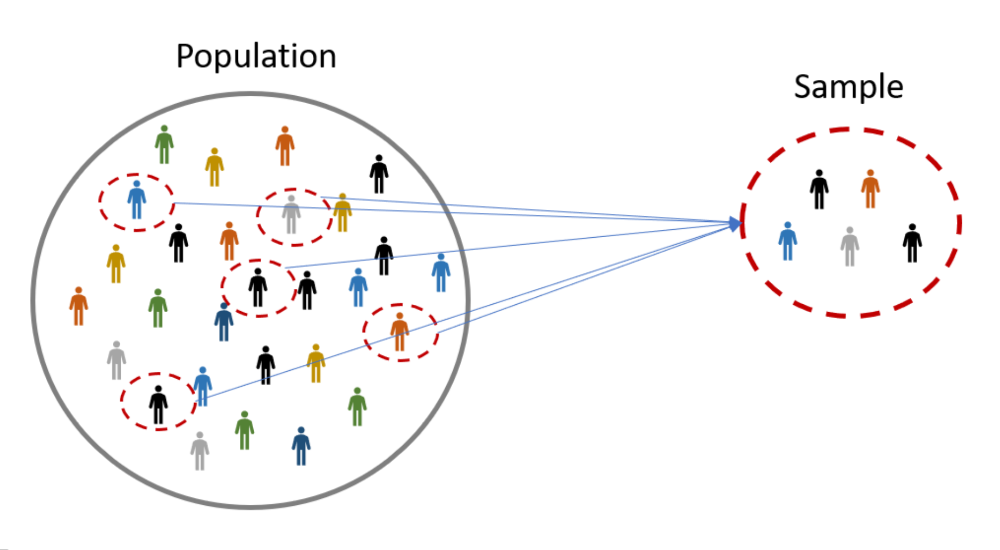

```{r setup, include=FALSE}
knitr::opts_chunk$set(echo = TRUE)
```

```{r, echo=F, message=F, warning=F}
library(readr)
library(openintro)
data(COL)
data(possum)
```

# Sampling principles and strategies

## Populations and samples

- A **population** is the entire group that you want to draw conclusions about.

- A **sample** is the specific group that you will collect data from. The size of the sample is always less than the total size of the population.




## Populations and samples

\begin{multicols}{2}

\includegraphics{images/running.png}

\columnbreak

\textbf{Research question:} Can people become better, more efficient runners on their own, merely by running?

\pause

\textbf{Population of interest:} \pause  All people.

\end{multicols}

\pause

**Sample:** Group of adult women who recently joined a running group.

\pause

**Population to which results can be generalized:** Adult women, if the data are randomly sampled.

## Anecdotal evidence and early smoking research

- Anti-smoking research started in the 1930s and 1940s when cigarette smoking became increasingly popular. While some smokers seemed to be sensitive to cigarette smoke, others were completely unaffected.

- Anti-smoking research was faced with resistance based on **anecdotal evidence** such as "My uncle smokes three packs a day and he's in perfectly good health", evidence based on a limited sample size that might not be representative of the population.

- It was concluded that "smoking is a complex human behavior, by its nature difficult to study, confounded by human variability."

- In time researchers were able to examine larger samples of cases (smokers), and trends showing that smoking had negative health impacts became much clearer.

## Census

- Wouldn't it be better to just include everyone and "sample" the entire population?
  - This is called a **census**.
  
## Census

- Wouldn't it be better to just include everyone and "sample" the entire population?
  - This is called a **census**.
  
- There are problems with taking a census:
  - It can be difficult to complete a census: there always seem to be some individuals who are hard to locate or hard to measure. And these difficult-to-find people may have certain characteristics that distinguish them from the rest of the population.
  
  - Populations rarely stand still. Even if you could take a census, the population changes constantly, so it's never possible to get a perfect measure.
  
  - Taking a census may be more complex than sampling.
  
## Census


## Exploratory analysis to inference

- Sampling is natural.

- Think about sampling something you are cooking - you taste (examine) a small part of what you're cooking to get an idea about the dish as a whole.

- When you taste a spoonful of soup and decide the spoonful you tasted isn't salty enough, that's **exploratory analysis**.

- If you generalize and conclude that your entire soup needs salt, that's an **inference**.

- For your inference to be valid, the spoonful you tasted (the sample) needs to be **representative** of the entire pot (the population).
  - If your spoonful comes only from the surface and the salt is collected at the bottom of the pot, what you tasted is probably not representative of the whole pot.
  - If you first stir the soup thoroughly before you taste, your spoonful will more likely be representative of the whole pot.

## Sampling bias

- **Non-response:** If only a small fraction of the randomly sampled people choose to respond to a survey, the sample may no longer be representative of the population.

- **Voluntary response:** Occurs when the sample consists of people who volunteer to respond because they had strong opinions on the issue. Such a sample will also not be representative of the population.


\begin{multicols}{2}

\includegraphics[width=0.6\columnwidth]{vol_resp_bias_q.png}

\columnbreak

\includegraphics[width=0.6\columnwidth]{vol_resp_bias_res.png}

\end{multicols}

- **Convenience sample:** Individuals who are easily accessible are more likely to be included in the sample.

## Sampling bias example: Landon vs FDR

A historical example of a biased sample yielding misleading results:

\begin{multicols}{3}

\includegraphics{images/landon.jpg}

\columnbreak

In 1936, Landon sought the Republican presidential nomination opposing the re-election of FDR.

\columnbreak

\includegraphics{images/fdr.png}

\end{multicols}

## The Literary Digest Poll

\begin{multicols}{2}

\begin{itemize}
\item The Literary Digest polled about 10 million Americans, and got responses from about 2.4 million.

\item The poll showed that Landon would likely be the overwhelming winner and FDR would get only 43\% of the votes.

\item Election result: FDR won, with 62\% of the votes.
\end{itemize}

\columnbreak

\includegraphics[width=0.8\columnwidth]{literaryDigest.png}
\end{multicols}

  - The magazine was completely discredited because of the poll, and was soon discontinued.
  
## The Literary Digest Poll \- what went wrong?

- The magazine had surveyed
  - Its own readers,
  - Registered automobile owners, and
  - Registered telephone users.

- These groups had incomes well above the national average of the day (remember, this is Great Depression era) which resulted in lists of voters far more likely to support Republicans than a truly **typical** voter of the time, i.e. the sample was not representative of the American population at the time.

## Large sample are preferable, but... 

- The Literary Digest election poll was based on a sample size of 2.4 million, which is huge, but since the sample was **biased**, the sample did not yield an accurate prediction.

- Back to the soup analogy: If the soup is not well stirred, it doesn't matter how large a spoon you have, it will still not taste right. If the soup is well stirred, a small spoon will suffice to test the soup.

## Practice

\alert{A school district is considering whether it will no longer allow high school students to part at school after two recent accidents where students were serverly injures. As a first step, they survey parents by mail, asking them whether or not the parents would object to this policy change. Of 6,000 surveys that go out, 1,200 are returned. Of these 1,200 surveys that were completed, 960 agreed with the policy change and 240 disagreed. Which of the following statements are true?}

\begin{enumerate}[I]
\item Some of the mailings may have never reached the parents.
\item The school district has strong support from parents to move forward with the policy approval.
\item It is possible that majority of the parents of high school students disagree with the policy change.
\item The survey results are unlikely to be biased because all parents were mailed a survey.
\end{enumerate}

A) Only I   B) I and II   C) I and III  D) III and IV  E) Only IV

## Practice

\alert{A school district is considering whether it will no longer allow high school students to part at school after two recent accidents where students were serverly injures. As a first step, they survey parents by mail, asking them whether or not the parents would object to this policy change. Of 6,000 surveys that go out, 1,200 are returned. Of these 1,200 surveys that were completed, 960 agreed with the policy change and 240 disagreed. Which of the following statements are true?}

\begin{enumerate}[I]
\item Some of the mailings may have never reached the parents.
\item The school district has strong support from parents to move forward with the policy approval.
\item It is possible that majority of the parents of high school students disagree with the policy change.
\item The survey results are unlikely to be biased because all parents were mailed a survey.
\end{enumerate}

A) Only I   B) I and II   C) I and III  D) \alert{III and IV}  E) Only IV


## Observational studies

- Researchers collect data in a way that does not directly interfere with how the data arise.

- Results of an observational study can generally be used to establish an association between the explanatory and response variables.

## Obtaining good samples

- Almost all statistical methods are based on the notion of implied randomness.

- If observational data are not collected in a random framework from a population, these statistical methods \- the estimates and errors associated with the estimated \- are not reliable.

- Most commonly used random sampling techniques are **simple**, **stratified** and **cluster** sampling.

## Simple random sampling

Randomly select cases from the population, where there is no implied connection between the points that are selected.


## Stratified sample

**Strata** are made up of similar observations. We take a simple random sample from \underline{each} stratum.


## Cluster sample

**Clusters** are usually not made up on homogeneous observations. We take a simple random sample of clusters, and then sample \underline{all} observations in that cluster. Usually preferred for economical reasons.


## Multistage sample

**Clusters** are usually not made up of homogeneous observations. We take a simple random sample of clusters, and then take a simple random sample of observations from the sampled clusters.


## Practice

\alert{A city council has requested a household survey be conducted in a suburban area of their city. The area is broken into many distinct and unique neighborhoods, some including large homes, some with only apartments. Which approach would likely be the \underline{least} effective?}

A) Simple random sampling
B) Cluster sampling
C) Stratified sampling
D) Blocked sampling

## Practice

\alert{A city council has requested a household survey be conducted in a suburban area of their city. The area is broken into many distinct and unique neighborhoods, some including large homes, some with only apartments. Which approach would likely be the \underline{least} effective?}

A) Simple random sampling
B) \alert{Cluster sampling}
C) Stratified sampling
D) Blocked sampling
