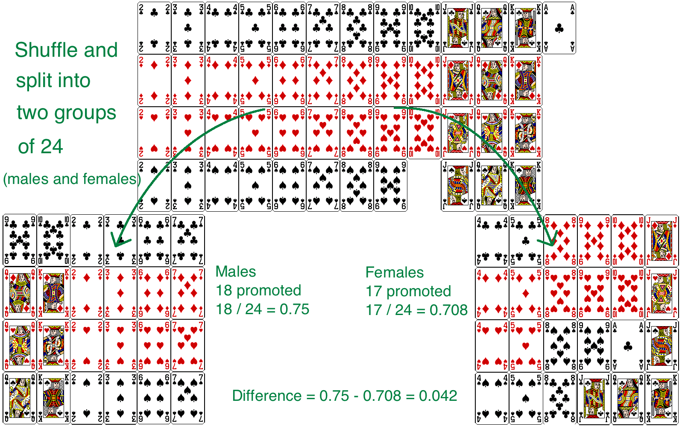

```{r setup, include=FALSE}
knitr::opts_chunk$set(echo = FALSE)
```

```{r, echo=F, message=F, warning=F}
library(readr)
library(openintro)
library(datasets)
library(tidyverse)
library(scales)
data(COL)
```

# Case Study: Gender discrimination

## Gender discrimination

- In 1972, as a part of a study on gender discrimination, 48 male bank supervisors were each given the same personnel file and asked to judge whether the person should be promoted to a branch manager job that was described as "routine".

- The files were identical except that half of the supervisors had files showing the person was male while the other half had files showing the person was female.

- It was randomly determined which supervisors got "male" applications and which got "female" applications.

- Of the 48 files reviewed, 35 were promoted.

- The study is testing whether females are unfairly discriminated against.

\alert{Is this an observational study or an experiment?}


## Data

\alert{At a first glance, does there appear to be a relationship between promotion and gender?}

\begin{table}[]
\begin{tabular}{ccccc}
                        &        & \multicolumn{2}{c}{Promotion} &       \\ \cline{3-4}
                        &        & Promoted    & Not Promoted    & Total \\ \cline{2-5} 
\multirow{2}{*}{Gender} & Male   & 21          & 3               & 24    \\
                        & Female & 14          & 10              & 24    \\ \cline{2-5} 
                        & Total  & 35          & 13              & 48    \\ \cline{2-5} 
\end{tabular}
\end{table}

\pause

**% of males promoted:** 21/24 = 0.875

**% of females promoted:** 14/24 = 0.583

## Practice

\alert{We saw a difference of almost 30\% (28.2\% to be exact) between the proportion of male and female files that are promoted. Based on this information, which of the below is true?}

A) If we were to repeat the experiment we will definitely see that more female files get promoted. This was a fluke.
B) Promotion is dependent on gender, males are more likely to be promoted, and hence there is gender discrimination against women in promotion decisions.
C) The difference in the proportions of promoted male and female files is due to chance, this is not evidence of gender discrimination against women in promotion decisions.
D) Women are less qualified than men, and this is why fewer females get promoted.

## Practice

\alert{We saw a difference of almost 30\% (28.2\% to be exact) between the proportion of male and female files that are promoted. Based on this information, which of the below is true?}

A) If we were to repeat the experiment we will definitely see that more female files get promoted. This was a fluke.
B) \alert{Promotion is dependent on gender, males are more likely to be promoted, and hence there is gender discrimination against women in promotion decisions.} **Maybe**
C) \alert{The difference in the proportions of promoted male and female files is due to chance, this is not evidence of gender discrimination against women in promotion decisions.} **Maybe**
D) Women are less qualified than men, and this is why fewer females get promoted. 

## Two competing claims

\begin{enumerate}

\item "There is nothing going on."\\ Promotion and gender are \textbf{independent}, no gender discrimination, observed difference in proportions is simply due to chance. \rightarrow \textbf{ Null hypothesis}

\pause

\item "There is something going on."\\ Promotion and gender are dependent, there is gender discrimination, observed difference in proportions is not due to chance. \rightarrow \textbf{ Alternative hypothesis}

\end{enumerate}

## A trial as a hypothesis test

\begin{multicols}{2}

\begin{itemize}

\item Hypothesis testing is very much like a court trial.

\item $H_0$: Defendant is innocent\\ $H_A$: Defendant is guilty

\item We then present the evidence \- collect data.

\end{itemize}

\columnbreak

\includegraphics[width=1\columnwidth]{trial.png}

\end{multicols}

  \begin{itemize}
  
  \item Then we judge the evidence - "Could these data plausibly have happened by chance if the null hypothesis were true?"
  
    \begin{itemize}
    \item If they were very unlikely to have occurred, then the evidence raises more than a reasonable               doubt in out minds about the null hypothesis.
    \end{itemize}
    
  \item Ultimately we must make a decision. How unlikely is unlikely?
  
  \end{itemize}

## A trial as a hypothesis test

- If the evidence is not strong enough to reject then assumption of innocence, the jury returns with a verdict of "not guilty".

  - The jury does not say that the defendant is innocent, just that there is not enough evidence to convict.
  
  - The defendant may, in fact, be innocent, but the jury has no way of being sure.
  
- Said statistically, we fail to reject the null hypothesis.

  - We never declare the null hypothesis to be true, because we simply do not know whether it's true or not.
  
  - Therefore we never "accept the null hypothesis".
  
## A trial as a hypothesis test

- In a trial, the burden of proof is on the prosecution.

- In a hypothesis test, the burden of proof is on the unusual claim. 

- The null hypothesis is the ordinary state of affairs (the status quo), so it's the alternative hypothesis that we consider unusual and for which we must gather evidence.

## Recap: Hypothesis testing framework

- We start with a **null hypothesis ($H_0$)** that represents the status quo.

- We also have an **alternative hypothesis ($H_A$)** that represents our research question, i.e. what we're testing for.

- We conduct a hypothesis test under the assumption that the null hypothesis is true, either via simulation (today) or theoretical methods (later in the courses).

- if the test results suggest that the data do not provide convincing evidence for the alternative hypothesis, we stick with the null hypothesis, If they do, then we reject the null hypothesis in favor of the alternative.

## Simulating the experiment...

... under the assumption of independence, i.e. leave things up to chance.

If results from the simulations based on the **chance model** look like the data, then we can determine that the difference between the proportions of promoted files between males and females was simply **due to chance** (promotion and gender are independent).

If the results from the simulations based on the chance model do not look like the data, then we can determine that the difference between the proportions of promoted filed between males and females was not due to chance, but **due to an actual effect of gender** (promotion and gender are dependent).

## Application activity: simulating the experiment

Use a deck of playing cards to simulate the experiment.

\begin{enumerate}

\item Let a face card represent \textit{not} promoted and a non\-face card represent a \textit{promoted}. Consider aces as face cards.

  \begin{itemize}
  
  \item Set aside the jokers.
  
  \item Take out 3 aces \rightarrow there are exactly 13 face cards left in the deck (face cards: A, K, Q, J).
  
  \item Take out a number card \rightarrow there are exactly 35 number (non\-face) cards left in the deck (number cards: 2\-10).
  
  \end{itemize}
  
\item Shuffle the cards and deal them into two groups of size 24, representing males and females.

\item Count and record how many files in each group are promoted (number cards).

\item Calculate the proportion of promoted files in each group and take the difference (male - female), and record this value.

\item Repeat steps 2 - 4 many times.

\end{enumerate}

## Step 1


## Step 2 \- 4



## Practice

\alert{Do the results of the simulation you just ran provide convincing evidence of gender discrimination against women, i.e. dependence between gender and promotion decisions?}

A) No, the data do not provide convincing evidence for the alternative hypothesis, therefore we can't reject the null hypothesis of independence between gender and promotion decisions. The observed difference between the two proportions was due to chance.

B) Yes, the data provide convincing evidence for the alternative hypothesis of gender discrimination against women in promotion decisions. The observed difference between the two proportions was due to a real effect of gender.

## Practice

\alert{Do the results of the simulation you just ran provide convincing evidence of gender discrimination against women, i.e. dependence between gender and promotion decisions?}

A) No, the data do not provide convincing evidence for the alternative hypothesis, therefore we can't reject the null hypothesis of independence between gender and promotion decisions. The observed difference between the two proportions was due to chance.

B) \alert{Yes, the data provide convincing evidence for the alternative hypothesis of gender discrimination against women in promotion decisions. The observed difference between the two proportions was due to a real effect of gender.}

## Simulation using software

These simulations are tedious and slow to run using the method described earlier. In reality, we use software to generate the simulations. The dot plot below shows the distribution of simulated differences in promotion rates based on 100 simulations.

```{r, echo=F, message=F, fig.width=8, fig.height=4.5,warning=F,fig.align='center'}
set.seed(8535)

gender <- c(rep('male', 24), rep('female', 24))
outcome <- c(rep(c('promoted', 'not promoted'), c(21, 3)), rep(c('promoted', 'not promoted'), c(14, 10)))

nsim  = 100
n     = length(gender)
group = gender
var1  = outcome
success = "promoted"
sim   = matrix(NA, nrow = n, ncol = nsim)
n1    = n2 = 24

statistic <- function(var1, group){	
	t1 <- var1 == success & group == levels(as.factor(group))[1]
	t2 <- var1 == success & group == levels(as.factor(group))[2]
	sum(t1)/n1 - sum(t2)/n2 
}

for(i in 1:nsim){
	sim[,i] = sample(group, n, replace = FALSE)
}

sim_dist = apply(sim, 2, statistic, var1 = outcome)
diffs    = sim_dist
pval     = sum(diffs >= 0.29) / nsim
values  <- table(sim_dist)


X <- c()
Y <- c()
for(i in 1:length(diffs)){
	x   <- diffs[i]
	rec <- sum(sim_dist == x)
	X   <- append(X, rep(x, rec))
	Y   <- append(Y, 1:rec)
}

plot(X, Y, xlim=range(diffs)+c(-1,1)*sd(diffs)/4, xlab = "Difference in promotion rates", ylab="",axes = FALSE, ylim=c(0,max(Y)), col=COL[1], cex = 1.5, cex.lab = 1.5, pch=20)
axis(1, at = seq(-0.4,0.4,0.1), labels = c(-0.4,"",-0.2,"",0,"",0.2,"",0.4))
abline(h=0)
```