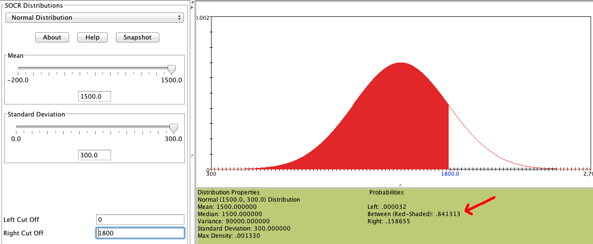
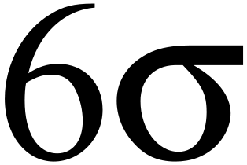

```{r setup, include=FALSE}
knitr::opts_chunk$set(echo = FALSE)
```

```{r, echo=F, message=F, warning=F}
library(readr)
library(openintro)
data(COL)
```

# Normal distibution

## Normal distribution

- Unimodal and symmetric, bell shaped curve.

- Many variables are nearly normal, but none are exactly normal.

- Denoted as $\textcolor{red}{N(\mu, \sigma)}$ $\rightarrow$ Normal with mean $\mu$ and standard deviation $\sigma$.

```{r, echo=F, message=F, warning=F, fig.width=4, fig.height=2,fig.align='center'}
#===> plot <===#
par(mfrow=c(1,1), las=1, mar=0.5*c(1,1,1,1))

# curve 1
X <- seq(-4,4,0.01)
Y <- dnorm(X)
plot(X, Y, type='l', axes=F, xlim=c(-3.4,3.4), col='#335588', lwd=4)
#axis(1, at=-3:3)
abline(h=-0.002, col='#888888')
```


## Heights of males

\begin{multicols}{2}

\includegraphics[width=1\columnwidth]{ok_cupid_men.png}

\columnbreak

\end{multicols}

## Heights of males

\begin{multicols}{2}

\includegraphics[width=1\columnwidth]{ok_cupid_men.png}

\columnbreak

"The male heights on OkCupid very nearly follow the expected normal distribution \- except the whole thing is shifted to be right of where it should be. Almost universally guys like to add a couple inches."

"You can also see a more subtle vanity at work: starting at roughly 5'8", the top of the dotted curve tilts even further rightward. This means that guys as they get closer to six feet round up a bit more than usual, stretching for that coveted psychological benchmark."

\end{multicols}

## Heights of females

\begin{multicols}{2}

\includegraphics[width=1\columnwidth]{ok_cupid_women.png}

\columnbreak

\end{multicols}

## Heights of females

\begin{multicols}{2}

\includegraphics[width=1\columnwidth]{ok_cupid_women.png}

\columnbreak

"When we looked into the data for women, we were surprised to see height exaggeration was just as widespread, though without the lurch towards a benchmark height."

\end{multicols}


## Normal distributions with different parameters

\centering{$\mu:$ mean, $\sigma:$ standard deviation}
```{r, echo=F, message=F, warning=F, fig.width=4, fig.height=2,fig.align='center',include=F}
set.seed(1)

x <- rnorm(100000)
hold <- hist(x, breaks=50, prob=T)

```

```{r, echo=F, message=F, warning=F, fig.width=3, fig.height=1.5,fig.align='center'}

#===> plot <===#
par(mfrow=c(1,2), las=1, mar=c(2.5,1,0.5,1))

#main = bquote('N('~mu==.0~','~sigma==.1~')')

# curve 1
X <- seq(-4,4,0.01)
Y <- dnorm(X)
plot(X, Y, type='l', axes=F, xlim=c(-3.4,3.4),
     main = bquote('N('~mu==.0~','~sigma==.1~')'),line=-0.01)
axis(1, at=-3:3)
for(i in 1:length(hold$counts)){
	rect(hold$breaks[i], 0, hold$breaks[i+1], hold$density[i],
		border='#DDDDDD', col='#F4F4F4')
}
lines(X, Y)
abline(h=0)

# curve 2
X <- seq(3,35,0.01)
Y <- dnorm(X, 19, 4)
plot(X, Y, type='l', axes=F, xlim=c(5.4,32.6),
     main = bquote('N('~mu==.19~','~sigma==.4~')'),line=-0.01)
axis(1, at=19+4*(-3:3))

for(i in 1:length(hold$counts)){
	rect(19+4*hold$breaks[i], 0, 19+4*hold$breaks[i+1], hold$density[i]/4,
		border='#DDDDDD', col='#F4F4F4')
}
lines(X, Y)
abline(h=0)
```


```{r, echo=F, message=F, warning=F, fig.width=4, fig.height=2,fig.align='center',include=F}
set.seed(1)

x <- rnorm(100000)
hold <- hist(x, breaks=50, prob=T)
```

```{r, echo=F, message=F, warning=F, fig.width=3, fig.height=1.5,fig.align='center'}

#===> plot <===#
par(mfrow=c(1,1), las=1, mar=c(2.5,1,0.5,1))

# curve 1
X <- seq(-4,4,0.01)
Y <- dnorm(X)
plot(X, Y, type='l', axes=F, xlim=c(-5,35))
axis(1, at=seq(-10, 40, 10))
lines(X, Y)
abline(h=0)

# curve 2
X <- seq(3,35,0.01)
Y <- dnorm(X, 19, 4)
lines(X, Y)
```


## Practice

\alert{SAT scores are distributed nearly normally with mean 1500 and standard deviattion 300. ACT scores are distributed nearly normally with mean 21 and statdard deviation 5. A college admissions officer wants to determine which of the two applicants scored better on their standardized test with respect to the other test takers: Pam, who earned an 1800 on her SAT, or Jim, who scored a 24 on his ACT?}

```{r, echo=F, message=F, warning=F, fig.width=4, fig.height=1.8,fig.align='center'}
par(mfrow=c(1,2), mar=c(2.1,0,0,0), cex = 1.25)
m = 1500
s = 300
normTail(m = 1500, s = 300)
lines(c(m,m), dnorm(m, m, s)*c(0.01,0.99), lty=2, col='#EEEEEE')
lines(c(m,m)+s, dnorm(m+s, m, s)*c(0.01,1.25), lty=2, col='#335588')
text(m+s, dnorm(m+s,m,s)*1.25, 'Pam', pos=4, col='#335588', cex = 0.7)

m = 21
s = 5
normTail(m = 21, s = 5)
lines(c(m,m), dnorm(m, m, s)*c(0.01,0.99), lty=2, col='#EEEEEE')
lines(c(24,24), dnorm(m+3, m, s)*c(0.01,1.04), lty=2, col="red")
text(24, dnorm(24,m,s)*1.05, 'Jim', pos=4, col="red", cex = 0.7)
```


## Standardizing with Z scores

Since we cannoy just compare these two raw scores, we instead compare how many standard deviations beyond the mean each observation is:

  - Pam's score is $\frac{1800-1500}{300} = 1$ standard deviation above the mean.
  
  - Jim's score is $\frac{24-21}{5} = 0.6$ standard deviations above the mean.
  
```{r, echo=F, message=F, warning=F, fig.width=4, fig.height=1.8,fig.align='center'}
par(mfrow=c(1,1), las=1, mar=c(2,0.5,0,0.5))

m <- 0
s <- 1
X <- m+s*seq(-4,4,0.01)
Y <- dnorm(X, m, s)
plot(X, Y, type='l', axes=F, xlim=m+s*c(-2.7,2.7))
axis(1, at=m+s*(-3:3))
abline(h=0)
lines(c(m,m), dnorm(m, m, s)*c(0.01,0.99), lty=2, col='#EEEEEE')
lines(c(m,m)+s, dnorm(m+s, m, s)*c(0.01,1.5), lty=2, col='#335588')
lines(c(m,m)+0.6*s, dnorm(m+0.6*s, m, s)*c(0.01,1.1), lty=2, col="red")
text(m+s, dnorm(m+s,m,s)*1.5, ' Pam', pos=4, col='#335588')
text(m+0.6*s, dnorm(m+0.6*s,m,s)*1.1, 'Jim', pos=4.6, col="red")
```

## Standardizing with Z scores

- These are called **standardized** scores, or **Z scores**.

- Z score of an observation is the number of standard deviations it falls above or below the mean.

\centering{$Z = \frac{observation - mean}{SD}$}

- Z scores are define for distributions of any shape, but only when the distribution is normal can we use Z scores to calculate percentiles.

- Observations that are more than 2 SD away from the mean ($|Z| > 2$) are usually considered unusual.

## Percentiles

- **Percentile** is the percentage of observations that fall below a given data point.

- Graphically, percentile is the are below the probability distribution curve to the left of that observation.

```{r, echo=F, message=F, warning=F, fig.width=4, fig.height=1.8,fig.align='center'}
#===> plot <===#
par(las=1, mar=c(1.5,0,0.5,0), mgp=c(3,0.6,0))
X <- seq(-4,4,0.01)
Y <- dnorm(X)
plot(X, Y, type='l', axes=F, xlim=c(-3.4,3.4))
axis(1, at=-3:3, label=(1500+300*(-3:3)), cex.axis=0.7)
these <- which(X <= 1)
polygon(c(X[these[1]], X[these],X[rev(these)[1]]), c(0,Y[these],0), col='#CCCCCC')

#arrows(1.3,0.28, 0.43, 0.28, length=0.07)
#text(1.3, 0.28, 'X=1630\nZ=0.43', pos=4, cex=0.7)

lines(X, Y)
abline(h=0)
```


## Calculating percentiles - using computation

The are many ways to compute percentiles/areas under the curve:

- **R:**

```{r, echo=T}
pnorm(1800, mean = 1500, sd = 300)
```

- **Applet:** [https://gallery.shinyapps.io/dist_calc/](https://gallery.shinyapps.io/dist_calc/)



## Calculating percentiles - using tables

\footnotesize
\begin{tabular}{c | rrrrr | rrrrr |}
  \cline{2-11}
&&&& \multicolumn{4}{c}{Second decimal place of $Z$} &&& \\
  \cline{2-11}
$Z$ & 0.00 & 0.01 & 0.02 & 0.03 & 0.04 & 0.05 & 0.06 & 0.07 & 0.08 & 0.09 \\
  \hline
  \hline
0.0 & \tiny{0.5000} & \tiny{0.5040} & \tiny{0.5080} & \tiny{0.5120} & \tiny{0.5160} & \tiny{0.5199} & \tiny{0.5239} & \tiny{0.5279} & \tiny{0.5319} & \tiny{0.5359} \\
  0.1 & \tiny{0.5398} & \tiny{0.5438} & \tiny{0.5478} & \tiny{0.5517} & \tiny{0.5557} & \tiny{0.5596} & \tiny{0.5636} & \tiny{0.5675} & \tiny{0.5714} & \tiny{0.5753} \\
  0.2 & \tiny{0.5793} & \tiny{0.5832} & \tiny{0.5871} & \tiny{0.5910} & \tiny{0.5948} & \tiny{0.5987} & \tiny{0.6026} & \tiny{0.6064} & \tiny{0.6103} & \tiny{0.6141} \\
  0.3 & \tiny{0.6179} & \tiny{0.6217} & \tiny{0.6255} & \tiny{0.6293} & \tiny{0.6331} & \tiny{0.6368} & \tiny{0.6406} & \tiny{0.6443} & \tiny{0.6480} & \tiny{0.6517} \\
  0.4 & \tiny{0.6554} & \tiny{0.6591} & \tiny{0.6628} & \tiny{0.6664} & \tiny{0.6700} & \tiny{0.6736} & \tiny{0.6772} & \tiny{0.6808} & \tiny{0.6844} & \tiny{0.6879} \\
  \hline
  0.5 & \tiny{0.6915} & \tiny{0.6950} & \tiny{0.6985} & \tiny{0.7019} & \tiny{0.7054} & \tiny{0.7088} & \tiny{0.7123} & \tiny{0.7157} & \tiny{0.7190} & \tiny{0.7224} \\
  0.6 & \tiny{0.7257} & \tiny{0.7291} & \tiny{0.7324} & \tiny{0.7357} & \tiny{0.7389} & \tiny{0.7422} & \tiny{0.7454} & \tiny{0.7486} & \tiny{0.7517} & \tiny{0.7549} \\
  0.7 & \tiny{0.7580} & \tiny{0.7611} & \tiny{0.7642} & \tiny{0.7673} & \tiny{0.7704} & \tiny{0.7734} & \tiny{0.7764} & \tiny{0.7794} & \tiny{0.7823} & \tiny{0.7852} \\
  0.8 & \tiny{0.7881} & \tiny{0.7910} & \tiny{0.7939} & \tiny{0.7967} & \tiny{0.7995} & \tiny{0.8023} & \tiny{0.8051} & \tiny{0.8078} & \tiny{0.8106} & \tiny{0.8133} \\
  0.9 & \tiny{0.8159} & \tiny{0.8186} & \tiny{0.8212} & \tiny{0.8238} & \tiny{0.8264} & \tiny{0.8289} & \tiny{0.8315} & \tiny{0.8340} & \tiny{0.8365} & \tiny{0.8389} \\
  \hline
  \hline
  1.0 & \textcolor{red}{\tiny{0.8413}} & \tiny{0.8438} & \tiny{0.8461} & \tiny{0.8485} & \tiny{0.8508} & \tiny{0.8531} & \tiny{0.8554} & \tiny{0.8577} & \tiny{0.8599} & \tiny{0.8621} \\
  1.1 & \tiny{0.8643} & \tiny{0.8665} & \tiny{0.8686} & \tiny{0.8708} & \tiny{0.8729} & \tiny{0.8749} & \tiny{0.8770} & \tiny{0.8790} & \tiny{0.8810} & \tiny{0.8830} \\
  1.2 & \tiny{0.8849} & \tiny{0.8869} & \tiny{0.8888} & \tiny{0.8907} & \tiny{0.8925} & \tiny{0.8944} & \tiny{0.8962} & \tiny{0.8980} & \tiny{0.8997} & \tiny{0.9015} \\
\end{tabular}

## Six Sigma

"The term six sigma process comes from the notion that if one has six standard deviations between the process mean and the nearest specification limit, as shown in the graph, practically no items will fail to meet specifications."

\centering
{width="60%"}

## Quality control

\alert{At Heinz ketchup factory the amounts which go into bottles of ketchup are supposed to be normally distributed with mean 36 oz. and standard deviation 0.11 oz. Once every 30 minutes a bottle is selected from the production line, and is below 35.8 oz. or above 36.2 oz., then the bottle fails the quality control inspection. What percent of bottles have less than 35.8 ounces of ketchup?}

## Quality control

\alert{At Heinz ketchup factory the amounts which go into bottles of ketchup are supposed to be normally distributed with mean 36 oz. and standard deviation 0.11 oz. Once every 30 minutes a bottle is selected from the production line, and is below 35.8 oz. or above 36.2 oz., then the bottle fails the quality control inspection. What percent of bottles have less than 35.8 ounces of ketchup?}

Let $X =$ amount of ketchup in a bottle: $X \sim N(\mu = 36, \sigma = 0.11)$

## Quality control

\alert{At Heinz ketchup factory the amounts which go into bottles of ketchup are supposed to be normally distributed with mean 36 oz. and standard deviation 0.11 oz. Once every 30 minutes a bottle is selected from the production line, and is below 35.8 oz. or above 36.2 oz., then the bottle fails the quality control inspection. What percent of bottles have less than 35.8 ounces of ketchup?}

Let $X =$ amount of ketchup in a bottle: $X \sim N(\mu = 36, \sigma = 0.11)$

\begin{multicols}{2}

```{r, echo=F, message=F, warning=F, fig.width=4, fig.height=1.8,fig.align='center'}
par(mar=c(2.1,0,0,0))
normTail(m = 36, s = 0.11, L = 35.8, axes = FALSE, col = COL[1], lwd = 2)
axis(1, at=c(35.67, 35.8, 36, 36.33), label=expression("", "35.8", "36", ""))
```

\columnbreak

\end{multicols}

## Quality control

\alert{At Heinz ketchup factory the amounts which go into bottles of ketchup are supposed to be normally distributed with mean 36 oz. and standard deviation 0.11 oz. Once every 30 minutes a bottle is selected from the production line, and is below 35.8 oz. or above 36.2 oz., then the bottle fails the quality control inspection. What percent of bottles have less than 35.8 ounces of ketchup?}

Let $X =$ amount of ketchup in a bottle: $X \sim N(\mu = 36, \sigma = 0.11)$

\begin{multicols}{2}

```{r, echo=F, message=F, warning=F, fig.width=4, fig.height=1.8,fig.align='center'}
par(mar=c(2.1,0,0,0))
normTail(m = 36, s = 0.11, L = 35.8, axes = FALSE, col = COL[1], lwd = 2)
axis(1, at=c(35.67, 35.8, 36, 36.33), label=expression("", "35.8", "36", ""))
```

\columnbreak

$Z = \frac{35.8-36}{0.11}=-1.82$

\end{multicols}

## Finding the exact probability - Using R

```{r, echo=T}
pnorm(-1.82, mean =0, sd = 1)
```

## Finding the exact probability - Using R

```{r, echo=T}
pnorm(-1.82, mean =0, sd = 1)
```

OR

## Finding the exact probability - Using R

```{r, echo=T}
pnorm(-1.82, mean =0, sd = 1)
```

OR

```{r, echo=T}
pnorm(35.8, mean = 36, sd = 0.11)
```

## Practice

\alert{What percent of bottles \underline{pass} the quality control inspection?}

A) 1.82% B) 3.44% C) 6.88% D) 93.12% E) 96.56%

## Practice

\alert{What percent of bottles \underline{pass} the quality control inspection?}

A) 1.82% B) 3.44% C) 6.88% D) **93.12%** E) 96.56%

## Practice

\alert{What percent of bottles \underline{pass} the quality control inspection?}

A) 1.82% B) 3.44% C) 6.88% D) **93.12%** E) 96.56%

\begin{multicols}{3}

```{r, echo=F, message=F, warning=F, fig.width=5, fig.height=2,fig.align='center'}
par(mar=c(2.1,0,0,0))
normTail(m = 36, s = 0.11, M = c(35.8, 36.2), axes = FALSE, col = COL[1], main = "=", line=-4, adj = 1)
axis(1, at=c(35.67, 35.8, 36, 36.2, 36.33), label=expression("", "35.8", "36", "36.2", ""))
```

\columnbreak

\columnbreak

\end{multicols}

## Practice

\alert{What percent of bottles \underline{pass} the quality control inspection?}

A) 1.82% B) 3.44% C) 6.88% D) **93.12%** E) 96.56%

\begin{multicols}{3}

```{r, echo=F, message=F, warning=F, fig.width=5, fig.height=2,fig.align='center'}
par(mar=c(2.1,0,0,0))
normTail(m = 36, s = 0.11, M = c(35.8, 36.2), axes = FALSE, col = COL[1], main = "=", line=-4, adj = 1)
axis(1, at=c(35.67, 35.8, 36, 36.2, 36.33), label=expression("", "35.8", "36", "36.2", ""))
```

\columnbreak

```{r, echo=F, message=F, warning=F, fig.width=5, fig.height=2,fig.align='center'}
par(mar=c(2.1,0,0,0))
normTail(m = 36, s = 0.11, L = 36.2, axes = FALSE, col = COL[1], main = "-", line=-4, adj = 1)
axis(1, at=c(35.67, 36, 36.2, 36.33), label=expression("", "36", "36.2", ""))
```

\columnbreak

```{r, echo=F, message=F, warning=F, fig.width=5, fig.height=2,fig.align='center'}
par(mar=c(2.1,0,0,0))
normTail(m = 36, s = 0.11, L = 35.8, axes = FALSE, col = COL[1])
axis(1, at=c(35.67, 35.8, 36, 36.33), label=expression("", "35.8", "36", ""))
```

\end{multicols}

## Practice

\alert{What percent of bottles \underline{pass} the quality control inspection?}

A) 1.82% B) 3.44% C) 6.88% D) **93.12%** E) 96.56%

\begin{multicols}{3}

```{r, echo=F, message=F, warning=F, fig.width=5, fig.height=2,fig.align='center'}
par(mar=c(2.1,0,0,0))
normTail(m = 36, s = 0.11, M = c(35.8, 36.2), axes = FALSE, col = COL[1], main = "=", line=-4, adj = 1)
axis(1, at=c(35.67, 35.8, 36, 36.2, 36.33), label=expression("", "35.8", "36", "36.2", ""))
```

\columnbreak

```{r, echo=F, message=F, warning=F, fig.width=5, fig.height=2,fig.align='center'}
par(mar=c(2.1,0,0,0))
normTail(m = 36, s = 0.11, L = 36.2, axes = FALSE, col = COL[1], main = "-", line=-4, adj = 1)
axis(1, at=c(35.67, 36, 36.2, 36.33), label=expression("", "36", "36.2", ""))
```

\columnbreak

```{r, echo=F, message=F, warning=F, fig.width=5, fig.height=2,fig.align='center'}
par(mar=c(2.1,0,0,0))
normTail(m = 36, s = 0.11, L = 35.8, axes = FALSE, col = COL[1])
axis(1, at=c(35.67, 35.8, 36, 36.33), label=expression("", "35.8", "36", ""))
```

\end{multicols}

\centering{$Z_{35.8} = \frac{35.8-36}{0.11}=-1.82$}

## Practice

\alert{What percent of bottles \underline{pass} the quality control inspection?}

A) 1.82% B) 3.44% C) 6.88% D) **93.12%** E) 96.56%

\begin{multicols}{3}

```{r, echo=F, message=F, warning=F, fig.width=5, fig.height=2,fig.align='center'}
par(mar=c(2.1,0,0,0))
normTail(m = 36, s = 0.11, M = c(35.8, 36.2), axes = FALSE, col = COL[1], main = "=", line=-4, adj = 1)
axis(1, at=c(35.67, 35.8, 36, 36.2, 36.33), label=expression("", "35.8", "36", "36.2", ""))
```

\columnbreak

```{r, echo=F, message=F, warning=F, fig.width=5, fig.height=2,fig.align='center'}
par(mar=c(2.1,0,0,0))
normTail(m = 36, s = 0.11, L = 36.2, axes = FALSE, col = COL[1], main = "-", line=-4, adj = 1)
axis(1, at=c(35.67, 36, 36.2, 36.33), label=expression("", "36", "36.2", ""))
```

\columnbreak

```{r, echo=F, message=F, warning=F, fig.width=5, fig.height=2,fig.align='center'}
par(mar=c(2.1,0,0,0))
normTail(m = 36, s = 0.11, L = 35.8, axes = FALSE, col = COL[1])
axis(1, at=c(35.67, 35.8, 36, 36.33), label=expression("", "35.8", "36", ""))
```

\end{multicols}

\centering{$Z_{35.8} = \frac{35.8-36}{0.11}=-1.82$}

\centering{$Z_{36.2} = \frac{36.2-36}{0.11}=1.82$}

## Practice

\alert{What percent of bottles \underline{pass} the quality control inspection?}

A) 1.82% B) 3.44% C) 6.88% D) **93.12%** E) 96.56%

\begin{multicols}{3}

```{r, echo=F, message=F, warning=F, fig.width=5, fig.height=2,fig.align='center'}
par(mar=c(2.1,0,0,0))
normTail(m = 36, s = 0.11, M = c(35.8, 36.2), axes = FALSE, col = COL[1], main = "=", line=-4, adj = 1)
axis(1, at=c(35.67, 35.8, 36, 36.2, 36.33), label=expression("", "35.8", "36", "36.2", ""))
```

\columnbreak

```{r, echo=F, message=F, warning=F, fig.width=5, fig.height=2,fig.align='center'}
par(mar=c(2.1,0,0,0))
normTail(m = 36, s = 0.11, L = 36.2, axes = FALSE, col = COL[1], main = "-", line=-4, adj = 1)
axis(1, at=c(35.67, 36, 36.2, 36.33), label=expression("", "36", "36.2", ""))
```

\columnbreak

```{r, echo=F, message=F, warning=F, fig.width=5, fig.height=2,fig.align='center'}
par(mar=c(2.1,0,0,0))
normTail(m = 36, s = 0.11, L = 35.8, axes = FALSE, col = COL[1])
axis(1, at=c(35.67, 35.8, 36, 36.33), label=expression("", "35.8", "36", ""))
```

\end{multicols}

\centering{$Z_{35.8} = \frac{35.8-36}{0.11}=-1.82$}

\centering{$Z_{36.2} = \frac{36.2-36}{0.11}=1.82$}

\begin{align*}
P(35.8<X<36.2) &= P(-1.82<Z<1.82) \\
&= 0.9656-0.0344 \\
&= 0.9312
\end{align*}

## Finding cutoff points

\alert{Body temperatures of health humans are distributed nearly normally with mean $\ang{98.2}$F and standard deviation $\ang{0.73}$F. What is the cutoff for the lowest 3\% of human body temperatures?}

## Finding cutoff points

\alert{Body temperatures of health humans are distributed nearly normally with mean $\ang{98.2}$F and standard deviation $\ang{0.73}$F. What is the cutoff for the lowest 3\% of human body temperatures?}

\begin{multicols}{2}

```{r, echo=F, message=F, warning=F, fig.width=5, fig.height=2,fig.align='center'}
par(mar=c(2.1,0,0,0))
normTail(m = 98.2, s = 0.73, L = 96.8, axes = FALSE, col = COL[1], lwd=)
axis(1, at=c(96.01, 96.8, 98.2, 100.39), label=expression("", "?", "98.2", ""))
text(x = 96.4, y = 0.11, "0.03", col = COL[1], cex = 1.25)
```

\columnbreak

\end{multicols}

## Finding cutoff points

\alert{Body temperatures of health humans are distributed nearly normally with mean $\ang{98.2}$F and standard deviation $\ang{0.73}$F. What is the cutoff for the lowest 3\% of human body temperatures?}

\begin{multicols}{2}

```{r, echo=F, message=F, warning=F, fig.width=5, fig.height=2,fig.align='center'}
par(mar=c(2.1,0,0,0))
normTail(m = 98.2, s = 0.73, L = 96.8, axes = FALSE, col = COL[1], lwd=)
axis(1, at=c(96.01, 96.8, 98.2, 100.39), label=expression("", "?", "98.2", ""))
text(x = 96.4, y = 0.11, "0.03", col = COL[1], cex = 1.25)
```

\columnbreak

\footnotesize{$P(X<x) = 0.3$ \\ $P(Z<\textcolor{red}{-1.88})=0.03$}

\footnotesize{$Z = \frac{obs-mean}{SD} \rightarrow \frac{x-98.2}{0.73}=-1.88$}

\footnotesize{$x = (-1.88 \times 0.73)+98.2 = \ang{96.8} F$}

\end{multicols}

## Finding cutoff points

\alert{Body temperatures of health humans are distributed nearly normally with mean $\ang{98.2}$F and standard deviation $\ang{0.73}$F. What is the cutoff for the lowest 3\% of human body temperatures?}

\begin{multicols}{2}

```{r, echo=F, message=F, warning=F, fig.width=5, fig.height=2,fig.align='center'}
par(mar=c(2.1,0,0,0))
normTail(m = 98.2, s = 0.73, L = 96.8, axes = FALSE, col = COL[1], lwd=)
axis(1, at=c(96.01, 96.8, 98.2, 100.39), label=expression("", "?", "98.2", ""))
text(x = 96.4, y = 0.11, "0.03", col = COL[1], cex = 1.25)
```

\columnbreak

\footnotesize{$P(X<x) = 0.3$ \\ $P(Z<\textcolor{red}{-1.88})=0.03$}

\footnotesize{$Z = \frac{obs-mean}{SD} \rightarrow \frac{x-98.2}{0.73}=-1.88$}

\footnotesize{$x = (-1.88 \times 0.73)+98.2 = \ang{96.8} F$}

\end{multicols}

```{r, echo=T}
qnorm(0.03)
```

## Practice

\alert{Body temperature of healthy humans are distributed nearly normally with mean $\ang{98.2}$F and standard deviation $\ang{0.73}$F. What is the cutoff for the highest 10\% of human body temperatures?}

A) $\ang{97.3}$F B) $\ang{99.1}$F C) $\ang{99.4}$F D) $\ang{99.6}$F

## Practice

\alert{Body temperature of healthy humans are distributed nearly normally with mean $\ang{98.2}$F and standard deviation $\ang{0.73}$F. What is the cutoff for the highest 10\% of human body temperatures?}

A) $\ang{97.3}$F B) $\ang{99.1}$F C) $\ang{99.4}$F D) $\ang{99.6}$F

\begin{multicols}{2}

```{r, echo=F, message=F, warning=F, fig.width=5, fig.height=2,fig.align='center'}
par(mar=c(2.1,0,0,0))
normTail(m = 98.2, s = 0.73, U = 99.1, axes = FALSE, col = COL[1])
axis(1, at=c(96.01, 98.2, 99.1, 100.39), label=expression("", "98.2", "?", ""))
text(x = 99.7, y = 0.22, "0.10", col = COL[1], cex = 1.25)
text(x = 98.2, y = 0.25, "0.90", col = COL[1], cex = 1.25)
```

\columnbreak

\end{multicols}

## Practice

\alert{Body temperature of healthy humans are distributed nearly normally with mean $\ang{98.2}$F and standard deviation $\ang{0.73}$F. What is the cutoff for the highest 10\% of human body temperatures?}

A) $\ang{97.3}$F B) $\ang{99.1}$F C) $\ang{99.4}$F D) $\ang{99.6}$F

\begin{multicols}{2}

```{r, echo=F, message=F, warning=F, fig.width=5, fig.height=2,fig.align='center'}
par(mar=c(2.1,0,0,0))
normTail(m = 98.2, s = 0.73, U = 99.1, axes = FALSE, col = COL[1])
axis(1, at=c(96.01, 98.2, 99.1, 100.39), label=expression("", "98.2", "?", ""))
text(x = 99.7, y = 0.22, "0.10", col = COL[1], cex = 1.25)
text(x = 98.2, y = 0.25, "0.90", col = COL[1], cex = 1.25)
```

\columnbreak

\footnotesize\centering{$P(X>x)=0.10$ \\ $P(Z<\textcolor{red}{1.28}) = 0.90$}

\footnotesize\centering{$Z = \frac{obs-mean}{SD} \rightarrow \frac{x-98.2}{0.73} = 1.28$}

\footnotesize\centering{$x = (1.28 \times 0.73)+98.2=99.1$}

\end{multicols}


## 68 - 95 - 99.7 Rule

- For nearly normally distributed data,

  - about 68\% falls within 1 SD of the mean,
  - about 95\% falls within 2 SD of the mean,
  - about 99.7\% falls within 3 SD of the mean.
  
- It is possible for observations to fall 4, 5, or more standard deviations away from the mean, but these occurrences are very rare if the data are nearly normal.


```{r, echo=F, message=F, warning=F, fig.width=6, fig.height=2.5,fig.align='center'}
#===> plot <===#
par(las=1, mar=c(2.5,0,0.3,0))
X <- seq(-4,4,0.01)
Y <- dnorm(X)
plot(X, Y, type='n', axes=F, ylim=c(0,0.4), xlim=c(-3.2,3.2))
abline(h=0, col='#AAAAAA')
axis(1, at=-3:3, label=expression(mu-3*sigma,mu-2*sigma,mu-sigma,mu,
	mu+sigma,mu+2*sigma,mu+3*sigma))
COL <- c('#DFF0E8', '#CFC8D8', '#B8AFA8')
for(i in 3:1){
	these <- (X>=-i & X <= i)
	polygon(c(-i,X[these],i),c(0,Y[these],0), col=COL[i], border=COL[i])
}
#lines(c(0,0),c(0,dnorm(0)), col='#888888')

#===> label 99.7 <===#
arrows(-3,0.03, 3,0.03, code=3, col='#666666', length=0.15)
#lines(c(-3,-3), c(0,0.03), lty=3, col='#888888')
#lines(c(3,3), c(0,0.03), lty=3, col='#888888')
text(0, 0.02, '99.7%', col='#333333', pos=3)

#===> label 95 <===#
arrows(-2,0.13, 2,0.13, code=3, col='#666666', length=0.15)
#lines(c(-2,-2), c(0,0.13), lty=3, col='#888888')
#lines(c(2,2), c(0,0.13), lty=3, col='#888888')
text(0, 0.12, '95%', col='#333333', pos=3)

#===> label 68 <===#
arrows(-1,0.23, 1,0.23, code=3, col='#666666', length=0.15)
#lines(c(-1,-1), c(0,0.23), lty=3, col='#888888')
#lines(c(1,1), c(0,0.23), lty=3, col='#888888')
text(0, 0.22, '68%', col='#333333', pos=3)

lines(X, Y, col='#888888')
abline(h=0, col='#AAAAAA')
```


## Describing variability using the 68 - 95 - 99.7 Rule

SAT scores are distributed nearly normally with mean 1500 and standard deviation 300.

## Describing variability using the 68 - 95 - 99.7 Rule

SAT scores are distributed nearly normally with mean 1500 and standard deviation 300.

- $\sim$ 68\% of students score between 1200 and 1800 on the SAT.
- $\sim$ 95\% of students score between 900 and 2100 on the SAT.
- $\sim$ 99.7\% of students score between 600 and 2400 on the SAT.

```{r, echo=F, message=F, warning=F, fig.width=6, fig.height=2.5,fig.align='center'}
#===> plot <===#
par(las=1, mar=c(2.5,0,0.3,0))
X <- seq(-4,4,0.01)
Y <- dnorm(X)
plot(X, Y, type='n', axes=F, ylim=c(0,0.4), xlim=c(-3.2,3.2))
abline(h=0, col='#AAAAAA')
axis(1, at=-3:3, label=c("600","900","1200","1500","1800","2100","2400"))
COL <- c('#DFF0E8', '#CFC8D8', '#B8AFA8')
for(i in 3:1){
	these <- (X>=-i & X <= i)
	polygon(c(-i,X[these],i),c(0,Y[these],0), col=COL[i], border=COL[i])
}
#lines(c(0,0),c(0,dnorm(0)), col='#888888')

#===> label 99.7 <===#
arrows(-3,0.03, 3,0.03, code=3, col='#666666', length=0.15)
#lines(c(-3,-3), c(0,0.03), lty=3, col='#888888')
#lines(c(3,3), c(0,0.03), lty=3, col='#888888')
text(0, 0.02, '99.7%', col='#333333', pos=3)

#===> label 95 <===#
arrows(-2,0.13, 2,0.13, code=3, col='#666666', length=0.15)
#lines(c(-2,-2), c(0,0.13), lty=3, col='#888888')
#lines(c(2,2), c(0,0.13), lty=3, col='#888888')
text(0, 0.12, '95%', col='#333333', pos=3)

#===> label 68 <===#
arrows(-1,0.23, 1,0.23, code=3, col='#666666', length=0.15)
#lines(c(-1,-1), c(0,0.23), lty=3, col='#888888')
#lines(c(1,1), c(0,0.23), lty=3, col='#888888')
text(0, 0.22, '68%', col='#333333', pos=3)

lines(X, Y, col='#888888')
abline(h=0, col='#AAAAAA')
```

## Numer of hours of sleep on school nights

```{r, echo=F, message=F, warning=F, fig.width=6, fig.height=3,fig.align='center'}
d = read.csv("sleep.csv")
sleep = d$sleep[!is.na(d$sleep)]

n = length(sleep)
m = mean(sleep)
s = sd(sleep)
data(COL)
# sleep-hist
par(mar = c(2.5,2.5,0,0), las = 1)
hist(sleep, col = COL[1], main = "", xlab = "", ylab = "", axes = FALSE)
axis(1, cex.axis = 1.5)
axis(2, at = seq(0,80,20), cex.axis = 1.5)
text(x = 8, y = 55, paste("mean = ",round(m,2)), cex = 1.5)
text(x = 8, y = 45, paste("sd = ",round(s,2)), cex = 1.5)
```

- Mean = 6.88 hours, SD = 0.92 hours

## Numer of hours of sleep on school nights

```{r, echo=F, message=F, warning=F, fig.width=6, fig.height=3,fig.align='center'}
data(COL)
par(mar = c(2.5,2.5,0,0), las = 1)
hist(sleep, col = COL[1], main = "", xlab = "", ylab = "", axes = FALSE)
axis(1, cex.axis = 1.5)
axis(2, at = seq(0,80,20), cex.axis = 1.5)
abline(v = m)
rect(m-s, -5, m+s, 500, col=COL[6,4], border='#00000000')
text(x = m, y = 30, paste(round(sum((sleep >= m - s) & (sleep <= m + s)) / n,2)*100,"%"), col = COL[4], cex = 1.5)
lines(x = c(m-s,m-0.5),y = c(30,30), col = COL[4], lwd = 2)
lines(x = c(m+0.5,m+s),y = c(30,30), col = COL[4], lwd = 2)
```

- Mean = 6.88 hours, SD = 0.92 hours
- 72\% of the data are within 1 SD of the mean: 6.88 $\pm$ 0.93.

## Numer of hours of sleep on school nights

```{r, echo=F, message=F, warning=F, fig.width=6, fig.height=3,fig.align='center'}
data(COL)
par(mar = c(2.5,2.5,0,0), las = 1)
hist(sleep, col = COL[1], main = "", xlab = "", ylab = "", axes = FALSE)
axis(1, cex.axis = 1.5)
axis(2, at = seq(0,80,20), cex.axis = 1.5)
abline(v = m)
rect(m-s, -5, m+s, 500, col=COL[6,4], border='#00000000')
rect(m-2*s, -5, m+2*s, 500, col=COL[6,3], border='#00000000')
text(x = m, y = 30, paste(round(sum((sleep >= m - s) & (sleep <= m + s)) / n,2)*100,"%"), col = COL[4], cex = 1.5)
lines(x = c(m-s,m-0.5),y = c(30,30), col = COL[4], lwd = 2)
lines(x = c(m+0.5,m+s),y = c(30,30), col = COL[4], lwd = 2)
text(x = m, y = 50, paste(round(sum((sleep >= m - 2*s) & (sleep <= m + 2*s)) / n,2)*100,"%"), col = COL[4], cex = 1.5)
lines(x = c(m-2*s,m-0.5),y = c(50,50), col = COL[4], lwd = 2)
lines(x = c(m+0.5,m+2*s),y = c(50,50), col = COL[4], lwd = 2)
```

- Mean = 6.88 hours, SD = 0.92 hours
- 72\% of the data are within 1 SD of the mean: $6.88 \pm 0.93$.
- 92\% of the data are within 2 SD of the mean: $6.88 \pm 2 \times 0.93$. 

## Numer of hours of sleep on school nights

```{r, echo=F, message=F, warning=F, fig.width=6, fig.height=3,fig.align='center'}
data(COL)
par(mar = c(2.5,2.5,0,0), las = 1)
hist(sleep, col = COL[1], main = "", xlab = "", ylab = "", axes = FALSE)
axis(1, cex.axis = 1.5)
axis(2, at = seq(0,80,20), cex.axis = 1.5)
abline(v = m)
rect(m-s, -5, m+s, 500, col=COL[6,4], border='#00000000')
rect(m-2*s, -5, m+2*s, 500, col=COL[6,3], border='#00000000')
rect(m-3*s, -5, m+3*s, 500, col=COL[6,2], border='#00000000')
text(x = m, y = 30, paste(round(sum((sleep >= m - s) & (sleep <= m + s)) / n,2)*100,"%"), col = COL[4], cex = 1.5)
lines(x = c(m-s,m-0.5),y = c(30,30), col = COL[4], lwd = 2)
lines(x = c(m+0.5,m+s),y = c(30,30), col = COL[4], lwd = 2)
text(x = m, y = 50, paste(round(sum((sleep >= m - 2*s) & (sleep <= m + 2*s)) / n,2)*100,"%"), col = COL[4], cex = 1.5)
lines(x = c(m-2*s,m-0.5),y = c(50,50), col = COL[4], lwd = 2)
lines(x = c(m+0.5,m+2*s),y = c(50,50), col = COL[4], lwd = 2)
text(x = m, y = 70, paste(round(sum((sleep >= m - 3*s) & (sleep <= m + 3*s)) / n,2)*100,"%"), col = COL[4], cex = 1.5)
lines(x = c(m-3*s,m-0.5),y = c(70,70), col = COL[4], lwd = 2)
lines(x = c(m+0.5,m+3*s),y = c(70,70), col = COL[4], lwd = 2)
```

- Mean = 6.88 hours, SD = 0.92 hours
- 72\% of the data are within 1 SD of the mean: $6.88 \pm 0.93$.
- 92\% of the data are within 2 SD of the mean: $6.88 \pm 2 \times 0.93$. 
- 99\% of the data are within 3 SD of the mean: $6.88 \pm 3 \times 0.93$.

## Practice

\alert{Which of the following is \underline{false}?}

A) Majority of Z scores in a right skewed distribution are negative.
B) In skewed distributions the Z score of the mean might be different than 0.
C) For a normal distribution, IQR is less than $2 \times SD$.
D) Z scores are helpful for determining how unusual a data point is compared to the rest of the data in the distribution.

## Practice

\alert{Which of the following is \underline{false}?}

A) Majority of Z scores in a right skewed distribution are negative.
B) **In skewed distributions the Z score of the mean might be different than 0.**
C) For a normal distribution, IQR is less than $2 \times SD$.
D) Z scores are helpful for determining how unusual a data point is compared to the rest of the data in the distribution.

# Geometric distribution

## Milgram experiment

\begin{multicols}{2}

\begin{itemize}

\item Stanley Milgram, a Yale University psychologist, conducted a series of experiments on obedience to authority starting in 1963.

\item Experimenter(E) orders the teacher (T), the subject of the experiment, to give severe electric shocks to a learner (L) each time the learner answers a question incorrectly.

\item The learner is actually an actor, and the electric shocks are not real, but a prerecorded sound is played each time the teacher administers an electric shock.


\end{itemize}

\columnbreak

\includegraphics[width=1\columnwidth]{milgram.png}

\end{multicols}

## Milgram experiment

- These experiments measured the willingness of study participants to obey an authority figure who instructed them to perform acts that conflicted with their personal conscience.

- Milgram found that about 65% of people would obey authority and give such shocks.

- Over the years, additional research suggested this number is approximately consistent across communities and time.

## Bernouilli random variables

- Each person in Milgram's experiment can be thought of as a **trial**.

- A person is labeled a **success** if she refuses to administer a severe shock, and **failure** if she administers such shock.

- Since only 35% of people refused to administer a shock, **probability of success** is **p = 0.35**.

- When an individual trial has only two possible outcomes, it is called a **Bernoulli random variable**.

## Geometric distribution

\alert{Dr. Smith wants to repeat Milgram's experiments but she only wants to sample people until she finds someone who will not inflict a severe shock. What is the probability that she stops after the first person?}

\centering{P($1^{st}$ person refuses) = 0.35}

## Geometric distribution

\alert{Dr. Smith wants to repeat Milgram's experiments but she only wants to sample people until she finds someone who will not inflict a severe shock. What is the probability that she stops after the first person?}

\centering{P($1^{st}$ person refuses) = 0.35}

\raggedright

\alert{... the third person?}

\centering{P($1^{st}$ and $2^{nd}$ shock, $3^{rd}$ refuses) \\ = $\frac{S}{0.65} \times \frac{S}{0.65} \times \frac{R}{0.35} = 0.65^2 \times 0.35 \approx 0.15$}

## Geometric distribution

\alert{Dr. Smith wants to repeat Milgram's experiments but she only wants to sample people until she finds someone who will not inflict a severe shock. What is the probability that she stops after the first person?}

\centering{P($1^{st}$ person refuses) = 0.35}

\raggedright

\alert{... the third person?}

\centering{P($1^{st}$ and $2^{nd}$ shock, $3^{rd}$ refuses) \\ = $\frac{S}{0.65} \times \frac{S}{0.65} \times \frac{R}{0.35} = 0.65^2 \times 0.35 \approx 0.15$}

\raggedright

\alert{... the tenth person?}

## Geometric distribution

\alert{Dr. Smith wants to repeat Milgram's experiments but she only wants to sample people until she finds someone who will not inflict a severe shock. What is the probability that she stops after the first person?}

\centering{P($1^{st}$ person refuses) = 0.35}

\raggedright

\alert{... the third person?}

\centering{P($1^{st}$ and $2^{nd}$ shock, $3^{rd}$ refuses) \\ = $\frac{S}{0.65} \times \frac{S}{0.65} \times \frac{R}{0.35} = 0.65^2 \times 0.35 \approx 0.15$}

\raggedright

\alert{... the tenth person?}

\centering{P($1$ shocks, $10^{th}$ refuses) \\  = $\underbrace{\frac{S}{0.65} \dots \frac{S}{0.65}} \times \frac{R}{0.35} = 0.65^9 \times 0.35 \approx 0.0072$}

## Geometric distribution

**Geometric distribution** describes the waiting time until a success for **independent and identically distributed (iid)** Bernoulli random variables.

- Independence: Outcomes of trials don't affect each other.
- Identical: The probability of success is the same for each trial.

## Geometric distribution

**Geometric distribution** describes the waiting time until a success for **independent and identically distributed (iid)** Bernoulli random variables.

- Independence: Outcomes of trials don't affect each other.
- Identical: The probability of success is the same for each trial.

**Geometric probabilities**

If $p$ represents probability of success, $(1-p)$ represents probability of failure, and $n$ represents number of independent trials

\centering{P(success on the $n^{th}$ trial) = $(1-p)^{n-1}p$}

## Practice

\alert{Can we calculate the probability of rolling a 6 for the first time on the $6^{th}$ roll of a die using the geometric distribution? Note that what was a success (rolling a 6) and what was a failure (not rolling a 6) are clearly defined and one or the other must happen for each trial.}

A) No, on the the roll of a die there are more than 2 possible outcomes.
B) Yes, why not?

## Practice

\alert{Can we calculate the probability of rolling a 6 for the first time on the $6^{th}$ roll of a die using the geometric distribution? Note that what was a success (rolling a 6) and what was a failure (not rolling a 6) are clearly defined and one or the other must happen for each trial.}

A) No, on the the roll of a die there are more than 2 possible outcomes.
B) **Yes, why not?**

\centering{P(6 on the $6^{th}$ roll) = $(\frac{5}{6})^5 \cdot (\frac{1}{6}) \approx 0.067$}

## Expected value

\alert{How many people is Dr. Smith expected to test before finding the first one that refuses to administer the shock?}

## Expected value

\alert{How many people is Dr. Smith expected to test before finding the first one that refuses to administer the shock?}

The expected value, or the mean, of a geometric distribution is defined as $\frac{1}{p}$.

\centering{$\mu = \frac{1}{p} = \frac{1}{0.35} = 2.86$}

## Expected value

\alert{How many people is Dr. Smith expected to test before finding the first one that refuses to administer the shock?}

The expected value, or the mean, of a geometric distribution is defined as $\frac{1}{p}$.

\centering{$\mu = \frac{1}{p} = \frac{1}{0.35} = 2.86$}

\raggedright

She is expected to test 2.86 people before finding the first one that refuses to administer the shock.

## Expected value

\alert{How many people is Dr. Smith expected to test before finding the first one that refuses to administer the shock?}

The expected value, or the mean, of a geometric distribution is defined as $\frac{1}{p}$.

\centering{$\mu = \frac{1}{p} = \frac{1}{0.35} = 2.86$}

\raggedright

She is expected to test 2.86 people before finding the first one that refuses to administer the shock.

But how can she test a non-whole number of people?

## Expected value and its variability

Mean and standard deviation of geometric distribution

\centering{$\mu=\frac{1}{p}$ \hspace{1.5cm}  $\sigma = \sqrt{\frac{1-p}{p^2}}$}

## Expected value and its variability

Mean and standard deviation of geometric distribution

\centering{$\mu=\frac{1}{p}$ \hspace{1.5cm}  $\sigma = \sqrt{\frac{1-p}{p^2}}$}

- Going back to Dr. Smith's experiment:

\centering{$\sigma = \sqrt{\frac{1-p}{p^2}}=\sqrt{\frac{1-0.35}{0.35^2}}=2.3$}

## Expected value and its variability

Mean and standard deviation of geometric distribution

\centering{$\mu=\frac{1}{p}$ \hspace{1.5cm}  $\sigma = \sqrt{\frac{1-p}{p^2}}$}

- Going back to Dr. Smith's experiment:

\centering{$\sigma = \sqrt{\frac{1-p}{p^2}}=\sqrt{\frac{1-0.35}{0.35^2}}=2.3$}

- Dr. Smith is expected to test 2.86 people before finding the first one that refuses to administer the shock, give or take 2.3 people.

## Expected value and its variability

Mean and standard deviation of geometric distribution

\centering{$\mu=\frac{1}{p}$ \hspace{1.5cm}  $\sigma = \sqrt{\frac{1-p}{p^2}}$}

- Going back to Dr. Smith's experiment:

\centering{$\sigma = \sqrt{\frac{1-p}{p^2}}=\sqrt{\frac{1-0.35}{0.35^2}}=2.3$}

- Dr. Smith is expected to test 2.86 people before finding the first one that refuses to administer the shock, give or take 2.3 people.

- These values only make sense in the context of repeating the experiment many many times.

# Binomial distribution

## Experiment

\alert{Suppose we randomly select four individuals to participate in this experiment. What is the probability that exactly 1 of them will refuse to administer the shock?}

## Experiment

\alert{Suppose we randomly select four individuals to participate in this experiment. What is the probability that exactly 1 of them will refuse to administer the shock?}

Let's call these people Allen (A), Brittany (B), Caroline (C), and Damian (D). Each one of the four scenarios below will satisfy the condition of "exactly 1 of them refuses to administer the shock":

## Experiment

\alert{Suppose we randomly select four individuals to participate in this experiment. What is the probability that exactly 1 of them will refuse to administer the shock?}

Let's call these people Allen (A), Brittany (B), Caroline (C), and Damian (D). Each one of the four scenarios below will satisfy the condition of "exactly 1 of them refuses to administer the shock":

\centering{Scenario 1: $\frac{0.35}{(A) \textcolor{red}{ refuse}} \times \frac{0.35}{(B) \text{ }shock} \times \frac{0.65}{(C) \text{ }shock} \times \frac{0.65}{(D) \text{ }shock}=0.0961$}

## Experiment

\alert{Suppose we randomly select four individuals to participate in this experiment. What is the probability that exactly 1 of them will refuse to administer the shock?}

Let's call these people Allen (A), Brittany (B), Caroline (C), and Damian (D). Each one of the four scenarios below will satisfy the condition of "exactly 1 of them refuses to administer the shock":

\centering{Scenario 1: $\frac{0.35}{(A) \textcolor{red}{ refuse}} \times \frac{0.35}{(B) \text{ }shock} \times \frac{0.65}{(C) \text{ }shock} \times \frac{0.65}{(D) \text{ }shock}=0.0961$}

\centering{Scenario 2: $\frac{0.65}{(A) \text{ }shock } \times \frac{0.35}{(B)\textcolor{red}{ refuse}} \times \frac{0.65}{(C) \text{ }shock} \times \frac{0.65}{(D) \text{ }shock}=0.0961$}

## Experiment

\alert{Suppose we randomly select four individuals to participate in this experiment. What is the probability that exactly 1 of them will refuse to administer the shock?}

Let's call these people Allen (A), Brittany (B), Caroline (C), and Damian (D). Each one of the four scenarios below will satisfy the condition of "exactly 1 of them refuses to administer the shock":

\centering{Scenario 1: $\frac{0.35}{(A) \textcolor{red}{ refuse}} \times \frac{0.35}{(B) \text{ }shock} \times \frac{0.65}{(C) \text{ }shock} \times \frac{0.65}{(D) \text{ }shock}=0.0961$}

\centering{Scenario 2: $\frac{0.65}{(A) \text{ }shock } \times \frac{0.35}{(B)\textcolor{red}{ refuse}} \times \frac{0.65}{(C) \text{ }shock} \times \frac{0.65}{(D) \text{ }shock}=0.0961$}

\centering{Scenario 3: $\frac{0.65}{(A) \text{ }shock } \times \frac{0.65}{(B) \text{ }shock} \times \frac{0.35}{(C)\textcolor{red}{ refuse}} \times \frac{0.65}{(D) \text{ }shock}=0.0961$}

## Experiment

\alert{Suppose we randomly select four individuals to participate in this experiment. What is the probability that exactly 1 of them will refuse to administer the shock?}

Let's call these people Allen (A), Brittany (B), Caroline (C), and Damian (D). Each one of the four scenarios below will satisfy the condition of "exactly 1 of them refuses to administer the shock":

\centering{Scenario 1: $\frac{0.35}{(A) \textcolor{red}{ refuse}} \times \frac{0.35}{(B) \text{ }shock} \times \frac{0.65}{(C) \text{ }shock} \times \frac{0.65}{(D) \text{ }shock}=0.0961$}

\centering{Scenario 2: $\frac{0.65}{(A) \text{ }shock } \times \frac{0.35}{(B)\textcolor{red}{ refuse}} \times \frac{0.65}{(C) \text{ }shock} \times \frac{0.65}{(D) \text{ }shock}=0.0961$}

\centering{Scenario 3: $\frac{0.65}{(A) \text{ }shock } \times \frac{0.65}{(B) \text{ }shock} \times \frac{0.35}{(C)\textcolor{red}{ refuse}} \times \frac{0.65}{(D) \text{ }shock}=0.0961$}

\centering{Scenario 4: $\frac{0.65}{(A) \text{ }shock } \times \frac{0.65}{(B) \text{ }shock} \times \frac{0.65}{(C)\text{ }shock} \times \frac{0.35}{(D) \textcolor{red}{ refuse}}=0.0961$}

## Experiment

\alert{Suppose we randomly select four individuals to participate in this experiment. What is the probability that exactly 1 of them will refuse to administer the shock?}

Let's call these people Allen (A), Brittany (B), Caroline (C), and Damian (D). Each one of the four scenarios below will satisfy the condition of "exactly 1 of them refuses to administer the shock":

\centering{Scenario 1: $\frac{0.35}{(A) \textcolor{red}{ refuse}} \times \frac{0.35}{(B) \text{ }shock} \times \frac{0.65}{(C) \text{ }shock} \times \frac{0.65}{(D) \text{ }shock}=0.0961$}

\centering{Scenario 2: $\frac{0.65}{(A) \text{ }shock } \times \frac{0.35}{(B)\textcolor{red}{ refuse}} \times \frac{0.65}{(C) \text{ }shock} \times \frac{0.65}{(D) \text{ }shock}=0.0961$}

\centering{Scenario 3: $\frac{0.65}{(A) \text{ }shock } \times \frac{0.65}{(B) \text{ }shock} \times \frac{0.35}{(C)\textcolor{red}{ refuse}} \times \frac{0.65}{(D) \text{ }shock}=0.0961$}

\centering{Scenario 4: $\frac{0.65}{(A) \text{ }shock } \times \frac{0.65}{(B) \text{ }shock} \times \frac{0.65}{(C)\text{ }shock} \times \frac{0.35}{(D) \textcolor{red}{ refuse}}=0.0961$}

\raggedright
The probability of exactly one 1 of 4 people refusing to administer the shock is the sum of all of these probabilities.

\centering{$0.0961+0.0961+0.0961+0.0961 = 4 \times 0.0961 = 0.3844$}

## Binomial distribution

The question from the prior slide asked for the probability of given number of successes, **k**, in a given number of trials, **n**, (k = 1 success in $n=4$ trials), and we calculated this probability as

\centering{$\#$ of scenarios $\times$ P(single scenario)}

## Binomial distribution

The question from the prior slide asked for the probability of given number of successes, **k**, in a given number of trials, **n**, (k = 1 success in $n=4$ trials), and we calculated this probability as

\centering{$\#$ of scenarios $\times$ P(single scenario)}

- $\#$ of scenarios: there is a less tedious way to figure it out, we'll get to that shortly...

## Binomial distribution

The question from the prior slide asked for the probability of given number of successes, **k**, in a given number of trials, **n**, (k = 1 success in $n=4$ trials), and we calculated this probability as

\centering{$\#$ of scenarios $\times$ P(single scenario)}

- $\#$ of scenarios: there is a less tedious way to figure it out, we'll get to that shortly...
- P(single scenario) $= p^k \cdot (1-p)^{(n-k)}$

\raggedright\small \alert{Note:} probability of success to the power of number of successes, probability of failure to the power of number of failures.

## Binomial distribution

The question from the prior slide asked for the probability of given number of successes, **k**, in a given number of trials, **n**, (k = 1 success in $n=4$ trials), and we calculated this probability as

\centering{$\#$ of scenarios $\times$ P(single scenario)}

- $\#$ of scenarios: there is a less tedious way to figure it out, we'll get to that shortly...
- P(single scenario) $= p^k \cdot (1-p)^{(n-k)}$

\raggedright\small \alert{Note:} probability of success to the power of number of successes, probability of failure to the power of number of failures.

\normalsize The **Binomial distribution** describes the probability of having exactly $k$ successes in $n$ independent Bernoulli trials with probability of success $p$.

## Counting the \# of scenarios

Earlier we wrote out all possible scenarios that fit the condition of exactly one person refusing to administer the shock. If $n$ was larger and/or $k$ was different than 1, for example, $n=9$ and $k=2$.

\centering{\alert{RR}SSSSSSS}

## Counting the \# of scenarios

Earlier we wrote out all possible scenarios that fit the condition of exactly one person refusing to administer the shock. If $n$ was larger and/or $k$ was different than 1, for example, $n=9$ and $k=2$.

\centering{\alert{RR}SSSSSSS}

\centering{S\alert{RR}SSSSSS}

## Counting the \# of scenarios

Earlier we wrote out all possible scenarios that fit the condition of exactly one person refusing to administer the shock. If $n$ was larger and/or $k$ was different than 1, for example, $n=9$ and $k=2$.

\centering{\alert{RR}SSSSSSS}

\centering{S\alert{RR}SSSSSS}

\centering{SS\alert{RR}SSSSS}

\centering{$\dots$}

\centering{SS\alert{R}SS\alert{R}SSS}

\centering{$\dots$}

\centering{SSSSSSS\alert{RR}}

\raggedright Writing out all possible scenarios would be incredibly tedious and prone to errors.

## Calculating the \# of scenarios

The **choose function** is useful for calculating the number of ways to choose $k$ successes in $n$ trials.

\centering{${n \choose x} = \frac{n!}{k!(n-k)!}$}

## Calculating the \# of scenarios

The **choose function** is useful for calculating the number of ways to choose $k$ successes in $n$ trials.

\centering{${n \choose x} = \frac{n!}{k! \cdot (n-k)!}$}

- $k=1, n=4: {4 \choose 1} = \frac{4!}{1!(4-1)!} = \frac{4 \times 3 \times 2 \times 1}{1 \times (3 \times 2 \times 1)} = 4$

## Calculating the \# of scenarios

The **choose function** is useful for calculating the number of ways to choose $k$ successes in $n$ trials.

\centering{${n \choose x} = \frac{n!}{k! \cdot (n-k)!}$}

- $k=1, n=4: {4 \choose 1} = \frac{4!}{1!(4-1)!} = \frac{4 \times 3 \times 2 \times 1}{1 \times (3 \times 2 \times 1)} = 4$

- $k=2, n=9: {9 \choose 2} = \frac{9!}{2!(9-2)!} = \frac{9 \times 8 \times 7!}{2 \times 1 \times 7!} = 36$

\raggedright
\noindent\rule{4cm}{0.4pt}

\alert{Note:} You can also use R for these calculations:
```{r, echo=T}
choose(9,2)
```

## Properties of the choose function

\alert{Which of the following is false?}

A) There are $n$ ways of getting 1 success in $n$ trials, ${n \choose 1} = n$.
B) There is only 1 way of getting $n$ successes in $n$ trials, ${n \choose n} = 1$.
C) There is only 1 way of getting $n$ failures in $n$ trials, ${n \ choose 0} = 1$.
D) There are $n-1$ ways of getting $n-1$ successes in $n$ trials, ${n \choose n-1} = n-1$

## Properties of the choose function

\alert{Which of the following is false?}

A) There are $n$ ways of getting 1 success in $n$ trials, ${n \choose 1} = n$.
B) There is only 1 way of getting $n$ successes in $n$ trials, ${n \choose n} = 1$.
C) There is only 1 way of getting $n$ failures in $n$ trials, ${n \ choose 0} = 1$.
D) \alert{There are $n-1$ ways of getting $n-1$ successes in $n$ trials, ${n \choose n-1} = n-1$}

## Binomial distribution

If $p$ represents probability of success, $(1-p)$ represents probability of failure, $n$ represents number of independent trials, and $k$ represents number of successes

\centering{P(k successes in n trials) = ${n \choose k}p^k(1-p)^{(n-k)}$}

## Practice

\alert{Which of the following is not a condition that needs to be met for the binomial distribution to be applicable?}

A) The trials must be independent.
B) The number of trials, $n$, must be fixed.
C) Each trial outcome must be classified as a success or a failure.
D) The number of desired successes, $k$, must be greater than the number of trials.
E) The probability of success, $p$, must be the same for each trial.

## Practice

\alert{Which of the following is not a condition that needs to be met for the binomial distribution to be applicable?}

A) The trials must be independent.
B) The number of trials, $n$, must be fixed.
C) Each trial outcome must be classified as a success or a failure.
D) \alert{The number of desired successes, $k$, must be greater than the number of trials.}
E) The probability of success, $p$, must be the same for each trial.

## Practice

\alert{A 2012 Gallup survey suggests that 26.2\% of Americans are obese. Among a random sample of 10 Americans, what is the probability that exactly 8 are obese?}

A) Pretty high
B) Pretty love

## Practice

\alert{A 2012 Gallup survey suggests that 26.2\% of Americans are obese. Among a random sample of 10 Americans, what is the probability that exactly 8 are obese?}

A) Pretty high
B) \alert{Pretty love}

## Practice

\alert{A 2012 Gallup survey suggests that 26.2\% of Americans are obese. Among a random sample of 10 Americans, what is the probability that exactly 8 are obese?}

A) $0.262^8 \times 0.728^2$

B) ${8 \choose 10} \times 0.262^8 \times 0.738^2$

C) ${10 \choose 8} \times 0.262^8 \times 0.738^2$

D) ${10 \choose 8} \times 0.262^2 \times 0.738^8$

## Practice

\alert{A 2012 Gallup survey suggests that 26.2\% of Americans are obese. Among a random sample of 10 Americans, what is the probability that exactly 8 are obese?}

A) $0.262^8 \times 0.728^2$

B) ${8 \choose 10} \times 0.262^8 \times 0.738^2$

C) \alert{${10 \choose 8} \times 0.262^8 \times 0.738^2=45 \times 0.262^8 \times 0.738^2 = 0.0005$}

D) ${10 \choose 8} \times 0.262^2 \times 0.738^8$


## The birthday problem

\alert{What is the probability that 2 randomly chosen people share a birthday?}

## The birthday problem

\alert{What is the probability that 2 randomly chosen people share a birthday?}

Pretty low, $\frac{1}{365} \approx 0.0027$

## The birthday problem

\alert{What is the probability that 2 randomly chosen people share a birthday?}

Pretty low, $\frac{1}{365} \approx 0.0027$

\alert{What is the probability that at least 2 people out of 366 people share a birthday?}

## The birthday problem

\alert{What is the probability that 2 randomly chosen people share a birthday?}

Pretty low, $\frac{1}{365} \approx 0.0027$

\alert{What is the probability that at least 2 people out of 366 people share a birthday?}

Exactly 1! (Excluding the possibility of a leap year birthday.)

## The birthday problem

\alert{What is the probability that at least 2 people (1 match) out of 121 people share a birthday?}

## The birthday problem

\alert{What is the probability that at least 2 people (1 match) out of 121 people share a birthday?}

Somewhat complicated to calculate, but we can think of it as the complement of the probability that there are no matches in 121 people.

\begin{align*}
P(no \text{ } matches) &= 1 \times (1-\frac{1}{365}) \times (1-\frac{2}{365}) \times \dots \times (1-\frac{120}{365})
\end{align*}

## The birthday problem

\alert{What is the probability that at least 2 people (1 match) out of 121 people share a birthday?}

Somewhat complicated to calculate, but we can think of it as the complement of the probability that there are no matches in 121 people.

\begin{align*}
P(no \text{ } matches) &= 1 \times (1-\frac{1}{365}) \times (1-\frac{2}{365}) \times \dots \times (1-\frac{120}{365}) \\
&= \frac{365 \times 364 \times \dots \times 245}{365^121}
\end{align*}

## The birthday problem

\alert{What is the probability that at least 2 people (1 match) out of 121 people share a birthday?}

Somewhat complicated to calculate, but we can think of it as the complement of the probability that there are no matches in 121 people.

\begin{align*}
P(no \text{ } matches) &= 1 \times (1-\frac{1}{365}) \times (1-\frac{2}{365}) \times \dots \times (1-\frac{120}{365}) \\
&= \frac{365 \times 364 \times \dots \times 245}{365^121} \\
&= \frac{365!}{365^121 \times (365-121)!}
\end{align*}

## The birthday problem

\alert{What is the probability that at least 2 people (1 match) out of 121 people share a birthday?}

Somewhat complicated to calculate, but we can think of it as the complement of the probability that there are no matches in 121 people.

\begin{align*}
P(no \text{ } matches) &= 1 \times (1-\frac{1}{365}) \times (1-\frac{2}{365}) \times \dots \times (1-\frac{120}{365}) \\
&= \frac{365 \times 364 \times \dots \times 245}{365^121} \\
&= \frac{365!}{365^121 \times (365-121)!} \\
&= \frac{121! \times {365 \choose 121}}{365^121}
\end{align*}

## The birthday problem

\alert{What is the probability that at least 2 people (1 match) out of 121 people share a birthday?}

Somewhat complicated to calculate, but we can think of it as the complement of the probability that there are no matches in 121 people.

\begin{align*}
P(no \text{ } matches) &= 1 \times (1-\frac{1}{365}) \times (1-\frac{2}{365}) \times \dots \times (1-\frac{120}{365}) \\
&= \frac{365 \times 364 \times \dots \times 245}{365^121} \\
&= \frac{365!}{365^121 \times (365-121)!} \\
&= \frac{121! \times {365 \choose 121}}{365^121} \approx 0
\end{align*}

## The birthday problem

\alert{What is the probability that at least 2 people (1 match) out of 121 people share a birthday?}

Somewhat complicated to calculate, but we can think of it as the complement of the probability that there are no matches in 121 people.

\begin{align*}
P(no \text{ } matches) &= 1 \times (1-\frac{1}{365}) \times (1-\frac{2}{365}) \times \dots \times (1-\frac{120}{365}) \\
&= \frac{365 \times 364 \times \dots \times 245}{365^121} \\
&= \frac{365!}{365^121 \times (365-121)!} \\
&= \frac{121! \times {365 \choose 121}}{365^121} \approx 0
\end{align*}

P(at least 1 match) $\approx 1$

## Expected value

\alert{A 2012 Gallup survey suggests that 26.2\% of Americans are obese. Among a random sample of 100 Americans, how many would you expect to be obese?}

## Expected value

\alert{A 2012 Gallup survey suggests that 26.2\% of Americans are obese. Among a random sample of 100 Americans, how many would you expect to be obese?}

- Easy enough, $100 \times 0.262 = 26.2$.

## Expected value

\alert{A 2012 Gallup survey suggests that 26.2\% of Americans are obese. Among a random sample of 100 Americans, how many would you expect to be obese?}

- Easy enough, $100 \times 0.262 = 26.2$.

- Or more formally, $\mu = np = 100 \times 0.262 = 26.2$.

## Expected value

\alert{A 2012 Gallup survey suggests that 26.2\% of Americans are obese. Among a random sample of 100 Americans, how many would you expect to be obese?}

- Easy enough, $100 \times 0.262 = 26.2$.

- Or more formally, $\mu = np = 100 \times 0.262 = 26.2$.

- But this doesn't mean in every random sample of 100 people exactly 26.2 will be obese. In fact that's not even possible. In some samples this value will be less, and in others more. How much would we expect this value to vary?

## Expected value and its variability

Mean and standard deviation of binomial distribution

\centering{$\mu = np$ \hspace{2cm} $\sigma = \sqrt{np(1-p)}$}

## Expected value and its variability

Mean and standard deviation of binomial distribution

\centering{$\mu = np$ \hspace{2cm} $\sigma = \sqrt{np(1-p)}$}

- Going back to the obesity rate:

\centering{$\sigma = \sqrt{np(1-p)} = \sqrt{100 \times 0.262 \times 0.738} \approx 4.4$}

## Expected value and its variability

Mean and standard deviation of binomial distribution

\centering{$\mu = np$ \hspace{2cm} $\sigma = \sqrt{np(1-p)}$}

- Going back to the obesity rate:

\centering{$\sigma = \sqrt{np(1-p)} = \sqrt{100 \times 0.262 \times 0.738} \approx 4.4$}

- We would expect 26.2 out of 100 randomly sampled Americans to be obese, with a standard deviation of 4.4.

\raggedright
\noindent\rule{4cm}{0.4pt}
\alert{Note:} Mean and standard deviation of a binomial might not always be whole numbers, and that is alright, these values represent what we would expect to see on average.

## Unusual observations

Using the notion that **observations that are more than 2 standard deviations away from the mean are considered unusual** and the mean and the standard deviation we just computed, we can calculate a range for the plausible number of obese Americans in random samples of 100.

\centering{$26.2 \pm (2 \times 4.4) = (17.4,35)$}

## Practice

\alert{An August 2012 Gallip poll suggests that 13\% of Americans think home schooling provides an excellent education for children. Would a random sample of 1,000 Americans where only 100 share this opinion be considered unusual?}

A) No \hspace{2cm} B) Yes


## Practice

\alert{An August 2012 Gallip poll suggests that 13\% of Americans think home schooling provides an excellent education for children. Would a random sample of 1,000 Americans where only 100 share this opinion be considered unusual?}

A) No \hspace{2cm} B) **Yes**

\centering{$\mu = np = 1,000 \times 0.13 = 130$}

\centering{$\sigma = \sqrt{np(1-p)} = \sqrt{1,000 \times 0.13 \times 0.87} \approx 10.6$}

## Practice

\alert{An August 2012 Gallip poll suggests that 13\% of Americans think home schooling provides an excellent education for children. Would a random sample of 1,000 Americans where only 100 share this opinion be considered unusual?}

A) No \hspace{2cm} B) **Yes**

\centering{$\mu = np = 1,000 \times 0.13 = 130$}

\centering{$\sigma = \sqrt{np(1-p)} = \sqrt{1,000 \times 0.13 \times 0.87} \approx 10.6$}

\raggedright
Method 1: Range of usual observations: $130 \pm 2 \times 10.6 = (108.8, 151.2)$. 100 is outside this range, so would be considered unusual.

## Practice

\alert{An August 2012 Gallip poll suggests that 13\% of Americans think home schooling provides an excellent education for children. Would a random sample of 1,000 Americans where only 100 share this opinion be considered unusual?}

A) No \hspace{2cm} B) **Yes**

\centering{$\mu = np = 1,000 \times 0.13 = 130$}

\centering{$\sigma = \sqrt{np(1-p)} = \sqrt{1,000 \times 0.13 \times 0.87} \approx 10.6$}

\raggedright
Method 1: Range of usual observations: $130 \pm 2 \times 10.6 = (108.8, 151.2)$. 100 is outside this range, so would be considered unusual.

Method 2: Z - score of observation: $Z = \frac{x-mean}{SD} = \frac{100-130}{10.6} = -2.83$. 100 is more than 2 SD below the mean, so would be considered unusual.

## Shapes of binomial distributions

For this activity you will use a web applet. Go to [https://gallery.shinyapps.io/dist_calc/](https://gallery.shinyapps.io/dist_calc/) and choose Binomial coin experiment in the drop down menu on the left.

  - Set the number of trials to 20 and the probability of success to 0.15. Describe the shape of the distribution of number of successes.
  
  - Keeping $p$ constant at 0.15, determine the minimum sample size required to obtain a unimodal and symmetric distribution of number of successes. Please submit only one response per team.
  
  - Further considerations:
    
    - What happens to the shape of the distribution as $n$ stays constant and $p$ changes?
    
    - What happens to shape of the distribution as $p$ stays constant and $n$ changes?
    

## Distributions of number of successes

\alert{Hollow histograms of samples from the binomial model where $p = 0.10$ and $n = 10, 30, 100, \text{and } 300.$ What happens as $n$ increases?}

```{r, echo=F, message=F, warning=F, out.width="90%",fig.align='center'}
k  <- -50:500
p  <- 0.1
n  <- c(10, 30, 100, 300)
xl <- c(0, 0, 0, 10)-1
xu <- c(7, 11, 24, 50)-1
axis1 <- list()
axis1[[1]] <- seq(0,6,2)
axis1[[2]] <- seq(0,10, 2)
axis1[[3]] <- seq(0, 20, 5)
axis1[[4]] <- seq(10, 50, 10)

par(mfrow=c(2,2))

for(i in 1:4){
  pk   <- dbinom(k, n[i], p)
  xlab <- paste("n =", n[i])
  plot(k-0.05,pk,type='s',xlim=c(xl[i], xu[i]), axes=FALSE, xlab=xlab, ylab="", col=COL[5], lwd=2, cex.lab = 2)
  axis(1, axis1[[i]])
  abline(h=0)
}

```


## How large is large enough?

The sample size is considered large enough if the expected number of successes and failures are both at least 10.

\centering{$np \geq 10$  and  $n(1-p) \geq 10$}

## How large is large enough?

The sample size is considered large enough if the expected number of successes and failures are both at least 10.

\centering{$np \geq 10$  and  $n(1-p) \geq 10$}

\raggedright
\\

$10 \times 0.13 = 1.3$  and  $10 \times (1-0.13) = 8.7$

## Practice

\alert{Below are four pairs of Binomial distribution parameters. Which distribution can be approximated by the normal distribution?}

A) $n=100, p=0.95$

B) $n=25, p=0.45$

C) $n=150, p=0.05$

D) $n=500, p=0.015$

## Practice

\alert{Below are four pairs of Binomial distribution parameters. Which distribution can be approximated by the normal distribution?}

A) $n=100, p=0.95$

B) \alert{$n=25, p=0.45 \rightarrow 25 \times 0.45 = 11.25; 25 \times 0.55 = 13.75$}

C) $n=150, p=0.05$

D) $n=500, p=0.015$

## An analysis of Facebook users

A recent study found that "Facebook users get more than they give".

For example:

  - 40% of Facebook users in our sample made a friend request, but 63% received at least one request.
  
  - Users in our sample pressed the like button next to friends' content an average of 14 times, but had their content "liked" an average of 20 times.
  
  - Users sent 9 personal messages, but received 12.
  
  - 12 % of users tagged a friend in a photo, but 35% were themselves tagged in a photo.
  
Any guesses for how this pattern can be explained?

## An analysis of Facebook users

A recent study found that "Facebook users get more than they give".

For example:

  - 40% of Facebook users in our sample made a friend request, but 63% received at least one request.
  
  - Users in our sample pressed the like button next to friends' content an average of 14 times, but had their content "liked" an average of 20 times.
  
  - Users sent 9 personal messages, but received 12.
  
  - 12 % of users tagged a friend in a photo, but 35% were themselves tagged in a photo.
  
Any guesses for how this pattern can be explained?

**Power users contribute much more content than the typical user.**

## Experiment

\alert{This study also found that approximately 25\% of Facebook users are considered power users. The same study found that the average Facebook user has 245 friends. What is the probability that the average Facebook user with 245 friends has 70 or more friends who would be considered power users? Note any assumptions you must make.}

We are given that $n=245, p=0.25$, and we are asked for the probability $P(K \geq 70)$. To proceed, we need independence, which we'll assume but could check if we had access to more Facebook data.

## Experiment

\alert{This study also found that approximately 25\% of Facebook users are considered power users. The same study found that the average Facebook user has 245 friends. What is the probability that the average Facebook user with 245 friends has 70 or more friends who would be considered power users? Note any assumptions you must make.}

We are given that $n=245, p=0.25$, and we are asked for the probability $P(K \geq 70)$. To proceed, we need independence, which we'll assume but could check if we had access to more Facebook data.

\begin{align*}
P(X \geq 70) &= P(K=70 or K=71 or \dots K = 245)\\
&= P(K=70)+P(K=71)+ \dots + P(K=245)
\end{align*}

## Experiment

\alert{This study also found that approximately 25\% of Facebook users are considered power users. The same study found that the average Facebook user has 245 friends. What is the probability that the average Facebook user with 245 friends has 70 or more friends who would be considered power users? Note any assumptions you must make.}

We are given that $n=245, p=0.25$, and we are asked for the probability $P(K \geq 70)$. To proceed, we need independence, which we'll assume but could check if we had access to more Facebook data.

\begin{align*}
P(X \geq 70) &= P(K=70 or K=71 or \dots K = 245)\\
&= P(K=70)+P(K=71)+ \dots + P(K=245)
\end{align*}

This seems like an awful lot of work...


## Normal approximation to the binomial

When the sample size is large enough, the binomial distribution with parameters $n$ and $p$ can be approximated by the normal model with parameters $\mu = np$ and $\sigma = \sqrt{np(1-p)}$.

  - In the case of the Facebook power users, $n = 245$ and $p = 0.25$.
  
\centering\small$\mu = 245 \times 0.25 = 61.25$ \text{   } $\sigma = \sqrt{245 \times 0.25 \times 0.75} = 6.78$

  - $Bin(n=245,p=0.25) \approx N(\mu = 61.25, \sigma = 6.78).$
  
```{r, echo=F, message=F, warning=F, out.width="60%",fig.align='center'}
p = 0.25
n = 245 
k = 0:245
pk = dbinom(k, n, p)
plot(k,pk,type='s',xlim=c(20, 100), axes = FALSE, xlab = "k", ylab = "", cex.axis = 2)
axis(1)
axis(2)
lines(k, dnorm(k, mean = n*p, s = sqrt(n*p*(1-p))), type = "l", col = COL[1])
X <- c(70, 70:245, 245)
Y <- c(0, dnorm(70:245, n*p, sqrt(n*p*(1-p))), 0)
polygon(X, Y, border = COL[1], col = COL[1,3])
legend("topleft", lty = c(1,1), lwd = c(1,3), col = c(COL[5], COL[1]), legend = c("Bin(245,0.25)", "N(61.5,6.78)"), inset = 0.05)
```


## Practice

\alert{What is the probability that the average Facebook user with 245 friends has 70 or more friends who would be considered power user?}


## Practice

\alert{What is the probability that the average Facebook user with 245 friends has 70 or more friends who would be considered power user?}

\begin{multicols}{2}

```{r, echo=F, message=F, warning=F, out.width="100%",fig.align='center'}
normTail(61.25, 6.78, U = 70, axes = FALSE, col = COL[1,3], cex.axis = 2)
axis(1, at = c(61.25 - 3*6.78, 61.25, 70, 61.25 + 3*6.78), labels =c(NA,"61.25","70",NA), cex.axis = 1.25)
```

\columnbreak

\begin{align*}
Z &= \frac{obs-mean}{SD} \\
&= \frac{70-61.25}{6.78}=1.29
\end{align*}
\begin{align*}
P(Z > 1.29) &= 1-0.9015 \\
&= 0.0985
\end{align*}

\end{multicols}

```{r, echo=T}
pnorm(1.29)
```

## The normal approximation breaks down on small intervals

- The normal approximation to the binomial distribution tends to perform poorly when estimating the probability of a small range of counts, even when the conditions are met.

- This approximation for intervals of values is usually improved if cutoff values are extended by 0.5 in both directions.

- The tip to add extra area when applying the normal approximation is most often useful when examining a range of observations. While it is possible to also apply this correction when computing a tail area, the benefit of the modification usually disappears since the total interval is typically quite wide.

# Negative binomial distribution

## Negative binomial distribution

- The **negative binomial distribution** describes the probability of observing the $k^{th}$ success on the $n^{th}$ trial.

- The following four conditions are useful for identifying a negative binomial case:

  \begin{enumerate}
  \item The trials are independent.
  \item Each trial outcome can be classified as a success or failure.
  \item The probability of success $(p)$ is the same for each trial.
  \item The last trial must be a success.
  \end{enumerate}
  
  Note that the first three conditions are common to the binomial distribution
  
P($k^{th}$ success on the $n^{th}$ trial) $= {n-1 \choose k-1}p^k(1-p)^{n-k}$,
Where $p$ is the probability that an individual trial is a success. All trials are assumed to be independent.

## Practice

\alert{A college student working at a psychology lab is asked to recruit 10 couples to participate in a study. She decides to stand outside the student center and ask every $5^{th}$ person leaving the building whether they are in a relationship and, if so, whether they would like to participate in the study with their significant other. Suppose the probability of finding such a person is 10/%. What is the probability that she will need to ask 30 people before she hits her goal?}

## Practice

\alert{A college student working at a psychology lab is asked to recruit 10 couples to participate in a study. She decides to stand outside the student center and ask every $5^{th}$ person leaving the building whether they are in a relationship and, if so, whether they would like to participate in the study with their significant other. Suppose the probability of finding such a person is 10/%. What is the probability that she will need to ask 30 people before she hits her goal?}

Given: $p=0.10,k=10,n=30.$ We are asked to find the probability of $10^{th}$ success on the $30^{th}$ trial, therefore we use the negative binomial distribution.

## Practice

\alert{A college student working at a psychology lab is asked to recruit 10 couples to participate in a study. She decides to stand outside the student center and ask every $5^{th}$ person leaving the building whether they are in a relationship and, if so, whether they would like to participate in the study with their significant other. Suppose the probability of finding such a person is 10/%. What is the probability that she will need to ask 30 people before she hits her goal?}

Given: $p=0.10,k=10,n=30.$ We are asked to find the probability of $10^{th}$ success on the $30^{th}$ trial, therefore we use the negative binomial distribution.

\begin{align*}
P(10^{th} \text{ success on the } 30^{th} \text{ trial}) &= {29 \choose 9} \times 0.10^10 \times 0.90^20
\end{align*}

## Practice

\alert{A college student working at a psychology lab is asked to recruit 10 couples to participate in a study. She decides to stand outside the student center and ask every $5^{th}$ person leaving the building whether they are in a relationship and, if so, whether they would like to participate in the study with their significant other. Suppose the probability of finding such a person is 10/%. What is the probability that she will need to ask 30 people before she hits her goal?}

Given: $p=0.10,k=10,n=30.$ We are asked to find the probability of $10^{th}$ success on the $30^{th}$ trial, therefore we use the negative binomial distribution.

\begin{align*}
P(10^{th} \text{ success on the } 30^{th} \text{ trial}) &= {29 \choose 9} \times 0.10^10 \times 0.90^20 \\
&= 10,015 \times 0.10^10 \times 0.90^20
\end{align*}

## Practice

\alert{A college student working at a psychology lab is asked to recruit 10 couples to participate in a study. She decides to stand outside the student center and ask every $5^{th}$ person leaving the building whether they are in a relationship and, if so, whether they would like to participate in the study with their significant other. Suppose the probability of finding such a person is 10/%. What is the probability that she will need to ask 30 people before she hits her goal?}

Given: $p=0.10,k=10,n=30.$ We are asked to find the probability of $10^{th}$ success on the $30^{th}$ trial, therefore we use the negative binomial distribution.

\begin{align*}
P(10^{th} \text{ success on the } 30^{th} \text{ trial}) &= {29 \choose 9} \times 0.10^10 \times 0.90^20 \\
&= 10,015 \times 0.10^10 \times 0.90^20 \\
&= 0.00012
\end{align*}

## Binomial vs Negative binomial

\alert{How is the negative binomial distribution different from the binomial distribution?}

## Binomial vs Negative binomial

\alert{How is the negative binomial distribution different from the binomial distribution?}

- In the binomial case, we typically have a fixed number of trials and instead consider the number of successes.

- In the negative binomial case, we examine how many trials it takes to observe a fixed number of successes and require that the last observation be a success.

## Practice

\alert{Which of the following describes a case where we would use the negative binomial distribution to calculate the desired probability?}

A) Probability that a 5 year old boy is taller than 42 inches.

B) Probability that 3 out of 10 softball throws are successful.

C) Probability if being dealt a straight flush hand in poker.

D) Probability of missing 8 shots before the first hit

E) Probability of hitting the ball for the $3^{rd}$ time on the $8^{th}$ try.

## Practice

\alert{Which of the following describes a case where we would use the negative binomial distribution to calculate the desired probability?}

A) Probability that a 5 year old boy is taller than 42 inches.

B) Probability that 3 out of 10 softball throws are successful.

C) Probability if being dealt a straight flush hand in poker.

D) Probability of missing 8 shots before the first hit

E) \alert{Probability of hitting the ball for the $3^{rd}$ time on the $8^{th}$ try.}


# Poisson distribution

## Poisson distribution

- The **Poisson distribution** is often useful for estimating the number of rare events in a large population over a short unit of time for a fixed population if the individuals within the population are independent.

- The **rate** for a Poisson distribution is the average number of occurrences in a mostly-fixed population per unit of time, and is typically denotes by $\mathbf{\lambda}$.

- Using the rate, we can describe the probability of observing exactly $k$ rare events in a single unit of time.

P(observe $k$ rare events) = $\frac{\lambda^k e^{-\lambda}}{k!}$,

where $k$ may take a value 0, 1, 2, and so on, and $k!$ represents $k$-factorial. The letter $e \approx 2.718$ is the base of the natural logarithm.

The mean and standard deviation of this distribution are $\lambda$ and $\sqrt{\lambda}$, respectively.

## Practice

\alert{Suppose that in a rural region of a developing country electricity power failures occur following a Poisson distribution with an average of 2 failures every week. Calculate the probability that in a given week the electricity fails only once.}

## Practice

\alert{Suppose that in a rural region of a developing country electricity power failures occur following a Poisson distribution with an average of 2 failures every week. Calculate the probability that in a given week the electricity fails only once.}

Given $\lambda = 2.$

## Practice

\alert{Suppose that in a rural region of a developing country electricity power failures occur following a Poisson distribution with an average of 2 failures every week. Calculate the probability that in a given week the electricity fails only once.}

Given $\lambda = 2.$

\begin{align*}
\text{P(only 1 failure in a week)} &= \frac{2^1 \times e^{-2}}{1!}
\end{align*}

## Practice

\alert{Suppose that in a rural region of a developing country electricity power failures occur following a Poisson distribution with an average of 2 failures every week. Calculate the probability that in a given week the electricity fails only once.}

Given $\lambda = 2.$

\begin{align*}
\text{P(only 1 failure in a week)} &= \frac{2^1 \times e^{-2}}{1!}\\
&= \frac{2 \times e^{-2}}{1}
\end{align*}

## Practice

\alert{Suppose that in a rural region of a developing country electricity power failures occur following a Poisson distribution with an average of 2 failures every week. Calculate the probability that in a given week the electricity fails only once.}

Given $\lambda = 2.$

\begin{align*}
\text{P(only 1 failure in a week)} &= \frac{2^1 \times e^{-2}}{1!}\\
&= \frac{2 \times e^{-2}}{1}\\
&= 0.27
\end{align*}

## Practice

\alert{Suppose that in a rural region of a developing country electricity power failures occur following a Poisson distribution with an average of 2 failure every week. Calculate the probability that on a given \underline{day} the electricity fails three times}


## Practice

\alert{Suppose that in a rural region of a developing country electricity power failures occur following a Poisson distribution with an average of 2 failure every week. Calculate the probability that on a given \underline{day} the electricity fails three times}

We are given the weekly failure rate, but to answer this question we need to first calculate the average rate of failure on a given day: $\lambda_{day} = \frac{2}{7} = 0.2857$. Note that we are assuming that the probability of power failure is the same on any day of the week, i.e. we assume independence.

## Practice

\alert{Suppose that in a rural region of a developing country electricity power failures occur following a Poisson distribution with an average of 2 failure every week. Calculate the probability that on a given \underline{day} the electricity fails three times}

We are given the weekly failure rate, but to answer this question we need to first calculate the average rate of failure on a given day: $\lambda_{day} = \frac{2}{7} = 0.2857$. Note that we are assuming that the probability of power failure is the same on any day of the week, i.e. we assume independence.

\begin{align*}
\text{P(3 failures on a given day)} &= \frac{0.2857^3 \times e^{-0.2857}}{3!}
\end{align*}

## Practice

\alert{Suppose that in a rural region of a developing country electricity power failures occur following a Poisson distribution with an average of 2 failure every week. Calculate the probability that on a given \underline{day} the electricity fails three times}

We are given the weekly failure rate, but to answer this question we need to first calculate the average rate of failure on a given day: $\lambda_{day} = \frac{2}{7} = 0.2857$. Note that we are assuming that the probability of power failure is the same on any day of the week, i.e. we assume independence.

\begin{align*}
\text{P(3 failures on a given day)} &= \frac{0.2857^3 \times e^{-0.2857}}{3!} \\
&= \frac{0.2857^3 \times e^{-0.2857}}{6}
\end{align*}

## Practice

\alert{Suppose that in a rural region of a developing country electricity power failures occur following a Poisson distribution with an average of 2 failure every week. Calculate the probability that on a given \underline{day} the electricity fails three times}

We are given the weekly failure rate, but to answer this question we need to first calculate the average rate of failure on a given day: $\lambda_{day} = \frac{2}{7} = 0.2857$. Note that we are assuming that the probability of power failure is the same on any day of the week, i.e. we assume independence.

\begin{align*}
\text{P(3 failures on a given day)} &= \frac{0.2857^3 \times e^{-0.2857}}{3!} \\
&= \frac{0.2857^3 \times e^{-0.2857}}{6} \\
&= 0.0029
\end{align*}


## Is it Poisson?

- A random variable may follow a Poisson distribution if the event being considered is rare, the population is large, and the events occur independently of each other.

- However we can think of situations where the events are not really independent. For  example, if we are interested in the probability of a certain number of weddings over one summer, we should take into consideration that weekends are more popular for weddings.

- In this case, a Poisson model may sometimes still be reasonable if we allow it to have a different rate for different times; we could model the rate as higher on weekends that on weekdays.

- The idea of modeling rates for a Poisson distribution against a second variable (day of the week) forms the foundation of some more advanced methods called **generalized linear models**. There are beyond the scope of this course, but we will discuss a foundation of linear models in Chapters 7 and 8.

## Practice

\alert{A random variable that follows which of the following distributions can take on values other than positive integers?}

A) Poisson

B) Negative binomial

C) Binomial

D) Normal

E) Geometric

## Practice

\alert{A random variable that follows which of the following distributions can take on values other than positive integers?}

A) Poisson

B) Negative binomial

C) Binomial

D) \alert{Normal}

E) Geometric
