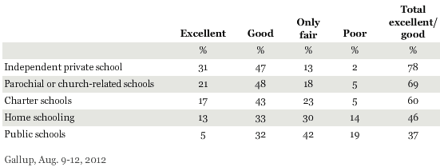

```{r setup, include=FALSE}
knitr::opts_chunk$set(echo = FALSE)
```

```{r, echo=F, message=F, warning=F}
library(readr)
library(openintro)
data(COL)
```


# Binomial distribution

## Example

\alert{Suppose a health insurance company found that 70\% of the people they insure stay below their deductible in any given year. This means that 30\% of the people exceed their deductible. Suppose the insurance agency is considering a random sample of four individuals they insure. What is the chance that exactly one of them will exceed the deductible and the other three will not?}

## Example

Let's call these people Allen (A), Brittany (B), Caroline (C), and Damian (D). Each one of the four scenarios below will satisfy the condition of "exactly 1 of them exceeds deductible":

\pause

\centering{Scenario 1: $\frac{0.3}{(A) \textcolor{red}{ Exceed}} \times \frac{0.7}{(B) \text{ }Not} \times \frac{0.7}{(C) \text{ }Not} \times \frac{0.7}{(D) \text{ }Not}=0.3^1 \times 0.7^3=0.103$}

\pause

\centering{Scenario 2: $\frac{0.7}{(A) \text{ }Not } \times \frac{0.3}{(B)\textcolor{red}{ Exceed}} \times \frac{0.7}{(C) \text{ }Not} \times \frac{0.7}{(D) \text{ }Not}=0.3^1 \times 0.7^3=0.103$}

\pause

\centering{Scenario 3: $\frac{0.7}{(A) \text{ }Not } \times \frac{0.7}{(B) \text{ }Not} \times \frac{0.3}{(C)\textcolor{red}{ Exceed}} \times \frac{0.7}{(D) \text{ }Not}=0.3^1 \times 0.7^3=0.103$}

\pause

\centering{Scenario 4: $\frac{0.7}{(A) \text{ }Not } \times \frac{0.7}{(B) \text{ }Not} \times \frac{0.7}{(C)\text{ }Not} \times \frac{0.3}{(D) \textcolor{red}{ Exceed}}=0.3^1 \times 0.7^3=0.103$}

\pause

\raggedright
The probability of exactly one 1 of 4 people exceeding deductible is the sum of all of these probabilities.

\centering{$0.103+0.103+0.103+0.103 = 4 \times 0.103 = 4\times 0.3^1 \times 0.7^3 = 0.412$}

## Binomial distribution

The question from the prior slide asked for the probability of given number of successes, **k**, in a given number of trials, **n**, (k = 1 success in $n=4$ trials), and we calculated this probability as

\centering{$\#$ of scenarios $\times$ P(single scenario)}

\pause

- $\#$ of scenarios: there is a less tedious way to figure it out, we'll get to that shortly...

\pause

- P(single scenario) $= p^k \cdot (1-p)^{(n-k)}$

\raggedright\small \alert{Note:} probability of success to the power of number of successes, probability of failure to the power of number of failures.

\pause

\normalsize The **Binomial distribution** describes the probability of having exactly $k$ successes in $n$ independent Bernoulli (binary) trials with probability of success $p$, where success always represents the outcome of interest (e.g., exceeding deductible).

## Counting the \# of scenarios

Earlier we wrote out all possible scenarios that fit the condition of exactly one person exceeding deductible. If $n$ was larger and/or $k$ was different than 1, for example, $n=9$ and $k=2$.

\centering{\alert{EE}NNNNNNN}

\pause

\centering{N\alert{EE}NNNNNN}

\pause

\centering{NN\alert{EE}NNNNN}

\centering{$\dots$}

\centering{NN\alert{E}NN\alert{E}NNN}

\centering{$\dots$}

\centering{NNNNNNN\alert{EE}}

\raggedright Writing out all possible scenarios would be incredibly tedious and prone to errors.

## Calculating the \# of scenarios

The **choose function** is useful for calculating the number of ways to choose $k$ successes in $n$ trials.

\centering{${n \choose k} = \frac{n!}{k! \cdot (n-k)!}$}

\pause

- $k=1, n=4: {4 \choose 1} = \frac{4!}{1!(4-1)!} = \frac{4 \times 3 \times 2 \times 1}{1 \times (3 \times 2 \times 1)} = 4$

\pause

- $k=2, n=9: {9 \choose 2} = \frac{9!}{2!(9-2)!} = \frac{9 \times 8 \times 7!}{2 \times 1 \times 7!} = 36$

\raggedright
\noindent\rule{4cm}{0.4pt}

\alert{Note:} You can also use R for these calculations:
```{r, echo=T}
choose(9,2)
```

## Properties of the choose function

\alert{Which of the following is false?}

A) There are $n$ ways of getting 1 success in $n$ trials, ${n \choose 1} = n$.
B) There is only 1 way of getting $n$ successes in $n$ trials, ${n \choose n} = 1$.
C) There is only 1 way of getting $n$ failures in $n$ trials, ${n \choose 0} = 1$.
D) There are $n-1$ ways of getting $n-1$ successes in $n$ trials, ${n \choose n-1} = n-1$

## Properties of the choose function

\alert{Which of the following is false?}

A) There are $n$ ways of getting 1 success in $n$ trials, ${n \choose 1} = n$.
B) There is only 1 way of getting $n$ successes in $n$ trials, ${n \choose n} = 1$.
C) There is only 1 way of getting $n$ failures in $n$ trials, ${n \choose 0} = 1$.
D) \alert{There are $n-1$ ways of getting $n-1$ successes in $n$ trials, ${n \choose n-1} = n-1$}

## Binomial distribution

If $p$ represents probability of success, $(1-p)$ represents probability of failure, $n$ represents number of independent trials, and $k$ represents number of successes

\centering{P($k$ successes in $n$ trials) = ${n \choose k}p^k(1-p)^{(n-k)}$}

\raggedright
\noindent\rule{4cm}{0.4pt}

\alert{Note:} You can also use R for these calculations:
```{r, echo=T, eval=FALSE}
dbinom(k, n, p)
```

## Practice

\alert{Which of the following is not a condition that needs to be met for the binomial distribution to be applicable?}

A) The trials must be independent.
B) The number of trials, $n$, must be fixed.
C) Each trial outcome must be classified as a success or a failure.
D) The number of desired successes, $k$, must be greater than the number of trials.
E) The probability of success, $p$, must be the same for each trial.

## Practice

\alert{Which of the following is not a condition that needs to be met for the binomial distribution to be applicable?}

A) The trials must be independent.
B) The number of trials, $n$, must be fixed.
C) Each trial outcome must be classified as a success or a failure.
D) \alert{The number of desired successes, $k$, must be greater than the number of trials.}
E) The probability of success, $p$, must be the same for each trial.

## Practice

\alert{A 2012 Gallup survey suggests that 26.2\% of Americans are obese. Among a random sample of 10 Americans, what is the probability that exactly 8 are obese?}

A) Pretty high
B) Pretty low

## Practice

\alert{A 2012 Gallup survey suggests that 26.2\% of Americans are obese. Among a random sample of 10 Americans, what is the probability that exactly 8 are obese?}

A) Pretty high
B) \alert{Pretty low}

## Practice

\alert{A 2012 Gallup survey suggests that 26.2\% of Americans are obese. Among a random sample of 10 Americans, what is the probability that exactly 8 are obese?}

A) $0.262^8 \times 0.728^2$

B) ${8 \choose 10} \times 0.262^8 \times 0.738^2$

C) ${10 \choose 8} \times 0.262^8 \times 0.738^2$

D) ${10 \choose 8} \times 0.262^2 \times 0.738^8$

## Practice

\alert{A 2012 Gallup survey suggests that 26.2\% of Americans are obese. Among a random sample of 10 Americans, what is the probability that exactly 8 are obese?}

A) $0.262^8 \times 0.728^2$

B) ${8 \choose 10} \times 0.262^8 \times 0.738^2$

C) \alert{${10 \choose 8} \times 0.262^8 \times 0.738^2=45 \times 0.262^8 \times 0.738^2 = 0.0005$}

D) ${10 \choose 8} \times 0.262^2 \times 0.738^8$

\raggedright
\noindent\rule{4cm}{0.4pt}

```{r, echo=T}
dbinom(8, 10, 0.262)
```

## Practice

\alert{The National Vaccine Information Center estimates that 90\% of Americans have had chickenpox by the time they reach adulthood. Find the following probabilities.}

(a) What is the probability that **exactly** 7 out of 10 randomly selected American adults will have had chickenpox in their childhood?

(b) What is the probability that **at least** 9 out of 10 randomly selected American adults will have had chickenpox in their childhood?

(c) What is the probability that **at most** 9 out of 10 randomly selected American adults will have had chickenpox in their childhood?

\pause

\alert{We need to check to see if all conditions of binomial distribution are met before we use the binomial formula to find the probability.}

## Conditions

\begin{itemize}

\item The trials are independent. \pause \ding{51} Because the sample is random \\

\pause

\item The number of trials, $n$, is fixed. \pause \ding{51} $n = 10$ \\

\pause

\item Each trial outcome can be classified as a success (have had chickenpox during childhood) or failure (have $not$ had chickenpox during childhood). \\ \pause \ding{51} Either have had chickenpox during childhood or not. \\

\pause

\item The probability of a success (have had chickenpox during childhood), $p$, is the same for each trial. \\ \pause \ding{51} $p = 0.9$\\

\end{itemize}

\alert{So, if we let the random variable $X$ represent the number of American adults who have had chickenpox during childhood among a random sample of 10 American adults. Then $X$ has Binomial distribution with $n=10$ trials and probability of success $p=0.9$.}

## Practice

(a) There are $k = 7$ successes in $n = 10$ trials and the probability of a success is $p = 0.9$.

\pause

In general,

\centering{P($k$ successes in $n$ trials) = ${n \choose k}p^k(1-p)^{(n-k)}$}

\pause 

\vspace{-0.5cm}
\begin{eqnarray*}
P(X = 7) &=& \binom{10}{7} (0.9)^7 (1-0.9)^{10-7} \\ \pause
&=& \frac{10!}{7!(10-7)!} (0.9)^7 (0.1)^3
\end{eqnarray*}

\pause

Dealing with the factorial part:
\vspace{-0.5cm}

\small

\[ \frac{10!}{7!(3)!} = \frac{10 \times 9 \times 8 \times 7 \times 6 \times 5 \times 4 \times 3 \times 2 \times 1}{(7 \times 6 \times 5 \times 4 \times 3 \times 2 \times 1)(3 \times 2 \times 1)} = \frac{10 \times 9 \times 8}{3 \times 2 \times 1} = 120\]

## Practice

(a) There are $k = 7$ successes in $n = 10$ trials and the probability of a success is $p = 0.9$.

\vspace{-0.5cm}
\begin{eqnarray*}
P(X = 7) &=& \binom{10}{7} (0.9)^7 (1-0.9)^{10-7} \\
&=& \frac{10!}{7!(10-7)!} (0.9)^7 (0.1)^3\\ 
&=& (120) (0.9)^7 (0.1)^3\\
&=& (120) (0.0004782969)\\
&=& 0.05739563 \approx 0.0574
\end{eqnarray*}


\pause

\vspace{-0.5cm}
Thus, the probability 7 of 10 randomly selected American adults will have had chickenpox in their childhood is 0.0574 or 5.74\%.

## Practice

(a) There are $k = 7$ successes in $n = 10$ trials and the probability of a success is $p = 0.9$.

\vspace{-0.5cm}
\begin{eqnarray*}
P(X = 7) &=& \binom{10}{7} (0.9)^7 (1-0.9)^{10-7} \\
&=& \frac{10!}{7!(10-7)!} (0.9)^7 (0.1)^3\\ 
&=& (120) (0.9)^7 (0.1)^3\\
&=& (120) (0.0004782969)\\
&=& 0.05739563 \approx 0.0574
\end{eqnarray*}

\vspace{-0.5cm}
\alert{Note:} You can also use R for these calculations:

```{r, echo=T}
dbinom(7, 10, 0.9)
```

## Practice

(b) What is the probability that **at least** 9 out of 10 randomly selected American adults will have had chickenpox in their childhood?

Since we have a total of 10 trials, at least 9 successes means $k = 9$ or $10$ successes. So, we need to apply the binomial formula two times; once with $k=9$ and another time with $k=10$.

\pause

\vspace{-0.5cm}
\begin{eqnarray*}
P(X \ge 9) &=& P(X = 9) + P(X = 10)\\
&=& \binom{10}{9} (0.9)^9 (1-0.9)^{10-9} + \binom{10}{10} (0.9)^{10} (1-0.9)^{10-10} \\
&=& \frac{10!}{9!(10-9)!} (0.9)^9 (0.1)^1 + \frac{10!}{10!(10-10)!} (0.9)^{10} (0.1)^0\\ 
&=& (10) (0.9)^9 (0.1)^1 + (1) (0.9)^{10} \\
&=& (10) (0.03874205) + 0.3486784\\
&=& 0.3874204 \approx 0.3874
\end{eqnarray*}

## Practice

(b) What is the probability that **at least** 9 out of 10 randomly selected American adults will have had chickenpox in their childhood?

\vspace{-0.5cm}
\begin{eqnarray*}
P(X \ge 9) &=& P(X = 9) + P(X = 10)\\
&=& \binom{10}{9} (0.9)^9 (1-0.9)^{10-9} + \binom{10}{10} (0.9)^{10} (1-0.9)^{10-10} \\
&=& \frac{10!}{9!(10-9)!} (0.9)^9 (0.1)^1 + \frac{10!}{10!(10-10)!} (0.9)^{10} (0.1)^0\\ 
&=& (10) (0.9)^9 (0.1)^1 + (1) (0.9)^{10} \\
&=& (10) (0.03874205) + 0.3486784\\
&=& 0.3874205 + 0.3486784 = 0.7360989 \approx 0.7361
\end{eqnarray*}

\vspace{-0.5cm}
Thus, the probability that at least 9 out of 10 randomly selected American adults have had chickenpox in their childhood is about 0.7361 or 73.61\%.


## Practice

(b) What is the probability that **at least** 9 out of 10 randomly selected American adults will have had chickenpox in their childhood?

\vspace{-0.5cm}
\begin{eqnarray*}
P(X \ge 9) &=& P(X = 9) + P(X = 10)\\
&=& 0.3874205 + 0.3486784 = 0.7360989 \approx 0.7361
\end{eqnarray*}

\vspace{-0.5cm}
\alert{Note:} You can also use R for these calculations:

```{r, echo=T}
dbinom(9, 10, 0.9) + dbinom(10, 10, 0.9)
```

Or

```{r, echo=T}
1 - pbinom(8, 10, 0.9)
```

## Practice

(c) What is the probability that **at most** 9 out of 10 randomly selected American adults will have had chickenpox in their childhood?

Since we have a total of 10 trials, at most 9 successes means $k = 9, 8, 7, ..., 1, 0$ successes. So, we need to apply the binomial formula ten times; once with $k=9$, once with $k=8$, etc. 

A shorter way is to use the idea of complementary events where we compute the probability of $k=10$ successes and subtract that probability from 1 since $10$ is the only remaining possible outcome.

\pause

\vspace{-0.5cm}
\begin{eqnarray*}
P(X \le 9) &=& P(X = 9) + P(X = 8) + ... + P(X=0)\\
&=& 1- P(X=10)\\
&=& 1 - \binom{10}{10} (0.9)^{10} (1-0.9)^{10-10}\\
&=& 1 - 0.3486784 = 0.6513216 \approx 0.6513
\end{eqnarray*}

## Practice

(c) What is the probability that **at most** 9 out of 10 randomly selected American adults will have had chickenpox in their childhood?

\vspace{-0.5cm}
\begin{eqnarray*}
P(X \le 9) &=& P(X = 9) + P(X = 8) + ... + P(X=0)\\
&=& 1- P(X=10)\\
&=& 1 - \binom{10}{10} (0.9)^{10} (1-0.9)^{10-10}\\
&=& 1 - 0.3486784 = 0.6513216 \approx 0.6513
\end{eqnarray*}

\vspace{-0.5cm}
Thus, the probability that at most 9 out of 10 randomly selected American adults will have had chickenpox in their childhood is 0.6513 or about 65.13\%.

## Practice

(c) What is the probability that **at most** 9 out of 10 randomly selected American adults will have had chickenpox in their childhood?

\vspace{-1cm}
\begin{eqnarray*}
P(X \le 9) &=& P(X = 9) + P(X = 8) + ... + P(X=0)\\
&=& 1- P(X=10)\\
&=& 1 - \binom{10}{10} (0.9)^{10} (1-0.9)^{10-10}\\
&=& 1 - 0.3486784 = 0.6513216 \approx 0.6513
\end{eqnarray*}

\vspace{-0.35cm}
\alert{Note:} You can also use R for these calculations:

```{r, echo=T}
1 - dbinom(10, 10, 0.9)
```

or

```{r, echo=T}
pbinom(9, 10, 0.9)
```


## Expected value

\alert{A 2012 Gallup survey suggests that 26.2\% of Americans are obese. Among a random sample of 100 Americans, how many would you expect to be obese?}

## Expected value

\alert{A 2012 Gallup survey suggests that 26.2\% of Americans are obese. Among a random sample of 100 Americans, how many would you expect to be obese?}

- Easy enough, $100 \times 0.262 = 26.2$.

## Expected value

\alert{A 2012 Gallup survey suggests that 26.2\% of Americans are obese. Among a random sample of 100 Americans, how many would you expect to be obese?}

- Easy enough, $100 \times 0.262 = 26.2$.

- Or more formally, $\mu = np = 100 \times 0.262 = 26.2$.

## Expected value

\alert{A 2012 Gallup survey suggests that 26.2\% of Americans are obese. Among a random sample of 100 Americans, how many would you expect to be obese?}

- Easy enough, $100 \times 0.262 = 26.2$.

- Or more formally, $\mu = np = 100 \times 0.262 = 26.2$.

- But this doesn't mean in every random sample of 100 people exactly 26.2 will be obese. In fact that's not even possible. In some samples this value will be less, and in others more. How much would we expect this value to vary?

## Expected value and its variability

Mean and standard deviation of binomial distribution

\centering{$\mu = np$ \hspace{2cm} $\sigma = \sqrt{np(1-p)}$}

## Expected value and its variability

Mean and standard deviation of binomial distribution

\centering{$\mu = np$ \hspace{2cm} $\sigma = \sqrt{np(1-p)}$}

- Going back to the obesity rate:

\centering{$\sigma = \sqrt{np(1-p)} = \sqrt{100 \times 0.262 \times 0.738} \approx 4.4$}

## Expected value and its variability

Mean and standard deviation of binomial distribution

\centering{$\mu = np$ \hspace{2cm} $\sigma = \sqrt{np(1-p)}$}

- Going back to the obesity rate:

\centering{$\sigma = \sqrt{np(1-p)} = \sqrt{100 \times 0.262 \times 0.738} \approx 4.4$}

- We would expect 26.2 out of 100 randomly sampled Americans to be obese, with a standard deviation of 4.4.

\raggedright
\noindent\rule{4cm}{0.4pt}
\alert{Note:} Mean and standard deviation of a binomial might not always be whole numbers, and that is alright, these values represent what we would expect to see on average.

## Unusual observations

Using the notion that **observations that are more than 2 standard deviations away from the mean are considered unusual** and the mean and the standard deviation we just computed, we can calculate a range for the plausible number of obese Americans in random samples of 100.

\centering{$26.2 \pm (2 \times 4.4) = (17.4,35)$}

## Practice

\alert{An August 2012 Gallip poll suggests that 13\% of Americans think home schooling provides an excellent education for children. Would a random sample of 1,000 Americans where only 100 share this opinion be considered unusual?}

A) No \hspace{2cm} B) Yes



## Practice

\alert{An August 2012 Gallip poll suggests that 13\% of Americans think home schooling provides an excellent education for children. Would a random sample of 1,000 Americans where only 100 share this opinion be considered unusual?}

A) No \hspace{2cm} B) **Yes**

\centering{$\mu = np = 1,000 \times 0.13 = 130$}

\centering{$\sigma = \sqrt{np(1-p)} = \sqrt{1,000 \times 0.13 \times 0.87} \approx 10.6$}

## Practice

\alert{An August 2012 Gallip poll suggests that 13\% of Americans think home schooling provides an excellent education for children. Would a random sample of 1,000 Americans where only 100 share this opinion be considered unusual?}

A) No \hspace{2cm} B) **Yes**

\centering{$\mu = np = 1,000 \times 0.13 = 130$}

\centering{$\sigma = \sqrt{np(1-p)} = \sqrt{1,000 \times 0.13 \times 0.87} \approx 10.6$}

\raggedright
Method 1: Range of usual observations: $130 \pm 2 \times 10.6 = (108.8, 151.2)$. 100 is outside this range, so would be considered unusual.

## Practice

\alert{An August 2012 Gallip poll suggests that 13\% of Americans think home schooling provides an excellent education for children. Would a random sample of 1,000 Americans where only 100 share this opinion be considered unusual?}

A) No \hspace{2cm} B) **Yes**

\centering{$\mu = np = 1,000 \times 0.13 = 130$}

\centering{$\sigma = \sqrt{np(1-p)} = \sqrt{1,000 \times 0.13 \times 0.87} \approx 10.6$}

\raggedright
Method 1: Range of usual observations: $130 \pm 2 \times 10.6 = (108.8, 151.2)$. 100 is outside this range, so would be considered unusual.

Method 2: Z - score of observation: $Z = \frac{x-mean}{SD} = \frac{100-130}{10.6} = -2.83$. 100 is more than 2 SD below the mean, so would be considered unusual.

## Shapes of binomial distributions

For this activity you will use a web applet. Go to [https://gallery.shinyapps.io/dist_calc/](https://gallery.shinyapps.io/dist_calc/) and choose Binomial coin experiment in the drop down menu on the left.

  - Set the number of trials to 20 and the probability of success to 0.15. Describe the shape of the distribution of number of successes.
  
  - Keeping $p$ constant at 0.15, determine the minimum sample size required to obtain a unimodal and symmetric distribution of number of successes. Please submit only one response per team.
  
  - Further considerations:
    
    - What happens to the shape of the distribution as $n$ stays constant and $p$ changes?
    
    - What happens to shape of the distribution as $p$ stays constant and $n$ changes?
    

## Distributions of number of successes

\alert{Hollow histograms of samples from the binomial model where $p = 0.10$ and $n = 10, 30, 100, \text{and } 300.$ What happens as $n$ increases?}

```{r, echo=F, message=F, warning=F, out.width="90%",fig.align='center'}
k  <- -50:500
p  <- 0.1
n  <- c(10, 30, 100, 300)
xl <- c(0, 0, 0, 10)-1
xu <- c(7, 11, 24, 50)-1
axis1 <- list()
axis1[[1]] <- seq(0,6,2)
axis1[[2]] <- seq(0,10, 2)
axis1[[3]] <- seq(0, 20, 5)
axis1[[4]] <- seq(10, 50, 10)

par(mfrow=c(2,2))

for(i in 1:4){
  pk   <- dbinom(k, n[i], p)
  xlab <- paste("n =", n[i])
  plot(k-0.05,pk,type='s',xlim=c(xl[i], xu[i]), axes=FALSE, xlab=xlab, ylab="", col=COL[5], lwd=2, cex.lab = 2)
  axis(1, axis1[[i]])
  abline(h=0)
}

```


## How large is large enough?

The sample size is considered large enough if the expected number of successes and failures are both at least 10.

\centering{$np \geq 10$  and  $n(1-p) \geq 10$}

## How large is large enough?

The sample size is considered large enough if the expected number of successes and failures are both at least 10.

\centering{$np \geq 10$  and  $n(1-p) \geq 10$}

\raggedright

$10 \times 0.13 = 1.3$  and  $10 \times (1-0.13) = 8.7$

## Practice

\alert{Below are four pairs of Binomial distribution parameters. Which distribution can be approximated by the bell shaped curve?}

A) $n=100, p=0.95$

B) $n=25, p=0.45$

C) $n=150, p=0.05$

D) $n=500, p=0.015$

## Practice

\alert{Below are four pairs of Binomial distribution parameters. Which distribution can be approximated by the bell shaped curve?}

A) $n=100, p=0.95$

B) \alert{$n=25, p=0.45 \rightarrow 25 \times 0.45 = 11.25; 25 \times 0.55 = 13.75$}

C) $n=150, p=0.05$

D) $n=500, p=0.015$

