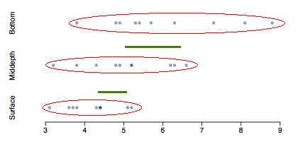

```{r setup, include=FALSE}
knitr::opts_chunk$set(echo = FALSE)
```

```{r, echo=F, message=F, warning=F}
library(readr)
library(openintro)
library(here)
library(tidyverse)
library(xtable)
data(COL)
```


# One-sample means with the _t_ distribution

## Friday the $13^{th}$

Between 1990 - 1992 researchers in the UK collected data on traffic flow, accidents, hospital admissions on Friday $13^{th}$ and the previous Friday, Friday $6^{th}$. Below is an excerpt from this data set on traffic flow. We can assume that traffic flow on given day at locations 1 and 2 are independent.

\small
\begin{center}
\begin{tabular}{rllrrrl}
  \hline
 & type & date & 6$^{\text{th}}$ & 13$^{\text{th}}$ & diff & location  \\ 
  \hline
1 & traffic & 1990,  July & 139246 & 138548 & 698 & loc 1 \\
  2 & traffic & 1990,  July & 134012 & 132908 & 1104 & loc 2 \\
  3 & traffic & 1991,  September & 137055 & 136018 & 1037 & loc 1 \\
  4 & traffic & 1991,  September & 133732 & 131843 & 1889 & loc 2 \\
  5 & traffic & 1991,  December & 123552 & 121641 & 1911 & loc 1 \\
  6 & traffic & 1991,  December & 121139 & 118723 & 2416 & loc 2 \\
  7 & traffic & 1992,  March & 128293 & 125532 & 2761 & loc 1 \\
  8 & traffic & 1992,  March & 124631 & 120249 & 4382 & loc 2 \\
  9 & traffic & 1992,  November & 124609 & 122770 & 1839 & loc 1 \\
  10 & traffic & 1992,  November & 117584 & 117263 & 321 & loc 2 \\
   \hline
\end{tabular}
\end{center}


## Friday the $13^{th}$

- We want to investigate if people's behavior is different on Friday $13^{th}$ compared to Friday $6^{th}$.

\pause

- One approach is to compare the traffic flow on these two days.

\pause

\begin{itemize}

\item We want to investigate if people's behavior is different on Friday 13$^{\text{th}}$ compared to Friday 6$^{\text{th}}$.

\pause

\item One approach is to compare the traffic flow on these two days.

\pause

\item $H_0:$ Average traffic flow on Friday 6$^{\text{th}}$ and 13$^{\text{th}}$ are equal. \\
$H_A:$ Average traffic flow on Friday 6$^{\text{th}}$ and 13$^{\text{th}}$ are different.

\pause

\end{itemize}

\alert{Each case in the data set represents traffic flow recorded at the same location in the same month of the same year: one count from Friday $6^{th}$ and the other Friday $13^{th}$. Are these two counts independent?}

\pause

No.

## Hypotheses

\alert{What are the hypotheses for testing for a difference between the average traffic flow between Friday $6^{th} \text{ and } 13^{th}$?}

\begin{enumerate}[A)]
\item  $H_0: \mu_{6th} = \mu_{13th}$ \\ $H_A: \mu_{6th} \ne \mu_{13th}$
\item  $H_0: p_{6th} = p_{13th}$ \\ $H_A: p_{6th} \ne p_{13th}$
\item  $H_0: \mu_{diff} = 0$ \\ $H_A: \mu_{diff} \ne 0$ 
\item  $H_0: \bar{x}_{diff} = 0$ \\ $H_A: \bar{x}_{diff} = 0$
\end{enumerate}


## Hypotheses

\alert{What are the hypotheses for testing for a difference between the average traffic flow between Friday $6^{th} \text{ and } 13^{th}$?}

\begin{enumerate}[A)]
\item  $H_0: \mu_{6th} = \mu_{13th}$ \\ $H_A: \mu_{6th} \ne \mu_{13th}$
\item  $H_0: p_{6th} = p_{13th}$ \\ $H_A: p_{6th} \ne p_{13th}$
\item  $\textcolor{red}{H_0: \mu_{diff} = 0}$ \\ $\textcolor{red}{H_A: \mu_{diff} \ne 0}$ 
\item  $H_0: \bar{x}_{diff} = 0$ \\ $H_A: \bar{x}_{diff} = 0$
\end{enumerate}

## Conditions

- **Independence:** We are told to assume that cases (rows) are independent.

\pause

- **Sample size / skew:** \pause

\begin{columns}

\begin{column}{0.7\textwidth}
\begin{itemize}
\item The sample distribution does not appear to be extremely skewed, but it's very difficult to assess with such a small sample size. We might want to think about whether we would expect the population distribution to be skewed or not $-$ probably not, it should be equally likely to have days with lower than average traffic and higher than average traffic.
\end{itemize}
\end{column}

\begin{column}{0.3\textwidth}

```{r, echo=F, message=F, warning=F, out.width="100%",fig.align='center'}
friday = read.csv("friday.csv", h = T, na.strings = "")

# histogram
histPlot(friday$diff[friday$type == "traffic"], col="#22558833", border="#225588", xlab = "Difference in traffic flow", cex.lab = 1.5)

```

\end{column}

\end{columns}

- We do not know $\sigma$ and $n$ is too small to assume $s$ is a reliable estimate for $\sigma$.

\pause

\alert{So what do we do when the sample size is small?}

## Review: what purpose does a large sample serve?

As long as observations are independent, and the population distribution is not extremely skewed, a large sample would ensure that...

  - The sampling distribution of the mean is nearly normal.
  
  - The estimate of the standard error, as $\frac{s}{\sqrt{n}}$, is reliable.
  
## The normality condition

- The CLT, which states that sampling distributions will be nearly normal, holds true for **any** sample size as long as the population distribution is nearly normal.

\pause

- While this is helpful special case, it's inherently difficult to verify normality in small data sets.

\pause

- We should exercise caution when verifying the normality condition for small samples. It is important to not only examine the data but also think about where the data come from.

  - For example, ask: would I expect this distribution to be symmetric, and am I confident that outliers are rare?
  

## The _t_ distribution

- When the population standard deviation is unknown (almost always), the uncertainty of the standard error estimate is addressed by using a new distribution: the **_t_ distribution**.

\pause

- This distribution also has a bell shape, but its tails are **thicker** than the normal model's.

\pause

- Therefore observations are more likely to fall beyond two SDs from the mean than under the normal distribution.

\pause

- Extra thick tails are helpful for resolving our problem with a less reliable estimate the standard error (since _n_ is small).

```{r, echo=F, message=F, warning=F, fig.width=4, fig.height=1.4,fig.align='center'}
par(mar=c(2, 1, 1, 1), mgp=c(5, 0.6, 0))
plot(c(-4, 4), c(0, dnorm(0)), type='n', axes=FALSE, cex.axis=0.8)
axis(1)
abline(h=0)

X <- seq(-5, 5, 0.01)
Y <- dnorm(X)
lines(X, Y, lty=3, lwd=2)

Y <- dt(X, 2)
lines(X, Y, lwd=1.5, col = "#225588")

legend("topright", inset = 0.05, lty = c(3,1), lwd = c(2,1.5), c("normal","t"), col = c("black","#225588"), bty = "n")
```


## The _t_ distribution

- Always centered at zero, like the standard normal ($z$) distribution.

- Has a single parameter: **degrees of freedom** ($\mathbf{df}$).

```{r, echo=F, message=F, warning=F, fig.width=4, fig.height=1.7,fig.align='center'}
par(mar=c(2, 1, 1, 1), mgp=c(5, 0.6, 0))
plot(c(-3.5, 7), c(0, dnorm(0)), type='n', axes=FALSE)
axis(1, cex.axis = 0.75)
abline(h=0)

COL <- c('#000000FF', '#00000091', '#0000006F', '#0000004B', '#00000022')
DF <- c('normal', 10, 5, 2, 1)

X <- seq(-5, 8, 0.01)
Y <- dnorm(X)
lines(X, Y, col=COL[1])

for(i in 2:5){
	Y <- dt(X, as.numeric(DF[i]))
	lines(X, Y, col=COL[i])
}

legend('topright', legend=c(DF[1], paste('t, df=', DF[2:5], sep='')), col=COL, lty=rep(1, 5), bty = "n", cex = 0.85)

```

\pause

\alert{What happens to shape of the $t$ distribution as $df$ increases?}

\pause

Approaches normal.

## Back to Friday the $13^{th}$

\small
\begin{tabular}{rllrr || r || l}
  \hline
 & type & date & 6$^{\text{th}}$ & 13$^{\text{th}}$ & diff & location  \\ 
  \hline
  1 & traffic & 1990,  July & 139246 & 138548 & 698 & loc 1 \\
  2 & traffic & 1990,  July & 134012 & 132908 & 1104 & loc 2 \\
  3 & traffic & 1991,  September & 137055 & 136018 & 1037 & loc 1 \\
  4 & traffic & 1991,  September & 133732 & 131843 & 1889 & loc 2 \\
  5 & traffic & 1991,  December & 123552 & 121641 & 1911 & loc 1 \\
  6 & traffic & 1991,  December & 121139 & 118723 & 2416 & loc 2 \\
  7 & traffic & 1992,  March & 128293 & 125532 & 2761 & loc 1 \\
  8 & traffic & 1992,  March & 124631 & 120249 & 4382 & loc 2 \\
  9 & traffic & 1992,  November & 124609 & 122770 & 1839 & loc 1 \\
  10 & traffic & 1992,  November & 117584 & 117263 & 321 & loc 2 \\
   \hline
\end{tabular}
\normalsize

\begin{align*}
\hspace{6cm} \bar{x}_{diff} & = 1836 \\
 s_{diff} & = 1176 \\
 n &= 10
\end{align*}

## Finding the test statistic

The test statistic for inference on a small sample (n < 50) mean is the $T$ statistic with $df = n = 1$.

\centering{$T_{df} = \frac{\text{point estimate} - \text{null value}}{SE}$}

\pause

\raggedright
\alert{in context...}

\begin{eqnarray*}
point estimate & = \bar{x}_{diff} = 1836  \\
\pause
SE & = \frac{s_{diff}}{\sqrt{n}} = \frac{1176}{\sqrt{10}} = 372 \\
\pause
T & = \frac{1836-0}{372} = 4.94 \\
\pause
df & = 10-1 = 9
\end{eqnarray*}

\noindent\rule{4cm}{0.4pt}
\alert{Note:} Null value is 0 because in the null hypothesis we set $\mu_{diff} = 0.$


## Finding the p-value

- The p-value is, once again, calculated as the area tail area under the $t$ distribution.

\pause

- Using R:

```{r, echo=T}
2 * pt(4.94, df = 9, lower.tail = FALSE)
```

\pause

- Using a web app:

  [https://gallery.shinyapps.io/dist_calc/](https://gallery.shinyapps.io/dist_calc/)

\pause

- Or when these aren't available, we can use a $t$-table.

## Conclusion of the test

\alert{What is the conclusion of this hypothese test?}

\pause

Since the p-value is quite low, we conclude that the data provide strong evidence of a difference between traffic flow on Friday $6^{th} \text{ and } 13^{th}.$

## What is the difference?

- We concluded that there is a difference in the traffic flow between Friday $6^{th} \text{ and } 13^{th}.$

\pause

- But it would be more interesting to find out what exactly this difference is.

\pause

- We can use a confidence interval to estimate this difference.

## Confidence interval for a small sample mean

- Confidence intervals are always of the form

\centering{$\text{point estimate} \pm ME$}

\pause

- ME is always calculated as the product of a critical value and SE.

\pause

- Since small sample means follow a $t$ distribution (and not a $z$ distribution), the critical value is a $t^*$ (as opposed to a $z^*$).

\centering{$\text{point estimate} \pm t^* \times SE$}

## Finding the critical $t (t^*)$

Using R:

```{r, echo=T}
qt(p = 0.975, df = 9)
```

## Constructing a CI for a small sample mean

\alert{Which of the following is the correct calculation of a 95\% confidence interval for the difference between the traffic flow between Friday $6^{th} \text{ and } 13^{th}$?}

\centering{$\bar{x}_{diff} = 1836 \hspace{0.5cm} s_{diff} = 1176 \hspace{0.5cm} n = 10 \hspace{0.5cm} SE = 372$}

\begin{enumerate}[A)]
\item $1836 \pm 1.96 \times 372$
\item $1836 \pm 2.26 \times 372$
\item $1836 \pm -2.26 \times 372$
\item $1836 \pm 2.26 \times 1176$
\end{enumerate}

## Constructing a CI for a small sample mean

\alert{Which of the following is the correct calculation of a 95\% confidence interval for the difference between the traffic flow between Friday $6^{th} \text{ and } 13^{th}$?}

\centering{$\bar{x}_{diff} = 1836 \hspace{0.5cm} s_{diff} = 1176 \hspace{0.5cm} n = 10 \hspace{0.5cm} SE = 372$}

\begin{enumerate}[A)]
\item $1836 \pm 1.96 \times 372$
\item $\textcolor{red}{1836 \pm 2.26 \times 372 \hspace{1cm}\rightarrow(995,2677)}$
\item $1836 \pm -2.26 \times 372$
\item $1836 \pm 2.26 \times 1176$
\end{enumerate}

## Interpreting the CI

\alert{Which of the following is the \textbf{best} interpretation for the confidence interval we just calculated?}

\centering{$\textcolor{red}{\mu_{diff: \text{ } 6th - 13th} = (995,2677)}$}

\raggedright We are 95% confident that...

A) The difference between the average number of cars on the road on Friday $6^{th} \text{ and } 13^{th}$ is between 995 and 2677.

B) On Friday $6^{th}$ there are 995 to 2677 fewer cars on the road than on the Friday $13^{th}$, on average.

C) On Friday $6^{th}$ there are 995 to 2677 more cars on the road than on the Friday $13^{th}$, on average.

D) On Friday $13^{th}$ there are 995 to 2677 fewer cars on the road than on the Friday $6^{th}$, on average.


## Interpreting the CI

\alert{Which of the following is the \textbf{best} interpretation for the confidence interval we just calculated?}

\centering{$\textcolor{red}{\mu_{diff: \text{ } 6th - 13th} = (995,2677)}$}

\raggedright We are 95% confident that...

A) The difference between the average number of cars on the road on Friday $6^{th} \text{ and } 13^{th}$ is between 995 and 2677.

B) On Friday $6^{th}$ there are 995 to 2677 fewer cars on the road than on the Friday $13^{th}$, on average.

C) On Friday $6^{th}$ there are 995 to 2677 more cars on the road than on the Friday $13^{th}$, on average.

D) \textcolor{red}{On Friday $13^{th}$ there are 995 to 2677 fewer cars on the road than on the Friday $6^{th}$, on average.}

## Synthesis

\alert{Does the conclusion from the hypothesis test agree with the findings of the confidence intereval?}

\pause

Yes, the hypothesis test found a significant difference, and the CI does not contain the null value of 0.

\pause

\alert{Do you think the findings of this study suggests that people believe Friday $13^{th}$ is a day of bad luck?}

\pause

No, this is an observational study. We have just observed a significant difference between the number of cars on the road on these two days. We have not tested for people's beliefs.


## Recap: Inference using the $t$-distribution

- If $\sigma$ is unknown, use $t$-distribution with $SE = \frac{s}{\sqrt{n}}$.

\pause

- Conditions:
  
  - Independence of observations (often verified by random sample, and if sampling w/o replacement, n < 10% of population).
  
  - No extreme skew.
  
\pause

- Hypothesis testing:

\centering{$T_{df} = \frac{\text{point estimate}-\text{null value}}{SE}, \text{where }df=n-1$}

\pause

- Confidence interval: $\text{point estimate} \pm t^*_{df} \times SE$

\pause

\raggedright\noindent\rule{4cm}{0.4pt}
\alert{Note:} The example we used was for paired means (difference between dependent groups). We took the difference between the observations and used only these differences (one sample) in our analysis, therefore the mechanics are the same as when we are working with just one sample.


# Paired data

## 

\alert{200 observations were randomly sampled from the High School and Beyond survey. The same students took a reading and writing test and their scores are shown below. At a first glance, does there appear to be a difference between the average reading and writing test score?}

```{r, echo=F, message=F, warning=F, out.width="90%",fig.align='center'}
data(hsb2)
data(COL)
par(mar=c(3, 4, 0.5, 0.5), las=1, mgp=c(2.8, 0.7, 0), cex.axis = 1.1, cex.lab = 1.1)
scores <- c(hsb2$read, hsb2$write)
gp <- c(rep('read', nrow(hsb2)), rep('write', nrow(hsb2)))
openintro::dotPlot(scores, gp, vertical=TRUE, xlab="",ylab = "scores", at=1:2+0.13, col=fadeColor(COL[1],33), xlim=c(0.5,2.5), ylim=c(20, 80), axes = FALSE, cex.lab = 1.8, cex.axis = 1.8)
axis(1, at = c(1,2), labels = c("read","write"), cex.lab = 1.8, cex.axis = 1.8)
axis(2, at = seq(20,80,20), cex.axis = 1.25)
boxplot(scores ~ gp, add=TRUE, axes=FALSE)
abline(h=0)
```

## Practice

\alert{The same students took a reading and writing test and their scores are shown below. Are the reading and writing scores of each student independent of each other?}

\begin{center}
\begin{tabular}{rrrr}
  \hline
 & id & read & write \\ 
  \hline
1 & 70 & 57 & 52 \\ 
  2 & 86 & 44 & 33 \\ 
  3 & 141 & 63 & 44 \\ 
  4 & 172 & 47 & 52 \\ 
  $\vdots$ &   $\vdots$  &   $\vdots$ &   $\vdots$  \\
  200 & 137 & 63 & 65 \\ 
   \hline
\end{tabular}
\end{center}

A) Yes $\hspace{3.5cm}$ B) No

## Practice

\alert{The same students took a reading and writing test and their scores are shown below. Are the reading and writing scores of each student independent of each other?}

\begin{center}
\begin{tabular}{rrrr}
  \hline
 & id & read & write \\ 
  \hline
1 & 70 & 57 & 52 \\ 
  2 & 86 & 44 & 33 \\ 
  3 & 141 & 63 & 44 \\ 
  4 & 172 & 47 & 52 \\ 
  $\vdots$ &   $\vdots$  &   $\vdots$ &   $\vdots$  \\
  200 & 137 & 63 & 65 \\ 
   \hline
\end{tabular}
\end{center}

A) Yes $\hspace{3.5cm}$ B) \alert{No}

## Analyzed paired data

- When two sets of observations have this special correspondence (not independent), they are said to be **paired**.

\pause

- To analyze paired data, it is often useful to look at the difference in outcomes of each pair of observations.

\centering{diff = read $-$ write}

\pause

- It is important that we always subtract using a consistent order.

\begin{columns}

\begin{column}{0.5\textwidth}
\small
\begin{center}
\begin{tabular}{rrrrr}
  \hline
 & id & read & write & diff \\ 
  \hline
  1 & 70 & 57 & 52 & 5 \\ 
  2 & 86 & 44 & 33 & 11 \\ 
  3 & 141 & 63 & 44 & 19 \\ 
  4 & 172 & 47 & 52 & -5 \\ 
  $\vdots$ &   $\vdots$  &   $\vdots$ &   $\vdots$ &   $\vdots$ \\
  200 & 137 & 63 & 65 & -2 \\ 
   \hline
\end{tabular}
\end{center}
\normalsize
\end{column}

\begin{column}{0.5\textwidth}
```{r, echo=F, message=F, warning=F, out.width="100%",fig.align='center'}
data(hsb2)
data(COL)
histPlot(hsb2$read - hsb2$write, col = COL[1], xlab = "Differences in scores (read - write)", ylab = "", cex.lab = 2, cex.axis = 3)
```
\end{column}

\end{columns}


## Parameter and point estimate

- **Parameter of interest:** Average difference between the reading and writing scores of **all** high school students.

\centering{$\mu_{diff}$}

\pause

- **Point estimate:** Average difference between the reading and writing scores of **sampled** high school students.

\centering{$\bar{x}_{diff}$}

## Setting the hypotheses

\alert{If in fact there was no difference between the scores on the reading and writing exams, what would you expect the average difference to be?}

\pause

0

\pause

\alert{What are the hypotheses for testing if there is a difference between the average reading and writing scores?}

\pause

\begin{itemize}

\item[$H_0:$] There is no difference between the average reading and writing score. \\
\centering{$\mu_{diff}=0$}

\item[$H_A:$] There is a difference between the average reading and writing score. \\
\centering{$\mu_{diff} \ne 0$}

\end{itemize}


## Nothing new here

- The analysis is no different than what we have done before.

- We have data from **one** sample: differences.

- We are testing to see if average difference is different than 0.

## Checking assumptions & conditions

\alert{Which of the following is true?}

A) Since students are sampled randomly and are less than 10% of all high school students, we can assume that the difference between the reading and writing scores of one student in the sample is independent of another.

B) The distribution of differences is bimodal, therefore we cannot continue with the hypothesis test.

C) In order for differences to be random we should have sampled with replacement.

D) Since students are sampled randomly and are less than 10% all students, we can assume that the sampling distribution of the average difference will be nearly normal.

## Checking assumptions & conditions

\alert{Which of the following is true?}

A) \alert{Since students are sampled randomly and are less than 10% of all high school students, we can assume that the difference between the reading and writing scores of one student in the sample is independent of another.}

B) The distribution of differences is bimodal, therefore we cannot continue with the hypothesis test.

C) In order for differences to be random we should have sampled with replacement.

D) Since students are sampled randomly and are less than 10% all students, we can assume that the sampling distribution of the average difference will be nearly normal.

## Calculating the test-statistic and the p-value

\alert{The observed average difference between the two scores is -0.545 points and the standard deviation of the difference is 8.887 points. Do these data provide convincing evidence of a difference between the average scores on the two exams? Use $\alpha = 0.05$.}

\begin{columns}

\begin{column}{0.5\textwidth}
```{r, echo=F, message=F, warning=F, out.width="100%",fig.align='center'}
data(hsb2)
data(COL)
par(mar=c(2,0,0,0), las=1, mgp=c(3,1,0), mfrow = c(1,1))

m = 0
s = 8.887/sqrt(200)
l = -0.545
u = 0.545

normTail(m = m, s = s, L = l, U = u, axes = FALSE, col = COL[1])
axis(1, at = c(m - 3*s,l,m,u,m + 3*s), label = c(NA,l,m,u,NA), cex.axis = 2)
```
\end{column}

\pause

\begin{column}{0.5\textwidth}
\begin{eqnarray*}
T &=& \frac{-0.545 - 0}{\frac{8.887}{\sqrt{200}}} \\
&=& \frac{-0.545}{0.628} = -0.87 \\
df &=& 200 - 1 = 199 \\
\pause
p-value &=& 0.1927 \times 2 = 0.3854
\end{eqnarray*}
\end{column}

\end{columns}

\pause

Since p-value > 0.05, fail to reject, the data do \underline{not} provide convincing evidence of a difference between the average reading and writing scores.


## Interpretation of p-value

\alert{Which of the following is the correct interpretation of the p-value?}

A) Probability that the average scores on the reading and writing exams are equal.

B) Probability that the average scores on the reading and writing exams are different.

C) Probability of obtaining a random sample of 200 students where the average difference between the reading and writing scores is at least 0.545 (in either direction), if it fact the true average difference between the scores is 0.

D) Probability of incorrectly rejecting the null hypothesis if in fact the null hypothesis is true.

## Interpretation of p-value

\alert{Which of the following is the correct interpretation of the p-value?}

A) Probability that the average scores on the reading and writing exams are equal.

B) Probability that the average scores on the reading and writing exams are different.

C) \alert{Probability of obtaining a random sample of 200 students where the average difference between the reading and writing scores is at least 0.545 (in either direction), if it fact the true average difference between the scores is 0.}

D) Probability of incorrectly rejecting the null hypothesis if in fact the null hypothesis is true.

## HT $\leftrightarrow$ CI

\alert{Suppose we were to construct 95\% confidence interval for the average difference between the reading and writing scores. Would you expect this interval to include 0?}

A) Yes

B) No

C) Cannot tell from the information given.

## HT $\leftrightarrow$ CI

\alert{Suppose we were to construct 95\% confidence interval for the average difference between the reading and writing scores. Would you expect this interval to include 0?}

A) \alert{Yes}

B) No

C) Cannot tell from the information given.

\begin{eqnarray*} 
-0.545 \pm 1.97 \frac{8.887}{\sqrt{200}} &=& -0.545 \pm 1.97 \times 0.628 \\
&=& -0.545 \pm 1.24 \\
&=& (-1.785, 0.695)
\end{eqnarray*}

# Difference of two means

## Diamonds

- Weights of diamonds are measured in carats.

- 1 carat = 100 points, 0.99 carats = 99 points, etc.

- The difference between the size of a 0.99 carat diamond and a 1 carat diamond is undetectable to the naked human eye, but does the price of a 1 carat diamond tend to be higher than the price of a 0.99 carat?

- We are going to test to see if there is a difference between the average prices of 0.99 and 1 carat diamonds.

- In order to be able to compared equivalent units, we divide the prices of 0.99 carat diamonds by 99 and 1 carat diamonds, and compare the average point prices.

\raggedleft\includegraphics[width=0.3\columnwidth]{diamond.png}

## Data

```{r, echo=F, message=F, warning=F,out.width="50%",fig.align='center'}
data(diamonds)

pt99 = diamonds[diamonds$carat == 0.99,]
pt99$ptprice = round(pt99$price / 99, 2)
pt99$carat = "pt99"
pt100_full = diamonds[diamonds$carat == 1, ]
set.seed(223)
rows_to_sample = sample(1: nrow(pt100_full), 30)
pt100 = pt100_full[rows_to_sample,]
pt100$ptprice = round(pt100$price / 100, 2)
pt100$carat = "pt100"

diamond = as.data.frame(rbind(pt99,pt100))

boxplot(diamond$ptprice ~ diamond$carat, names = c("carat = 1", "carat = 0.99"),xlab="", ylab="",cex.axis=2, outline = F, ylim =c(20,80))

```

\begin{center}
\begin{tabular}{l | c | c}
		& {\footnotesize \textcolor{blue}{0.99 carat}} &  {\footnotesize \textcolor{blue}{1 carat}}  \\
		& pt99	& pt100 \\
\hline
$\bar{x}$	& 44.50		& 53.43 \\
$s$		& 13.32		& 12.22 \\
$n$		& 23			& 30
\end{tabular}
\end{center}

\normalsize\noindent\rule{4cm}{0.4pt}
\alert{Note:} These data are a random sample from the \texttt{diamonds} data set in \texttt{ggplot2} R package.


## Parameter and point estimate

- **Parameter of interest:** Average difference between the point prices of **all** 0.99 carat and 1 carat diamonds.

\centering{$\mu_{pt99} - \mu_{pt100}$}

\pause

- **Point estimate:** Average difference between the point prices of **sampled** 0.99 carat and 1 carat diamonds.

\centering{$\bar{x}_{pt99} - \bar{x}_{pt100}$}

## Hypotheses

\alert{Which of the following is the correct set of hypotheses for testing if the average point price of 1 carat diamonds ($_{pt100}$) is higher than the average point price of 0.99 carat diamonds ($_{pt99}$)?}

\begin{enumerate}[A)]

\item  $H_0: \mu_{pt99} = \mu_{pt100}$ \\
$H_A: \mu_{pt99} \ne \mu_{pt100}$

\item  $H_0: \mu_{pt99} = \mu_{pt100}$ \\
$H_A: \mu_{pt99} > \mu_{pt100}$

\item  $H_0: \mu_{pt99} = \mu_{pt100}$ \\
$H_A: \mu_{pt99} < \mu_{pt100}$

\item  $H_0: \bar{x}_{pt99} = \bar{x}_{pt100}$ \\
$H_A: \bar{x}_{pt99} < \bar{x}_{pt100}$

\end{enumerate}

## Hypotheses

\alert{Which of the following is the correct set of hypotheses for testing if the average point price of 1 carat diamonds ($_{pt100}$) is higher than the average point price of 0.99 carat diamonds ($_{pt99}$)?}

\begin{enumerate}[A)]

\item  $H_0: \mu_{pt99} = \mu_{pt100}$ \\
$H_A: \mu_{pt99} \ne \mu_{pt100}$

\item  $H_0: \mu_{pt99} = \mu_{pt100}$ \\
$H_A: \mu_{pt99} > \mu_{pt100}$

\item  \textcolor{red}{$H_0: \mu_{pt99} = \mu_{pt100}$} \\
\textcolor{red}{$H_A: \mu_{pt99} < \mu_{pt100}$}

\item  $H_0: \bar{x}_{pt99} = \bar{x}_{pt100}$ \\
$H_A: \bar{x}_{pt99} < \bar{x}_{pt100}$

\end{enumerate}

## Conditions

\alert{Which of the following does \underline{not} need to be satisfied in order to conduct this hypothesis test using theoretical methods?}

A) Point price of one 0.99 carat diamond in the sample should be independent of another, and the point price of one 1 carat diamond should independent of another as well.

B) Point prices of 0.99 carat and 1 carat diamonds in the sample should be independent.

C) Distributions of point prices of 0.99 and 1 carat diamonds should not be extremely skewed.

D) Both sample sizes should be at least 30.

## Conditions

\alert{Which of the following does \underline{not} need to be satisfied in order to conduct this hypothesis test using theoretical methods?}

A) Point price of one 0.99 carat diamond in the sample should be independent of another, and the point price of one 1 carat diamond should independent of another as well.

B) Point prices of 0.99 carat and 1 carat diamonds in the sample should be independent.

C) Distributions of point prices of 0.99 and 1 carat diamonds should not be extremely skewed.

D) \alert{Both sample sizes should be at least 30.}

## Test statistics

The test statistic for inference on the difference of two means where $\sigma_1$ and $\sigma_2$ are unknown is the T statistic.

\centering{$T_{df} = \frac{\text{point estimate} - \text{null value}}{SE}$}

\raggedright where

\centering{$SE = \sqrt{\frac{s_1^2}{n_1} + \frac{s_2^2}{n_2}} \hspace{1cm} \text{and} \hspace{1cm} df = min(n_1 - 1, n_2 - 1)$}

\raggedright\noindent\rule{4cm}{0.4pt}

\alert{Note:} The calculation of the $df$ is actually much more complicated. For simplicity we'll use the above formula to \underline{estimate} the true $df$ when conducting the analysis by hand.

## Test statistic

\begin{center}
\begin{tabular}{l | c | c}
		& {\footnotesize \textcolor{blue}{0.99 carat}} &  {\footnotesize \textcolor{blue}{1 carat}}  \\
		& pt99	& pt100 \\
\hline
$\bar{x}$	& 44.50		& 53.43 \\
$s$		& 13.32		& 12.22 \\
$n$		& 23			& 30
\end{tabular}
\end{center}

\alert{in context...}

\pause

\begin{eqnarray*}
T &=& \frac{\text{point estimate} - \text{null value} }{SE} \\
\pause
&=& \frac{(44.50 - 53.43) - 0}{ \sqrt{\frac{13.32^2}{23} + \frac{12.22^2}{30} }} \\
\pause
&=& \frac{-8.93}{3.56} \\
\pause
&=& -2.508
\end{eqnarray*}

## Test statistic

\alert{Which of the following is the correct $df$ for this hypothesis test?}

\begin{columns}

\begin{column}{0.3\textwidth}
A) 22

B) 23

C) 30

D) 29

E) 52
\end{column}

\begin{column}{0.7\textwidth}

\end{column}

\end{columns}

## Test statistic

\alert{Which of the following is the correct $df$ for this hypothesis test?}

\begin{columns}

\begin{column}{0.3\textwidth}
A) \textcolor{red}{22}

B) 23

C) 30

D) 29

E) 52
\end{column}

\begin{column}{0.7\textwidth}
$\textcolor{red}{\rightarrow df = min(n_{pt99}-1, n_{pt100}-1)}$\\
$\textcolor{red}{= min(23-1,30-1)}$\\
$\textcolor{red}{= min(22,29) = 22}$
\end{column}

\end{columns}

## p-value

\alert{Which of the following is the correct p-value for this hypothesis test?}

\centering{$T = -2.508 \hspace{1cm} df = 22$}

A) Between 0.005 and 0.01

B) Between 0.01 and 0.025

C) Between 0.02 and 0.05

D) Between 0.01 and 0.02

## p-value

\alert{Which of the following is the correct p-value for this hypothesis test?}

\centering{$T = -2.508 \hspace{1cm} df = 22$}

A) Between 0.005 and 0.01

B) \alert{Between 0.01 and 0.025}

C) Between 0.02 and 0.05

D) Between 0.01 and 0.02

```{r, echo=T}
pt(q = -2.508, df = 22)
```

## Synthesis

\alert{What is the conclusion of the hypothesis test? How (if at all) would this conclusion change your behavior if you went diamond shopping?}

\pause

- p-value is small so reject $H_0$. The data provide convincing evidence to suggest that the point price of 0.99 carat diamonds is lower than the point price of 1 carat diamonds.

- Maybe buy a 0.99 carat diamond? It looks like a 1 carat, but is significantly cheaper.

## Equivalent confidence level

\alert{What is the equivalent confidence level for a one-sided hypothesis test at $\alpha = 0.05$?}

$\vspace{1cm}$

\begin{columns}

\begin{column}{0.3\textwidth}
A) 90%

B) 92.5%

C) 95%

D) 97.5%
\end{column}

\begin{column}{0.7\textwidth}

\end{column}

\end{columns}

## Equivalent confidence level

\alert{What is the equivalent confidence level for a one-sided hypothesis test at $\alpha = 0.05$?}

\begin{columns}

\begin{column}{0.3\textwidth}
A) \alert{90\%}

B) 92.5%

C) 95%

D) 97.5%
\end{column}

\begin{column}{0.7\textwidth}
```{r, echo=F, message=F, warning=F,out.width="100%",fig.align='center'}
plot(c(-4, 4), c(0, dnorm(0)), type='n', axes=FALSE, ylab = "", xlab = "")
axis(1, at = c(-5,-1.72, 0, 1.72, 5), labels = c(NA, NA, 0, NA, NA))
abline(h=0)

X <- seq(-8, 8, 0.01)
Y <- dt(X, 9)
lines(X, Y)

these <- which(X < -1.72)
yy <- c(0, Y[these], 0)
these <- c(these[1], these, rev(these)[1])
xx <- X[these]
polygon(xx, yy, col=COL[1])

these <- which(X > 1.72)
yy <- c(0, Y[these], 0)
these <- c(these[1], these, rev(these)[1])
xx <- X[these]
polygon(xx, yy, col=COL[1])

text(0,0.6*max(Y), "90%", col = "red", cex = 3)
text(2,0.05*max(Y), "5%", col = "red", cex = 2)
text(-2,0.05*max(Y), "5%", col = "red", cex = 2)
```
\end{column}

\end{columns}

## Critical value

\alert{What is the appropriate $t^*$ for a confidence interval for the average difference between the point prices of 0.99 and 1 carat diamonds?}

A) 1.32

B) 1.72

C) 2.07

D) 2.82


## Critical value

\alert{What is the appropriate $t^*$ for a confidence interval for the average difference between the point prices of 0.99 and 1 carat diamonds?}

A) 1.32

B) \alert{1.72}

C) 2.07

D) 2.82

```{r, echo=T}
qt(p = 0.95, df = 22)
```


## Confidence interval

**Calculate the interval, and interpret it in context**

\pause

\centering{$\text{point estimate} \pm ME$}

\pause

\begin{eqnarray*}
(\bar{x}_{pt99} - \bar{x}_{pt1}) \pm t^\star_{df} \times SE &=& (44.50 - 53.43) \pm 1.72 \times 3.56 \\
\pause
&=& -8.93 \pm  6.12 \\
\pause
&=& (-15.05, -2.81)
\end{eqnarray*}

\pause

\raggedright We are 90% confident that they average point price of a 0.99 carat diamond is \$15.05 to \$2.81 lower than the average point price of a 1 carat diamond.

## Recap: Inference using difference of two small sample means

- If $\sigma_1$ or $\sigma_2$ is unknown, difference between the sample means follow a $t$-distribution with $SE = \sqrt{\frac{s_1^2}{n_1} + \frac{s_2^2}{n_1}}$.

\pause

- Conditions:

  - Independence within groups (often verified by a random sample, and if sampling without replacement, n < 10% of population) and between groups.
  
  - No extreme skew in either group.
  
\pause

- Hypothesis testing:

\centering{$T_{df} = \frac{\text{point estimate} - \text{null value}}{SE}, \text{ where } df = min(n_1-1, n_2-1).$}

\pause

- Confidence interval:

\centering{$\text{point estimate} \pm t^*_{df} \times SE$}

# Computing the power for a 2-sample test

## 

\begin{center}
\begin{tabular}{l l | c c}
\multicolumn{2}{c}{} & \multicolumn{2}{c}{\textbf{Decision}} \\
& & fail to reject $H_0$ &  reject $H_0$ \\
  \cline{2-4}
& $H_0$ true & \onslide<4->{\textcolor{blue}{$1 - \alpha$}} & \onslide<2->{\textcolor{orange}{Type 1 Error, $\alpha$}} \\
\raisebox{1.5ex}{\textbf{Truth}} & $H_A$ true &  \onslide<3->{\textcolor{orange}{Type 2 Error, $\beta$}} & \onslide<5->{\textcolor{blue}{Power, $1 - \beta$}} \\
  \cline{2-4}
\end{tabular}
\end{center}

\pause

\begin{itemize}
\item Type 1 error is rejecting $H_0$ when you shouldn't have, and the probability of doing so is $\alpha$ (significance level)

\pause 

\item Type 2 error is failing to reject $H_0$ when you should have, and the probability of doing so is $\beta$ (a little more complicated to calculate)

\pause 

\item \textbf{Power} of a test is the probability of correctly rejecting $H_0$, and the probability of doing so is $1 - \beta$

\pause 

\item In hypothesis testing, we want to keep $\alpha$ and $\beta$ low, but there are inherent trade-offs.

\end{itemize}

## Type 2 error rate

If the alternative hypothesis is actually true, what is the chance that we make a Type 2 Error, i.e. we fail to reject the null hypothesis even when we should reject it?

  - The answer is not obvious.
  
  - If the true population average is very close to the null hypothesis value, it will be difficult to detect a difference (and reject $H_0$).
  
  - If the true population average is very different from the null hypothesis value, it will be easier to detect a difference.
  
  - Clearly, $\beta$ depends on the **effect size** ($\delta$).
  
## Example - Blood Pressure (BP), hypotheses

\alert{Suppose a pharmaceutical company has developed a new drug for lowering blood pressure, and they are preparing a clinical trial to test the drug's effectiveness. They recruit people who are taking a particular standard blood pressure medication, and half of the subjects are given the new drug (treatment) and the other half continue to take their current medication through generic-looking pills to ensure blinding (control). What are the hypotheses for a two-sided hypothesis test in this context?}

\pause 

\begin{align*}
H_0&: \mu_{treatment} - \mu_{control} = 0 \\
H_A&: \mu_{treatment} - \mu_{control} \ne 0  
\end{align*}

## Example - BP, standard error

\alert{Suppose researchers would like to run the clinical trial on patients with systolic blood pressures between 140 and 180 mmHg. Suppose previously published studies suggest that the standard deviation of the patients' blood pressures will be about 12 mmHg and the distribution of patient blood pressures will be approximately symmetric. If we had 100 patients per group, what would be the approximate standard error for difference in sample means of the treatment and control groups?}

\pause

\centering{$SE = \sqrt{\frac{12^2}{100} + \frac{12^2}{100}} = 1.70$}

## Example - BP, minimum effect size required to reject $H_0$

\alert{For what values of the difference between the observed averages of blood pressure in treatment and control groups (effect size) would we reject the null hypothesis at the 5\% significance level?}

\pause

{height="50%"}

\pause

The difference should be at least

\centering{$1.96 \times 1.70 = 3.332.$}

\raggedright or at most

\centering{$-1.96 \times 1.70 = -3.332.$}


## Example - BP, power

\alert{Suppose that the company researchers care about finding any effect on blood pressure that is 3 mmHg or larger vs the standard medication. What is the power of the test that can detect this effect?}

\pause

{height="50%"}

\pause

\centering{$Z = \frac{-3.332-(-3)}{1.70} = 0.20$}

\pause

\centering{$P(Z < -0.20) = 0.4207$}

## Example - BP, required sample size for 80% power

\alert{What sample size will lead to a power of 80\% for this test?}

\pause

{height="50%"}

\pause

\centering{$SE = \frac{3}{2.8} = 1.07142$}

\pause

\centering{$1.07142 = \sqrt{\frac{12^2}{n} + \frac{12^2}{n}}$}

\pause

\centering{$n = 250.88 \rightarrow n \geq 251$}

## Recap

- Calculate required sample size for a desired level of power.

- Calculate power for a range of sample sizes, then choose the sample size that yields the target power (usually 80% or 90%).

{height="70%"}

## Achieving desired power

There are several ways to increase power (and hence decrease type 2 error rate):

\pause

\begin{enumerate}

\item Increase the sample size.

\pause

\item Decrease the standard deviation of the sample, which essentially has the same effect as increasing the sample size (it will decrease the standard error). With a smaller $s$ we have a better chance of distinguishing the null value from the observed point estimate. This is difficult to ensure but cautious measurement process and limiting the population so that it is more homogeneous may help.

\pause

\item Increase $\alpha$, which will make it more likely to reject $H_0$ (but note that this has the side effect of increasing the Type 1 error rate).

\pause

\item Consider a larger effect size. If the true mean of the population is in the alternative hypothesis but close to the null value, it will be harder to detect a difference.

\end{enumerate}

# Comparing mean with ANOVA

##

\centering
{height="25%"}


- The Wolf River in Tennessee flows past an abandoned site once used by the pesticide industry for dumping wastes, including chlordane (pesticide), aldrin, and dieldrin (both insecticides).

\pause

- These highly toxic organic compounds can cause various cancers and birth defects. 

\pause

- The standard methods to test whether these substances are present in a river is to take samples at six-tenth depth.


\pause

- But since these compounds are denser than water and their molecules tend to stick to particles of sediment, they are more likely to be found in higher concentrations near the bottom than near mid depth.

## Data

Aldrin concentration (nanograms per liter) at three levels of depth.

\begin{center}
\begin{tabular}{r | c | c}
\hline
 	& aldrin 					& depth \\ 
\hline
1 	& \textcolor{gray}{3.80} 	& \textcolor{gray}{bottom}  \\ 
2 	& \textcolor{gray}{4.80} 	& \textcolor{gray}{bottom}  \\ 
...	&						& \\
10	& \textcolor{gray}{8.80} 	& \textcolor{gray}{bottom} \\
11	& \textcolor{blue}{3.20} 		& \textcolor{blue}{middepth}  \\
12	& \textcolor{blue}{3.80} 		& \textcolor{blue}{middepth} \\
...	&						& \\
20 	& \textcolor{blue}{6.60} 		& \textcolor{blue}{middepth} \\
21	& \textcolor{green}{3.10} 		& \textcolor{green}{surface} \\
22	& \textcolor{green}{3.60} 		& \textcolor{green}{surface} \\
...	&						& \\
30 	& \textcolor{green}{5.20} 		& \textcolor{green}{surface} \\  
\hline
\end{tabular}
\end{center}


## Exploratory analysis

Aldrin concentration (nanograms per liter) at three levels of depth.

```{r, echo=F, message=F, warning=F,fig.width=5, fig.height=2,fig.align='center'}
aldrin = read_csv("aldrin.csv")

# dotplot

par(mar=c(2,4.1,0,0), las=1, mgp=c(3,0.7,0), mfrow = c(3,1), cex.lab = 1.8, cex.axis = 2)

dotPlot(aldrin$aldrin[aldrin$depth == "bottom"], xlim = c(3,9), axes = FALSE, col = COL[1,2], xlab = "", ylab = "bottom", cex = 3)
dotPlot(aldrin$aldrin[aldrin$depth == "middepth"], xlim = c(3,9), axes = FALSE, col = COL[1,2], xlab = "", ylab = "middepth", cex = 3)
dotPlot(aldrin$aldrin[aldrin$depth == "surface"], xlim = c(3,9), col = COL[1,2], ylab = "surface", cex = 3)
```

\begin{center}
\begin{tabular}{l | c c c}
		& n	& mean	& sd		\\
\hline
bottom	& 10	& 6.04	& 1.58 \\
middepth& 10	& 5.05	& 1.10 \\
surface	& 10	& 4.20	& 0.66 \\
\hline
overall	& 30	& 5.1	0	& 1.37
\end{tabular}
\end{center}


## Research question

\alert{Is there a difference between the mean aldrin concetrations among the three levels?}

\pause

- To compare means of 2 groups we use a Z or a T statistic.

\pause

- To compare means of 3+ groups we use a new test called **ANOVA** and a new statistic called **F**.

## ANOVA

ANOVA is used to assess whether the mean of the outcome variable is different for different levels of a categorical variable.

\begin{itemize}
\item[$H_0:$] The mean outcome is the same across all categories, 
\[\mu_1 = \mu_2 = \cdots = \mu_k, \]
where $\mu_i$ represents the mean of the outcome for observations in category $i$.
\item[]
\item[$H_A:$] At least one mean is different than others.
\end{itemize}

## Conditions

\begin{enumerate}

\item The observations should be independent within and between groups

\begin{itemize}
\item If the data are a simple random sample from less than 10\% of the population, this condition is satisfied.
\item Carefully consider whether the data may be independent (e.g. no pairing). 
\item Always important, but sometimes difficult to check.
\end{itemize}

\pause

\item The observations within each group should be nearly normal.

\begin{itemize}
\item Especially important when the sample sizes are small.
\end{itemize}

\alert{How do we check for normality?}

\pause

\item The variability across the groups should be about equal.

\begin{itemize}
\item Especially important when the sample sizes differ between groups.
\end{itemize}

\alert{How can we check this condition?}

\end{enumerate}


## $z/t$ test vs. ANOVA - Purpose

\begin{columns}

\begin{column}{0.45\textwidth}
\centering{$\mathbf{z/t}$ \textbf{test}}

\raggedright Compare means from \textbf{two} groups to see whether they are so far apart that the observed difference cannot reasonably be attributed to sampling variability.


\centering{$H_0: \mu_1=\mu_2$}
\end{column}

\begin{column}{0.45\textwidth}
\centering{\textbf{ANOVA}}

\raggedright Compare the means from \textbf{two or more} groups to see whether they are so far apart that the observed difference cannot all reasonably be attributed to sampling variability.


\centering{$H_0: \mu_1=\mu_2= \cdots = \mu_k$}
\end{column}

\end{columns}

## $z/t$ test vs. ANOVA - Method

\begin{columns}

\begin{column}{0.45\textwidth}
\centering{$\mathbf{z/t}$ \textbf{test}}

\raggedright Compare a test statistic (a ratio).


\centering{$z/t = \frac{(\bar{x}_1 - \bar{x}_2) - (\mu_1-\mu_2)}{SE(\bar{x}_1-\bar{x}_2)}$}
\end{column}

\begin{column}{0.45\textwidth}
\centering{\textbf{ANOVA}}

\raggedright Compare a test statistic (a ratio).


\centering{$F = \frac{\text{variability bet. groups}}{\text{variability w/in groups}}$}
\end{column}

\end{columns}

\pause

- Large test statistics lead to small p-values.

- If the p-value is small enough $H_0$ is rejected, we conclude that the population means are not equal.

## $z/t$ test vs. ANOVA

- With only two groups t-test and ANOVA are equivalent, but only if we use a pooled standard variance in the denominator of the test statistic.

\pause

- With more than two groups, ANOVA compares the sample means to an overall **grand mean**.

## Hypotheses

\alert{What are the correct hypotheses for testing for a difference between the mean aldrin concentrations among the three levels?}

\begin{enumerate}[(a)]
\item $H_0: \mu_B = \mu_M = \mu_S$ \\
$H_A: \mu_B \ne \mu_M \ne \mu_S$ \\
\item $H_0: \mu_B \ne \mu_ M \ne \mu_S$ \\
$H_A: \mu_B = \mu_M = \mu_S$ \\
\item $H_0: \mu_B = \mu_M = \mu_S$ \\
$H_A:$ At least one mean is different.
\item $H_0: \mu_B = \mu_M = \mu_S = 0$ \\
$H_A:$ At least one mean is different.
\item $H_0: \mu_B = \mu_M = \mu_S$ \\
$H_A: \mu_B > \mu_M > \mu_S$ \\
\end{enumerate}


## Hypotheses

\alert{What are the correct hypotheses for testing for a difference between the mean aldrin concentrations among the three levels?}

\begin{enumerate}[(a)]
\item $H_0: \mu_B = \mu_M = \mu_S$ \\
$H_A: \mu_B \ne \mu_M \ne \mu_S$ \\
\item $H_0: \mu_B \ne \mu_ M \ne \mu_S$ \\
$H_A: \mu_B = \mu_M = \mu_S$ \\
\item \alert{$H_0: \mu_B = \mu_M = \mu_S$} \\
\alert{$H_A:$ At least one mean is different.}
\item $H_0: \mu_B = \mu_M = \mu_S = 0$ \\
$H_A:$ At least one mean is different.
\item $H_0: \mu_B = \mu_M = \mu_S$ \\
$H_A: \mu_B > \mu_M > \mu_S$ \\
\end{enumerate}


## Test statistic

\alert{Does there appear to be a lot of variability within groups? How about between groups?}

\centering{$F = \frac{\text{variability bet. groups}}{\text{variability w/in groups}}$}

{height="40%"}

## $F$ distribution and p-value

\centering{$F = \frac{\text{variability bet. groups}}{\text{variability w/in groups}}$}

```{r, echo=F, message=F, warning=F,fig.width=5.5, fig.height=1.5,fig.align='center'}
FTail <-
  function(U=NULL, df_n=100, df_d = 100, curveColor=1, border=1, col="#569BBD", xlim=NULL, ylim=NULL, xlab='', ylab='', detail=999){
    if(U <= 5){xlim <- c(0,5)}
    if(U > 5){xlim <- c(0,U+0.01*U)}
    temp <- diff(range(xlim))
    x    <- seq(xlim[1] - temp/4, xlim[2] + temp/4, length.out=detail)
    y    <- df(x, df_n, df_d)
    ylim <- range(c(0,y))
    plot(x, y, type='l', xlim=xlim, ylim=ylim, axes=FALSE, col=curveColor, xlab = "", ylab = "",lwd=2)
    these <- (x >= U)
    X <- c(x[these][1], x[these], rev(x[these])[1])
    Y <- c(0, y[these], 0)
    polygon(X, Y, border=border, col=col)
    abline(h=0)
    axis(1, at = c(0,U), label = c(NA,round(U,4)))
  }

par(mar = c(0,0,0,0))

FTail(19,20,2, col = COL[1])
```

- In order to be able to reject $H_0$, we need a small p-value, which requires a large F statistic.

- In order to obtain a large F statistic, variability between sample means needs to be greater than variability within sample means.


## Degrees of freedom associated with ANOVA

\begin{center}
\begin{tabular}{llrrrrr}
\hline
 			& 			& Df 	& Sum Sq	& Mean Sq 	& F value 	& Pr($>$F) \\ 
\hline
(\alert{G}roup) 	& depth 		& 2 	& 16.96 	& 8.48 		& 6.13 	& 0.0063 \\ 
(\alert{E}rror) 	& Residuals 	& 27 	& 37.33 	& 1.38 		&  		&  \\ 
\hline
	 		& \alert{T}otal	& 29	& 54.29 \\
\end{tabular}
\end{center}


\begin{itemize}
\item groups: $df_G = k - 1$, where $k$ is the number of groups
\item total: $df_T = n - 1$, where $n$ is the total sample size
\item error: $df_E = df_T - df_G$
\end{itemize}


\pause

\begin{itemize}

\item $df_G = k - 1 = 3 - 1 = 2$ \\ 

\pause

\item $df_T = n - 1 = 30 - 1 = 29$

\pause

\item $df_E = 29 - 2 = 27$ \\

\end{itemize}


## Sum of squares between groups, SSG

\footnotesize
\begin{center}
\begin{tabular}{ll rrrrr}
\hline
 			& 			& Df 	& Sum Sq	& Mean Sq 	& F value 	& Pr($>$F) \\ 
\hline
(\alert{G}roup) 	& depth 		& 2 	& \textcolor{red}{16.96} 	& 8.48 		& 6.13 	& 0.0063 \\ 
(\alert{E}rror) 	& Residuals 	& 27 	& 37.33 	& 1.38 		&  		&  \\ 
\hline
	 		& \alert{T}otal	& 29	& 54.29 \\
\end{tabular}
\end{center}

\normalsize

Measures the variability between groups 
\vspace{-0.25cm}
\[ SSG = \sum_{i = 1}^{k} n_i (\bar{x}_i - \bar{x})^2 \]
where $n_i$ is each group size, $\bar{x}_i$ is the average for each group, $\bar{x}$ is the overall (grand) mean.


\pause

\vspace{-0.5cm}

\begin{columns}

\begin{column}{0.4\textwidth}
\small
\begin{center}
\begin{tabular}{l | c c }
		& n	& mean		\\
\hline
bottom	& 10	& 6.04	 \\
middepth& 10	& 5.05	 \\
surface	& 10	& 4.2	 \\
\hline
overall	& 30	& 5.1	
\end{tabular}
\end{center}
\end{column}

\pause

\normalsize
\begin{column}{0.5\textwidth}
\begin{eqnarray*}
SSG &=& \left( 10 \times (6.04 - 5.1)^2 \right) \\
\pause
&+& \left( 10 \times (5.05 - 5.1)^2 \right) \\
\pause
&+& \left( 10 \times (4.2 - 5.1)^2 \right) \\
\pause
&=& 16.96 \\
\end{eqnarray*}
\end{column}

\end{columns}


## Sum of squares total, SST

\begin{center}
\begin{tabular}{ll rrrrr}
\hline
 			& 			& Df 	& Sum Sq	& Mean Sq 	& F value 	& Pr($>$F) \\ 
\hline
(\alert{G}roup) 	& depth 		& 2 	& 16.96	& 8.48 		& 6.13 	& 0.0063 \\ 
(\alert{E}rror) 	& Residuals 	& 27 	& 37.33 	& 1.38 		&  		&  \\ 
\hline
	 		& \alert{T}otal	& 29	& \textcolor{red}{54.29} \\
\end{tabular}
\end{center}


Measures the variability between groups 
\vspace{-0.25cm}
\[ SST = \sum_{i = 1}^{n} (x_i - \bar{x})^2 \]
where $x_i$ represent each observation in the dataset.


\pause

\vspace{-0.75cm}

\begin{eqnarray*}
SST &=& (3.8 - 5.1)^2 + (4.8 - 5.1)^2 + (4.9 - 5.1)^2 + \cdots + (5.2 - 5.1)^2 \\
\pause
&=& (-1.3)^2 + (-0.3)^2 + (-0.2)^2 + \cdots + (0.1)^2 \\
\pause
&=& 1.69 + 0.09 + 0.04 + \cdots + 0.01 \\
\pause
&=& 54.29
\end{eqnarray*}

## Sum of squares error, SSE

\begin{center}
\begin{tabular}{ll rrrrr}
\hline
 			& 			& Df 	& Sum Sq	& Mean Sq 	& F value 	& Pr($>$F) \\ 
\hline
(\alert{G}roup) 	& depth 		& 2 	& 16.96	& 8.48 		& 6.13 	& 0.0063 \\ 
(\alert{E}rror) 	& Residuals 	& 27 	& \textcolor{red}{37.33} 	& 1.38 		&  		&  \\ 
\hline
	 		& \alert{T}otal	& 29	& 54.29 \\
\end{tabular}
\end{center}


Measures the variability within groups:
\[ SSE = SST - SSG \]

\pause

\[ SSE =  54.29 - 16.96 =  37.33 \]


## Mean square error

\begin{center}
\begin{tabular}{ll rrrrr}
\hline
 			& 			& Df 	& Sum Sq	& Mean Sq 	& F value 	& Pr($>$F) \\ 
\hline
(\alert{G}roup) 	& depth 		& 2 	& 16.96	& \textcolor{red}{8.48} 		& 6.13 	& 0.0063 \\ 
(\alert{E}rror) 	& Residuals 	& 27 	& 37.33 	& \textcolor{red}{1.38} 		&  		&  \\ 
\hline
	 		& \alert{T}otal	& 29	& 54.29 \\
\end{tabular}
\end{center}


Mean square error is calculated as sum of squares divided by the degrees of freedom.


\pause

\begin{eqnarray*}
MSG &=& 16.96 / 2 = 8.48 \\
\pause
MSE &=& 37.33 / 27 = 1.38
\end{eqnarray*}


## Test statistic, F value

\begin{center}
\begin{tabular}{ll rrrrr}
\hline
 			& 			& Df 	& Sum Sq	& Mean Sq 	& F value 	& Pr($>$F) \\ 
\hline
(\alert{G}roup) 	& depth 		& 2 	& 16.96	& 8.48 		& \textcolor{red}{6.14} 	& 0.0063 \\ 
(\alert{E}rror) 	& Residuals 	& 27 	& 37.33 	& 1.38 		&  		&  \\ 
\hline
	 		& \alert{T}otal	& 29	& 54.29 \\
\end{tabular}
\end{center}


As we discussed before, the F statistic is the ratio of the between group and within group variability.
\[ F = \frac{MSG}{MSE} \]


\pause

\[ F = \frac{8.48}{1.38} = 6.14 \]


## p-value

\begin{center}
\begin{tabular}{ll rrrrr}
\hline
 			& 			& Df 	& Sum Sq	& Mean Sq 	& F value 	& Pr($>$F) \\ 
\hline
(\alert{G}roup) 	& depth 		& 2 	& 16.96	& 8.48 		& \textcolor{red}{6.14} 	& 0.0063 \\ 
(\alert{E}rror) 	& Residuals 	& 27 	& 37.33 	& 1.38 		&  		&  \\ 
\hline
	 		& \alert{T}otal	& 29	& 54.29 \\
\end{tabular}
\end{center}


p-value is the probability of at least as large a ratio between the ``between group" and ``within group" variability, if in fact the means of all groups are equal. It's calculated as the area under the F curve, with degrees of freedom $df_G$ and $df_E$, above the observed F statistic.


\pause

{height="45%"}


## Conclusion - in context

\alert{What is the conclusion of the hypothesis test?}

The data provide convincing evidence that the average aldrin concentration

A) is different for all groups.

B) on the surface is lower than the other levels.

C) is different for at least one group.

D) is the same for all groups.

## Conclusion - in context

\alert{What is the conclusion of the hypothesis test?}

The data provide convincing evidence that the average aldrin concentration

A) is different for all groups.

B) on the surface is lower than the other levels.

C) \alert{is different for at least one group.}

D) is the same for all groups.


## Conclusion

- If p-value is small (less than $\alpha$), reject $H_0$. The data provide convincing evidence that at least one mean is different from (but we can't tell which one).

\pause

- If p-value is large, fail to reject $H_0$. The data do not provide convincing evidence that at least one pair of means are different from each other, the observed differences in sample means are attributable to sampling variability (or chance).

## Independence

\alert{Does this condition appear to be satisfied?}

\pause

In this study, we have no reason to believe that the aldrin concentration won't be independent of each other.

## Approximately normal

\alert{Does this condition appear to be satisfied?}

```{r, echo=F, message=F, warning=F,out.width="75%",fig.align='center'}
par(mar=c(2,4,2,1), las=1, mgp=c(3,0.7,0), cex.lab = 1.25, cex.axis = 1.25, mfrow = c(1,3))

hist(aldrin$aldrin[aldrin$depth == "bottom"], col = COL[1], main = "", ylab = "", axes = FALSE, cex.axis = 2)
axis(1, at = c(3,5,7,9))
axis(2, at = c(0,1,2,3))
hist(aldrin$aldrin[aldrin$depth == "middepth"], col = COL[1], main = "", ylab = "", axes = FALSE,  cex.axis = 2)
axis(1, at = c(3,5,7))
axis(2, at = c(0,1,2))
hist(aldrin$aldrin[aldrin$depth == "surface"], col = COL[1], main = "", ylab = "", axes = FALSE, xlim = c(2.5,5.5), cex.axis = 2)
axis(1, at = c(2.5,4,5.5))
axis(2, at = c(0,1,2,3,4))
```

## Constant variance

\alert{Does this condition appear to be satisfied?}

```{r, echo=F, message=F, warning=F,out.width="75%",fig.align='center'}
par(mar=c(3,3,2,1), las=1, mgp=c(3,1.9,0), cex.lab = 1.25, cex.axis = 2, mfrow = c(1,1))

boxplot(aldrin$aldrin ~ aldrin$depth, names = c("bottom\nsd=1.58","middepth\nsd=1.10","surface\nsd=0.66"))
```


## Which means differ?

- Earlier we concluded that at least one pair of means differ. The natural question that follows is "which ones?"

\pause

- We can do two sample $t$ tests for differences in each possible pair of groups.

\pause

\alert{Can you see any pitfalls with this approach?}

\pause

- When we run too many tests, the Type 1 Error rate increases.

- This issue is resolved by using a modified significance level.

## Multiple comparisons

- The scenario of testing many pairs of groups is called **multiple comparisons**.

\pause

- The **Bonferroni correction** suggests that a more \alert{stringent} significance level is more appropriate for these tests:

\centering{$\alpha^* = \alpha / K$}

\raggedright where $K$ is the number of comparisons being considered.

\pause

- If there are $k$ groups, then usually all possible pairs are compared and $K = \frac{k(k-1)}{2}$

## Determining the modified $\alpha$

\alert{In the aldrin data set depth has 3 levels: bottom, mid-depth, and surface. If $\alpha = 0.05$, what should be the modified significance level for two sample $t$ tests for determining which pairs of groups have significantly different means?}

A) $\alpha^* = 0.05$

B) $\alpha^* = 0.05/2 = 0.025$

C) $\alpha^* = 0.05/3 = 0.0167$

D) $\alpha^* = 0.05/6 = 0.0083$

## Determining the modified $\alpha$

\alert{In the aldrin data set depth has 3 levels: bottom, mid-depth, and surface. If $\alpha = 0.05$, what should be the modified significance level for two sample $t$ tests for determining which pairs of groups have significantly different means?}

A) $\alpha^* = 0.05$

B) $\alpha^* = 0.05/2 = 0.025$

C) \textcolor{red}{$\alpha^* = 0.05/3 = 0.0167$}

D) $\alpha^* = 0.05/6 = 0.0083$

## Which means differ?

\alert{Based on the box plots below, which means would you expect to be significantly different?}

\begin{columns}

\begin{column}{0.6\textwidth}

```{r, echo=F, message=F, warning=F,out.width="100%",fig.align='center'}
par(mar=c(3,3,2,1), las=1, mgp=c(3,1.9,0), cex.lab = 1.25, cex.axis = 1.5, mfrow = c(1,1))

boxplot(aldrin$aldrin ~ aldrin$depth, names = c("bottom\nsd=1.58","middepth\nsd=1.10","surface\nsd=0.66"))
```

\end{column}

\begin{column}{0.35\textwidth}

\small
A) bottom \& surface

B) bottom \& mid-depth

C) mid-depth \& surface

D) bottom \& mid-depth; \\ mid-depth \& surface

E) bottom \& mid-depth; \\ bottom \& surface; \\ mid-depth \& surface

\end{column}

\end{columns}

## Which means differ?

If the ANOVA assumption of equal variability across groups is satisfied, we can use the data from all groups to estimate variability:

  - Estimate any within-group standard deviation with $\sqrt{MSE}$, which is $s_{pooled}$.
  
  - Use the error degrees of freedom, $n-k$, for $t$-distributions.
  
**Difference in two means: after ANOVA**

\centering{$SE = \sqrt{\frac{\sigma_1^2}{n_1}+\frac{\sigma_2^2}{n_2}} \approx \sqrt{\frac{MSE}{n_1}+\frac{MSE}{n_2}}$}

##

\alert{Is there a difference between the average aldrin concentration at the bottom and at mid depth?}

\begin{columns}

\begin{column}{0.4\textwidth}
\scriptsize
\begin{center}
\begin{tabular}{l | c c c}
		& n	& mean	& sd		\\
\hline
bottom	& 10	& \alert{6.04}	& 1.58 \\
middepth& 10	& \alert{5.05}	& 1.10 \\
surface	& 10	& 4.2 	& 0.66 \\
\hline
overall	& 30	& 5.1		& 1.37
\end{tabular}
\end{center}
\end{column}

\begin{column}{0.7\textwidth}
\scriptsize
\begin{center}
\begin{tabular}{l rrrrr}
\hline
 			& Df 	& Sum Sq	& Mean Sq 	& F value 	& Pr($>$F) \\ 
\hline
depth 		& 2 	& 16.96 	& 8.48 		& 6.13 	& 0.0063 \\ 
Residuals 	& \alert{27} 	& 37.33 	& \alert{1.38} 		&  		&  \\ 
\hline
Total			& 29	& 54.29 \\
\end{tabular}
\end{center}
\end{column}

\end{columns}

\begin{eqnarray*}
T_{df_E} &=& \frac{(\bar{x}_{bottom} - \bar{x}_{middepth})}{\sqrt{ \frac{MSE}{n_{bottom}} + \frac{MSE}{n_{middepth}} }} \\ 
\pause
T_{27} &=& \frac{( 6.04 - 5.05 )}{\sqrt{ \frac{1.38}{10} + \frac{1.38}{10} }} = \frac{0.99}{0.53}  =1.87 \\
\pause
0.05 &<& p-value < 0.10 \qquad \text{{\footnotesize (two-sided)}} \\
\pause
\alpha^\star &=& 0.05 / 3 = 0.0167
\end{eqnarray*}

\pause
\small Fail to reject $H_0$, data do not provide convincing evidence of a difference between average aldrin concentrations at bottom and mid depth.


## Pairwise comparisons

\alert{Is there a difference between the average aldrin concentration at the bottom and at surface?}

\pause 

\begin{eqnarray*}
T_{df_E} &=& \frac{(\bar{x}_{bottom} - \bar{x}_{surface})}{\sqrt{ \frac{MSE}{n_{bottom}} + \frac{MSE}{n_{surface}} }} \\ 
\pause
T_{27} &=& \frac{( 6.04 - 4.2 )}{\sqrt{ \frac{1.38}{10} + \frac{1.38}{10} }} = \frac{1.84}{0.53}  =3.47 \\
\pause
p-value = 0.0018 \qquad \text{{\footnotesize (two-sided)}} \\
\pause
\alpha^\star &=& 0.05 / 3 = 0.0167
\end{eqnarray*}
\pause
\small Reject $H_0$, the data provide convincing evidence of a difference between the average aldrin concentrations at bottom and surface.

