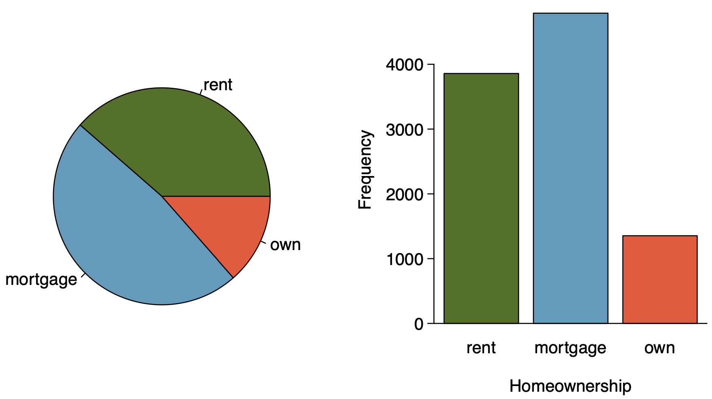

```{r setup, include=FALSE}
knitr::opts_chunk$set(echo = FALSE)
```

```{r, echo=F, message=F, warning=F}
library(readr)
library(openintro)
library(datasets)
library(tidyverse)
library(scales)
data(COL)
```

# Considering categorical data

## Contingency tables

A table that summarizes data for two categorical variable is called a **contingency table**.

\pause

The contingency table below shows the distribution of survival and ages of passengers on the Titanic.


\begin{table}[]
\begin{tabular}{ccccc}
                     &       & \multicolumn{2}{c}{Survival} &       \\ \cline{3-4}
                     &       & Died        & Survived       & Total \\ \cline{2-5} 
\multirow{2}{*}{Age} & Adult & 1438        & 654            & 2092  \\
                     & Child & 52          & 57             & 109   \\ \cline{2-5} 
                     & Total & 1490        & 711            & 2201  \\ \cline{2-5} 
\end{tabular}
\end{table}

## Bar Plots

A **bar plot** is a common way to display a single categorical variable. A bar plot where proportions instead of the frequencies are shown is called a **relative frequency bar plot**.

\begin{multicols}{2}

```{r, echo=F, message=F, out.width="100%",warning=F,fig.align='center'}
age_survived <- apply(Titanic, c(3, 4), sum)

titanic_data <- tibble(
  Age = c(rep("Child", 52 + 57), rep("Adult", 1438 + 654)),
  Survival = c(rep("Died", 52), rep("Survived", 57), rep("Died", 1438), rep("Survived", 654))
  )

ggplot(titanic_data, aes(x = Survival)) +
  geom_bar(fill = COL[1]) +
  labs(y = "Frequency") +
  theme_bw(base_size = 25)
```

\columnbreak

```{r, echo=F, message=F, out.width="100%",warning=F,fig.align='center'}
ggplot(titanic_data, aes(x = Survival)) +
  geom_bar(aes(y = (..count..)/sum(..count..)), fill = COL[1]) +
  labs(y = "Relative frequency") +
  scale_y_continuous(labels=percent) +
  theme_bw(base_size = 25)
```

\end{multicols}

\pause

\alert{How are bar plots different than histograms?}

\pause

\footnotesize Bar plots are used for displaying distributions of categorical variables, histograms are used for numerical variables. The x\-axis in a histogram is a number line, hence the order of the bards cannot be changed. In a bar plot, the categories can be listed in any order (though some ordering make more sense than others, especially for ordinal variables.)

## Choosing the appropriate proportion

\alert{Does there appear to be a relationship between age and survival for passengers on the Titanic?}

\begin{table}[]
\begin{tabular}{ccccc}
                     &       & \multicolumn{2}{c}{Survival} &       \\ \cline{3-4}
                     &       & Died        & Survived       & Total \\ \cline{2-5} 
\multirow{2}{*}{Age} & Adult & 1438        & 654            & 2092  \\
                     & Child & 52          & 57             & 109   \\ \cline{2-5} 
                     & Total & 1490        & 711            & 2201  \\ \cline{2-5} 
\end{tabular}
\end{table}

\pause

To answer this question we examine the row proportions:

\pause

  - % Adults who survived: 654 / 2091 $\approx$ 0.31
  
\pause
  
  - % Children who survived: 57 / 109 $\approx$ 0.52
  
## Bar plots with two variables

- **Stacked bar plot:** Graphical display of contingency table information, for counts.

- **Side\-by\-side bar plot:** Displays the same information by placing bars next to, instead of on top of, each other.

- **Standardized stacked bar plot:** Graphical display of contingency table information, for proportions.

## Bar plots with two variables

\alert{What are the difference between the three visualizations shown below?}

\begin{multicols}{2}

```{r, echo=F, message=F, out.width="100%",warning=F,fig.align='center'}
ggplot(titanic_data, aes(x = Age, fill = Survival)) +
  geom_bar() +
  labs(y = "Frequency") +
  theme_bw(base_size = 25) +
  scale_fill_manual(values = c(COL[1], COL[1,3]), breaks = c("Died", "Survived"))
```

\columnbreak

```{r, echo=F, message=F, out.width="100%",warning=F,fig.align='center'}
ggplot(titanic_data, aes(x = Age, fill = Survival)) +
  geom_bar(position = "dodge") +
  labs(y = "Frequency") +
  theme_bw(base_size = 25) +
  scale_fill_manual(values = c(COL[1], COL[1,3]), breaks = c("Died", "Survived"))
```

\end{multicols}

```{r, echo=F, message=F, out.width="47%",warning=F,fig.align='center'}
ggplot(titanic_data, aes(x = Age, fill = Survival)) +
  geom_bar(position = "fill") +
  labs(y = "Relative frequency") +
  theme_bw(base_size = 25) +
  theme(axis.title.x = element_text(vjust=2.5))+
  scale_fill_manual(values = c(COL[1], COL[1,3]), breaks = c("Died", "Survived"))
```


## Mosaic plots

\alert{What is the difference between the two visualizations shown below?}

\begin{multicols}{2}

```{r, echo=F, message=F, out.width="110%",warning=F,fig.align='center'}
ggplot(titanic_data, aes(x = Age, fill = Survival)) +
  geom_bar(position = "fill") +
  labs(y = "Relative frequency") +
  theme_bw(base_size = 25) +
  scale_fill_manual(values = c(COL[1], COL[1,3]), breaks = c("Died", "Survived"))
```

\columnbreak

```{r, echo=F, message=F, out.width="110%",warning=F,fig.align='center'}
mosaicplot(table(titanic_data$Age, titanic_data$Survival), color = c(COL[1],COL[1,3]), ylab = "", main = "", cex.axis = 2)
```

\end{multicols}

## Pie charts



## Pie charts

\alert{Can you tell which order excompasses the lowest percentage of mammal species?}

<!-- \begin{multicols}{2} -->

```{r, echo=F, message=F, out.width="100%",warning=F,fig.align='center',include=FALSE,eval=FALSE}
d = read_csv("dataset/msw3-all.csv")

colors = rev(as.vector(COL))

pie(sort(table(d$Order)), labels="", col = c(colors,"white"))
```

<!-- \columnbreak -->

```{r, echo=F, message=F, out.width="100%",warning=F,fig.align='center',include=F,eval=FALSE}
plot.new()
legend("center", names(rev(sort(table(d$Order)))), fill = rev(c(colors,"white")))
```

<!-- \end{multicols} -->

<!-- Doesn't seem to work properly -->

{width="60%"} {width="25%"}

## Side\-by\-side box plots

\alert{Does there appear to be a relationship between class year and number of clubs studetns are in?}

```{r, echo=F, message=F, out.width="100%",warning=F,fig.align='center'}
d = read.csv("dataset/year_clubs.csv")
d$year = factor(d$year, levels = c("First-year","Sophomore","Junior","Senior","Grad student"))
d = d[d$year != "Grad student",]
d$year = droplevels(d$year)

# box
par(cex.axis=1.1, cex=1.2)
boxPlot(d$clubs, fact = d$year, col = COL[1], ylab = "number of clubs")
```
